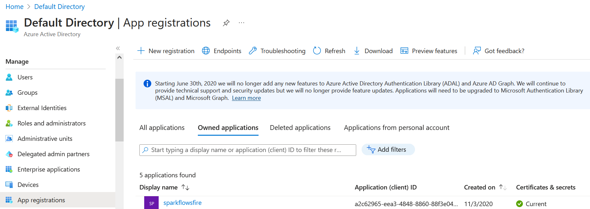
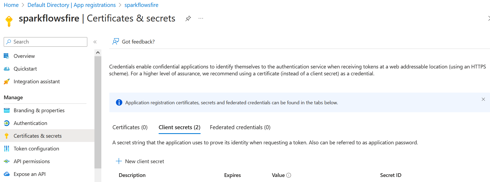

Register an application
=====

Fire Insights is integrated with Azure Key Vault. In order to configure Azure Key Vault you need to Register an application for Azure Directory with appropriate Privilege.

Create Azure Active Directory Application
-------------------------------

1. Login to Azure Portal if you are not already logged in.
2. Search for ``Azure Active Directory``.
3. From left Menu of Azure Directory Overview -> click App registrations -> Click + New Registration.
4. Enter your ``application name``. Optionally you can enter the Redirect URI to get Authentication response.
5. Click on Register.

Get Client / Application ID
-----------------

Azure Client Id is Active Directory Application ID. Client Id is the unique identifier of an application created in Active Directory. You can have many applications in an Active Directory. Each application will have a different access level.

1. Login to Azure Portal if you are not already logged in.
2. Search for Azure Active Directory.
3. From left Menu of Azure Directory Overview -> click App registration.
4. Click Owned Application tab -> Click the name of the application created in previous step, in my case name will be sparkflowsfire.
5. Copy Application ID.

Get Client Secret Id
-------

1. Login to Azure Portal if you are not already logged in.
2. Search for Azure Active Directory.
3. From left Menu of Azure Directory -> click App Registration -> Click the name of the application created in the previous step, in my case name will be sparkflowsfire.
4. From the left menu of sparkflowsfire (application) -> click Certificates & secrets.
5. Click on New Client Secret from right side pane -> Add description and expiration in Add a Client Secret screen -> Click Add button.
6. Copy Value.

.. note:: Make sure to copy Client ID and Secret ID, as it will be used in Configuring Credential Store in the Next step.
