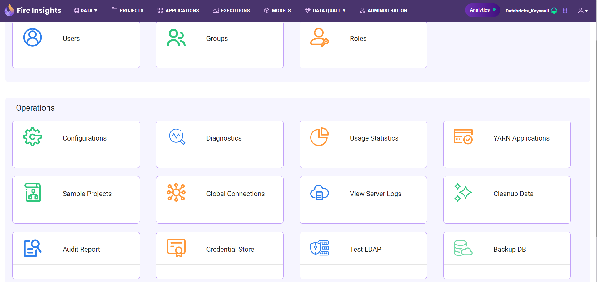
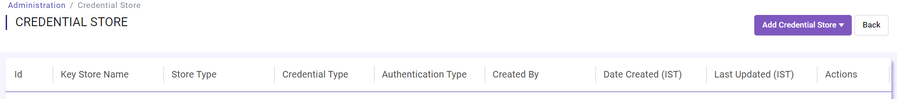
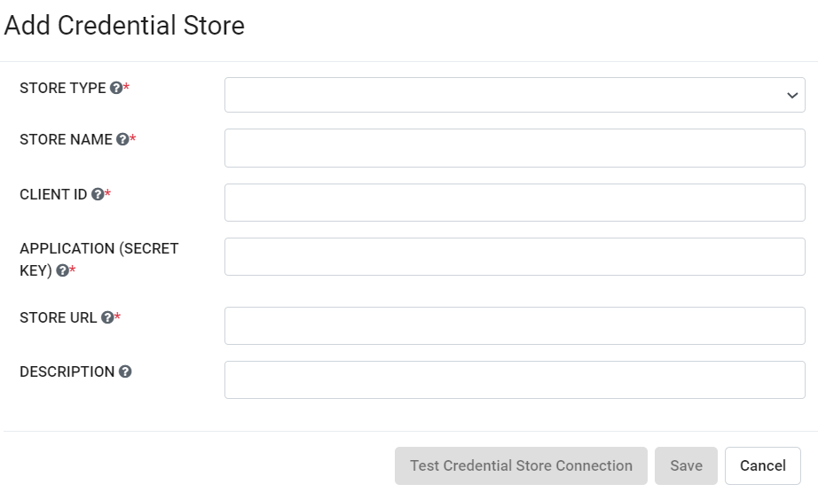
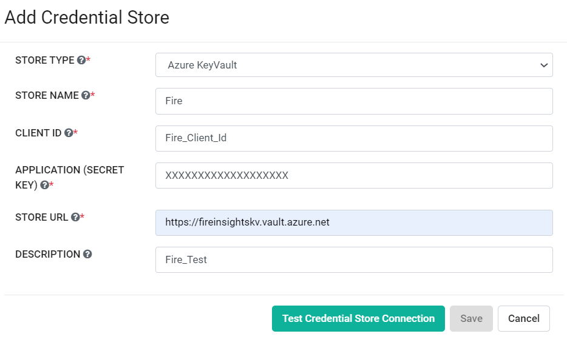
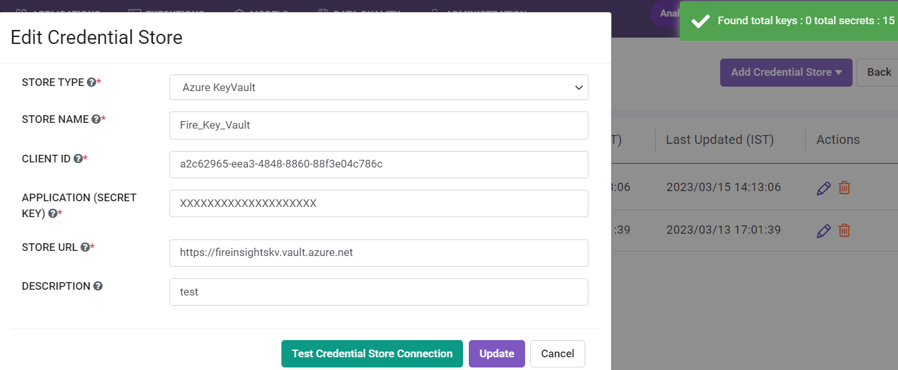
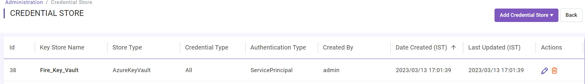

Configuring Azure Key Vault
===========================

You can configure Azure Key Vault in Fire Insights. Below are the steps for configuring Azure Key Vault:

Go to Administration -> Credential Store
-------------

Login to Fire Insights application as an admin user. Go to ``Administration`` and select ``Credential Store``.

Add Credential Store
------------------

Click on the ``ADD CREDENTIAL STORE`` button.

Add Credential Store Parameters
--------------------------

.. list-table:: Credential Store
   :widths: 20 80
   :header-rows: 1

   * - Title
     - Description
   * - STORE TYPE
     - Select Azure Key Vault.
   * - STORE NAME
     - Add any unique name.
   * - CLIENT ID
     - Add Client ID for Azure account which has access to Key Vault.
   * - SECRET KEY
     - Add Secret Key
   * - STORE URL
     - Azure KeyVault URL.
   * - DESCRIPTION
     - Add any description.
     

After adding the above parameters, you can click on ``TEST CREDENTIAL STORE CONNECTION`` to verify the connection before saving it.

Credential Store Created
------------------------

Once the credential store has been created, you can view it in the list of credential stores.

   

