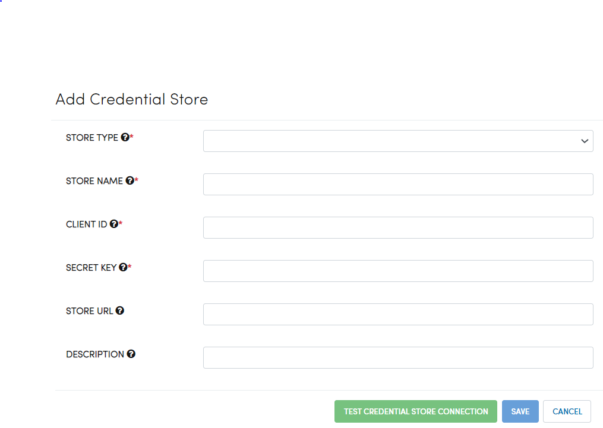

Configuring Azure Key Vault
===========================

You can configure Azure Key Vault in Fire Insights.

Below are the steps for configuring Azure Key Vault.

Go to Administration/Credential Store
-------------

Login to Fire Insights application, Go to Administration and select Credential Store.

.. figure:: ../../_assets/credential_store/1.PNG
   :alt: Credential Store
   :width: 90%

Add Credential Store
------------------

Click on ADD CREDENTIAL STORE tab

.. figure:: ../../_assets/credential_store/2.PNG
   :alt: Credential Store
   :width: 90%

Add Credential Store Parameter
--------------------------

.. list-table:: Credential Store
   :widths: 20 80
   :header-rows: 1

   * - Title
     - Description
   * - STORE TYPE
     - Select Connection Type from Drop down ie Azure KeyVault.
   * - STORE NAME
     - Add any unique name.
   * - CLIENT ID
     - Add Client Id for Azure account having access of KeyVault.
   * - SECRET KEY
     - Add Secret Key
   * - STORE URL
     - Azure KeyVault URI.
   * - DESCRIPTION
     - Add any description.
     

