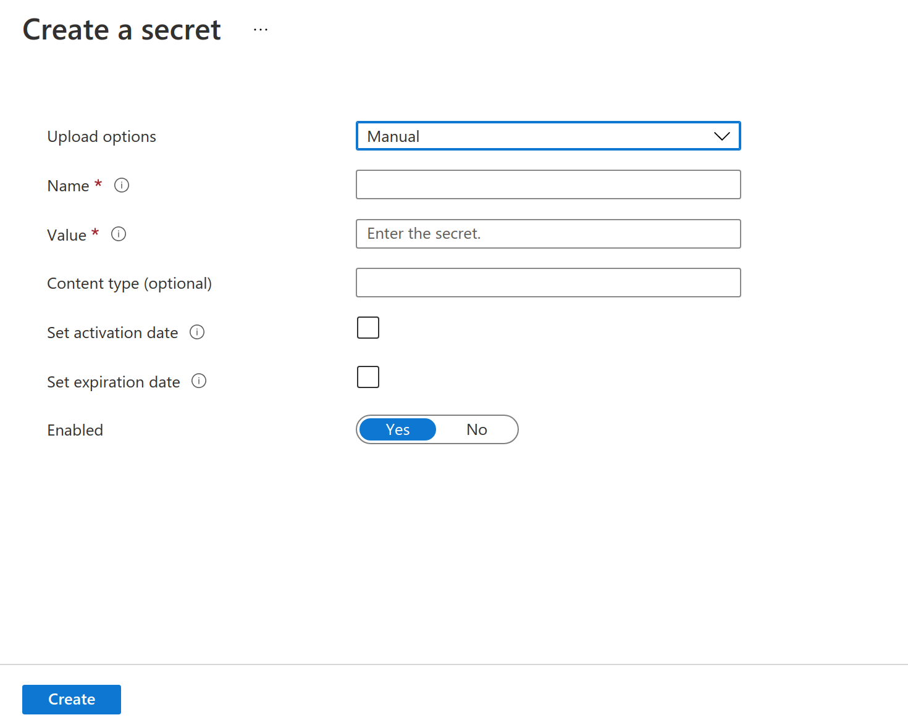

Azure Key Vault
================

Fire Insights is integrated with Azure Key Vault. Once configured, the keys in the Key Vault can be used in the connections defined in the Fire Insights.

Create Azure Key Vault in Azure portal
--------------------

Create a Key Vault in the Azure portal if you don't have any.

.. figure:: ../../_assets/credential_store/azure-keyvault-list.png
   :alt: Azure Key Vault
   :width: 70%

Click on ``Create`` and fill up the required fields and then click on ``Review and Create``.

.. figure:: ../../_assets/credential_store/azure-keyvault-create.png
   :alt: Azure Key Vault
   :width: 60%

Add Secret Keys/Values in the Key Vault
---------------

Click on ``Generate/Import``.

.. figure:: ../../_assets/credential_store/azure-keyvault-secret-list.png
   :alt: Azure Key Vault
   :width: 60%

Add secret keys and their values.

