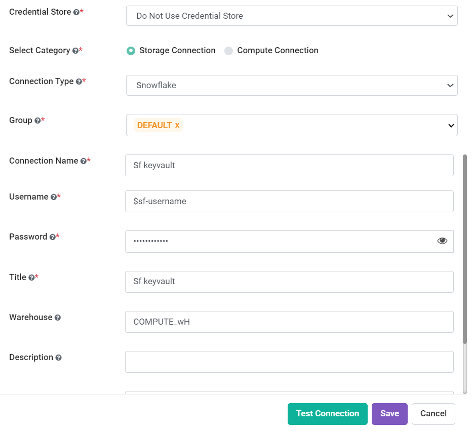

Credential Store Connection
============================

Sparkflows enables you to create connection. The values in the connections can be fetched from the credential stores.

Below are the steps for adding connection using values from the credential store:

Step 1 : Navigate to Connections
-------------

* Login to **Sparkflows**.
* Go to **Administration** and select **Global/Group Connections**, as shown below.

  .. figure:: ../../_assets/credential_store/admin-connections.PNG
     :alt: Credential Store
     :width: 70%

Step 2 : Add Connection
-----------

* On the Connections page, click on **Add Connection** button and select either **Add Connection For All** or **Add Connection For Group** from the dropdown based on your requirements, as shown below.

  .. figure:: ../../_assets/credential_store/connections-page.png
     :alt: Credential Store
     :width: 70%
   

Step 3 : Add Connection Parameter
--------------------------
* Enter the required connection parameters as listed in the table below:

.. list-table:: **Connection Parameter**
   :widths: 20 80
   :header-rows: 1

   * - Title
     - Description
   * - CREDENTIAL STORE
     - Select Credential Store listed in dropdown.
   * - CONNECTION TYPE
     - Select connection type configured in KeyVault, it can be `databricks, MySql, Mongo DB, Sql server, Hive, Redshift and Snowflake.`
   * - CONNECTION NAME
     - Add a connection name.
   * - USERNAME
     - Latest username for the selected connection, and if username is added in KeyVault, set it to $USERNAME.
   * - PASSWORD
     - Latest password for selected connection, and if password is added in KeyVault, set it to $PASSWORD.
   * - TITLE
     - Add a unique title.
   * - Warehouse
     - Snowflake Warehouse.  
   * - DESCRIPTION
     - Add description.
   * - URL
     - URL for selected connection, and if URL is added in KeyVault, set it to $URL.

Step 4 : Test and Save the Connection
------
  
* After adding the above parameters, click on **Test Connection** button. It will show the connection as **Successfully Connected**, as shown below. 

   
  .. figure:: ../../_assets/credential_store/sf_connection_3.PNG
     :alt: Credential Store
     :width: 70%   

* After this, you can save it to find it on the **connections list** page, as shown below.

  .. figure:: ../../_assets/credential_store/connection-list.png
     :alt: Credential Store
     :width: 70%

  Now you can use the same Connection in node in workflow editor and submit the Job.

  .. figure:: ../../_assets/credential_store/sf_connection_5.PNG
     :alt: Credential Store
     :width: 70%

  .. figure:: ../../_assets/credential_store/sf_connection_6.PNG
     :alt: Credential Store
     :width: 70%
   
  .. figure:: ../../_assets/credential_store/sf_connection_7.PNG
     :alt: Credential Store
     :width: 70% 

.. note::  Above example is shown for Snowflake connection and using **Readsnowflake** node in workflow.
