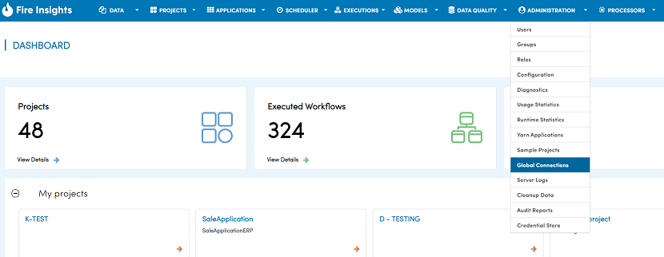
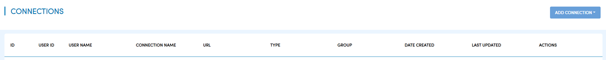
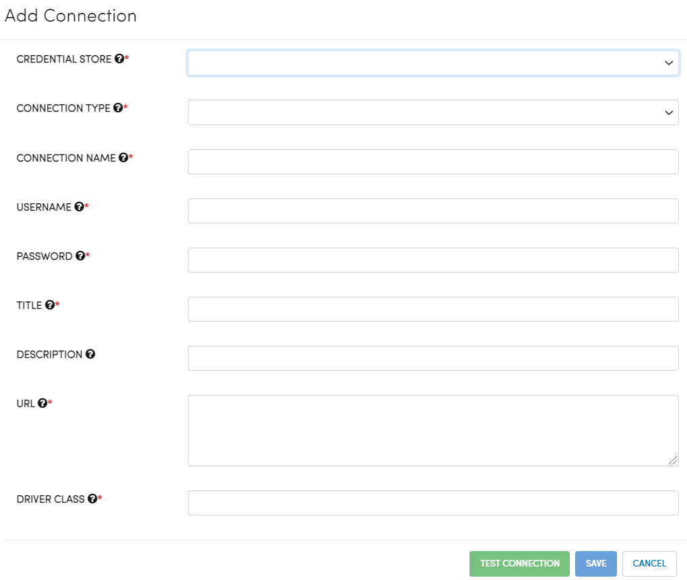
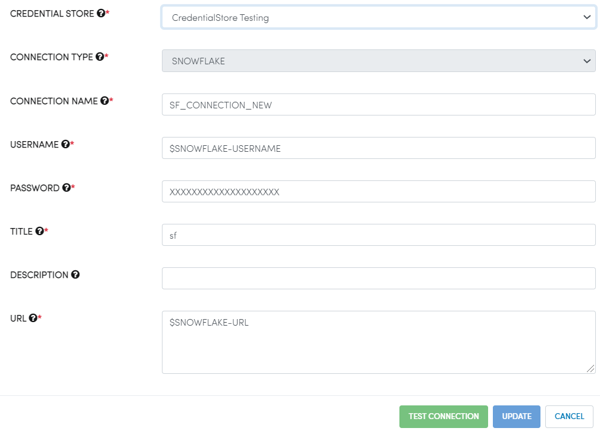
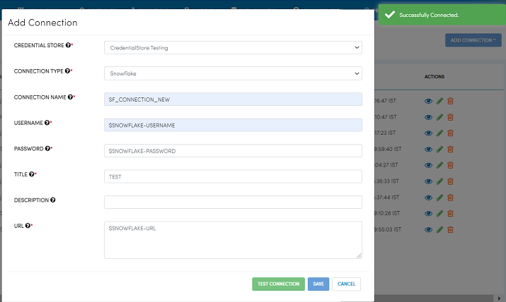
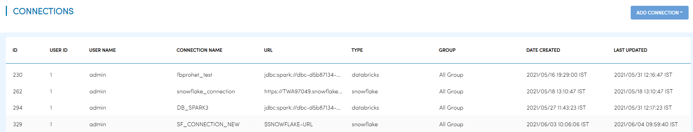
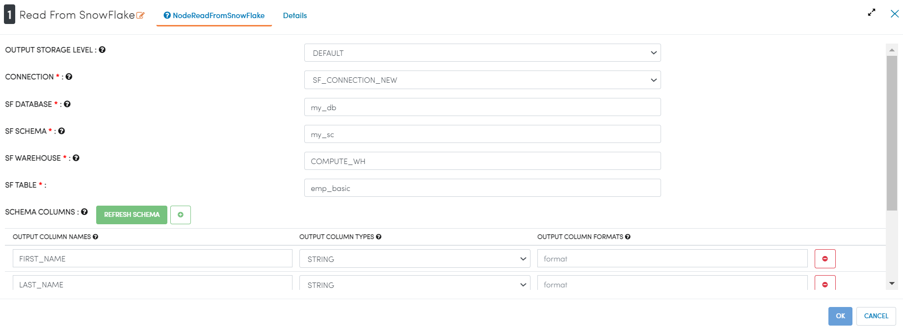
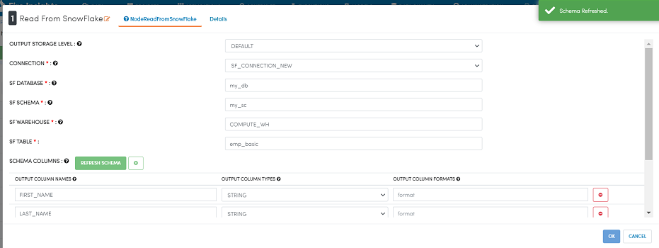
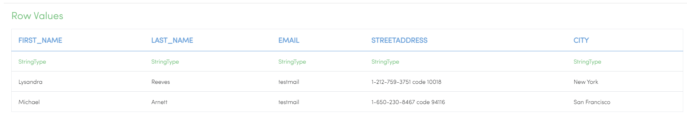
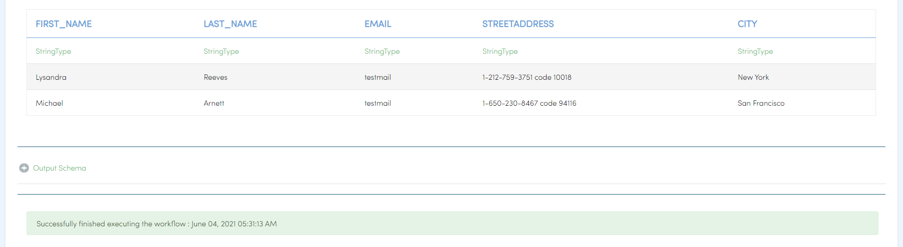

Credential Store Connection
============================

Fire Insights enables you to create connection. The values in the connections can be fetched from the credential stores.

Below are the steps for adding connection using values from the credential store:

Go to Administration/Global Connections
-------------

Login to Fire Insights, go to "Administration" and then select "Global Connections".

Add Connection
-----------

Click on "ADD CONNECTION" and then select either "Add Connection For All" or "Add Connection For Group" based on your requirements.

   

Add Connection Parameter
--------------------------

.. list-table:: Connection Parameter
   :widths: 20 80
   :header-rows: 1

   * - Title
     - Description
   * - CREDENTIAL STORE
     - Select Credential Store listed in dropdown.
   * - CONNECTION TYPE
     - Select connection type configured in KeyVault, it can be `databricks, MySql, MOngo DB, Sql server, Hive, Redshift and Snowflake.`
   * - CONNECTION NAME
     - Add a connection name.
   * - USERNAME
     - Latest username for the selected connection, and if username is added in KeyVault, set it to $USERNAME.
   * - PASSWORD
     - Latest password for selected connection, and if password is added in KeyVault, set it to $PASSWORD.
   * - TITLE
     - Add a unique title.
   * - DESCRIPTION
     - Add description.
   * - URL
     - URL for selected connection, and if URL is added in KeyVault, set it to $URL.
     

After adding the above parameters, clicking on "TEST CONNECTION" will show the connection as "successfully connected". After this, you can save it to find it under the "connection list".

   

Now you can use the connection in processor in workflow and submit the Job etc..

   

.. note::  Above example is shown for Snowflake connection and using "Readsnowflake node" in workflow.
