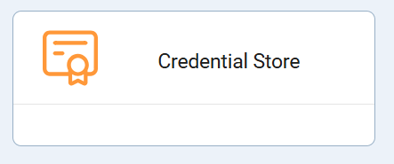
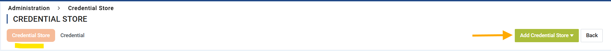
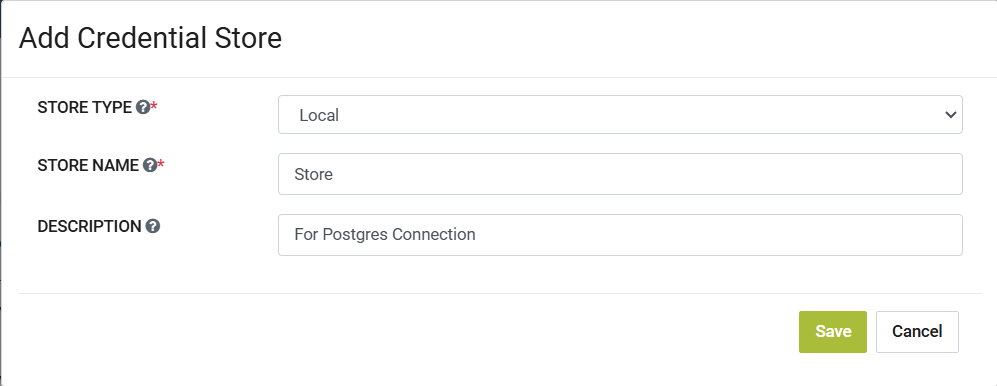

Local Credential Store
============================

Sparkflows enables you to create a Credential Store of type Local. This Credential Store can then be associated to a multiple Application Credentials which can then be used in Application Connection create/update along with Credential Store specific macros for any field.

Below are the steps for creating a Credential Store of type Local:

Go to Administration -> Credential Store
-------------

Login to Sparkflows then navigate to Administration page and then click on the Credential Store card.

Now select the **Credential Store** navigation tab and then click on **Add Credential Store** button.

Now select the **Store Type** as **Local** and fill in the Store Name and add an optional relevant description if required. The Store name should be unique else it will show the validation error below the text field for store name. Now click on **Save** button to create the Local Credential Store.

This Local Credential Store can now be associated to multiple Application Credentials and can be used within the Create/Edit of Application Connection through Credential Store specific macros.
