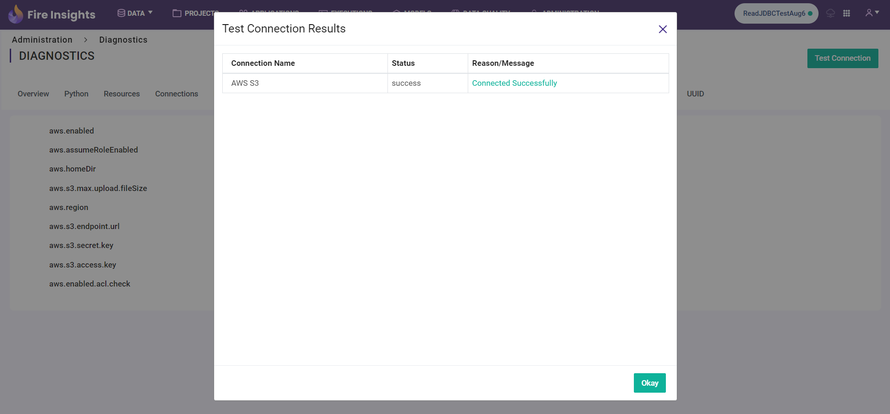
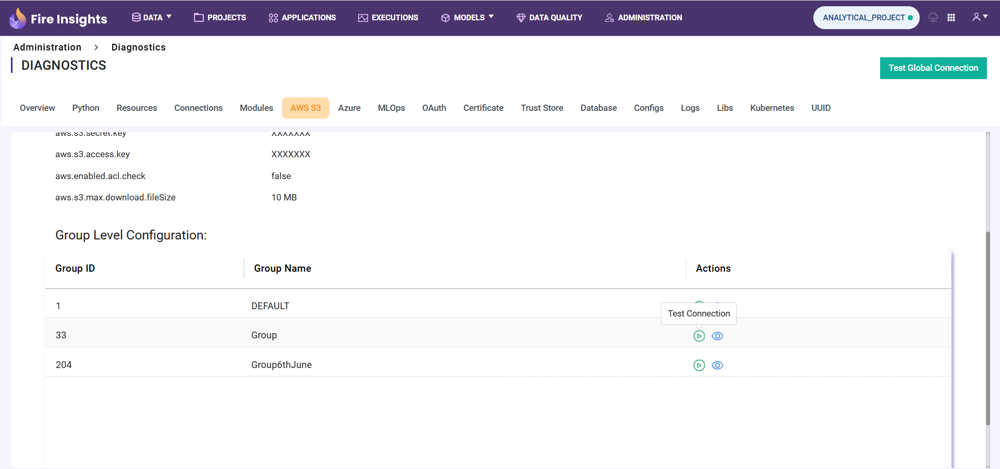
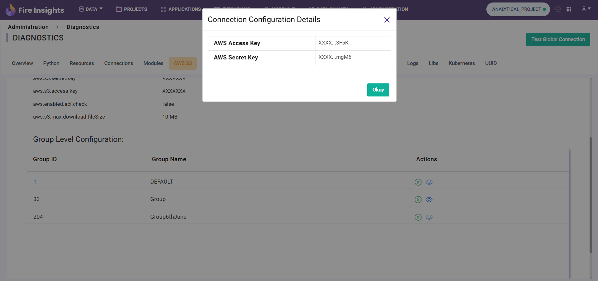

AWS S3
============

By clicking the ``Test Global Connection`` button, the user can test the S3 connection configured in the application's settings.

.. figure:: ../../_assets/diagnositcs/diagnostic-awss3.png
   :alt: aws connection
   :width: 60%

Group Level Configuration
_________________________
By clicking the ``Test Connection`` button displayed in the table, the user can test the S3 connection configured for the particular group.

By clicking the ``view connection details`` icon user can view the masked connection credentials for the group

