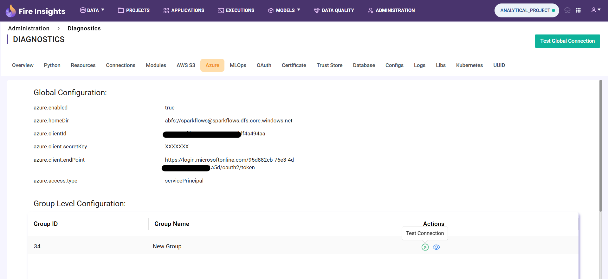

Azure
============

By clicking the ``Test Global Connection`` button, the user can test the Azure connection configured in the application's settings.

.. figure:: ../../_assets/diagnositcs/diagnostic-azure-testConnection-result.png
   :alt: azure test result
   :width: 60%

Group Level Configuration
_________________________
By clicking the ``Test Connection`` icon displayed in the table, the user can test the Azure connection configured for the particular group.

.. figure:: ../../_assets/diagnositcs/diagnostic-azure-testConnection-result.png
   :alt: adls test connection result
   :width: 60%

By clicking the ``view connection details`` icon user can view the masked connection credentials which is configured for the group

