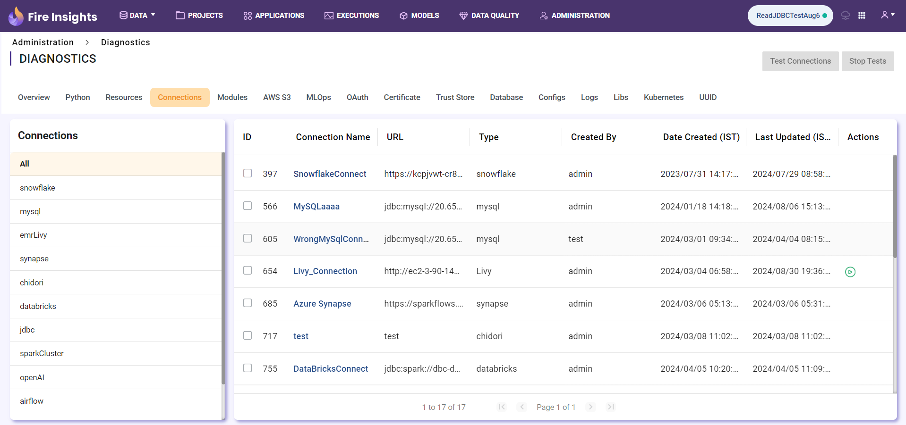
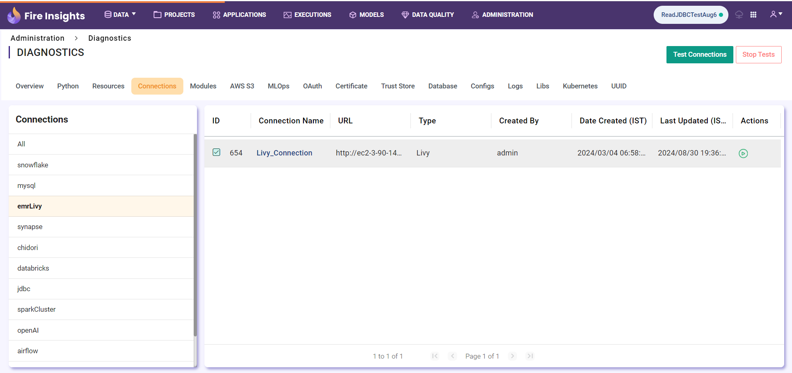
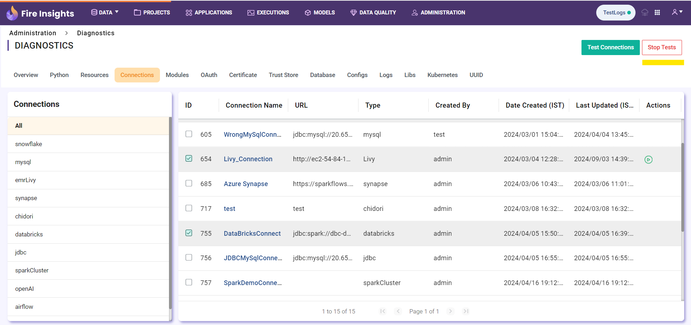
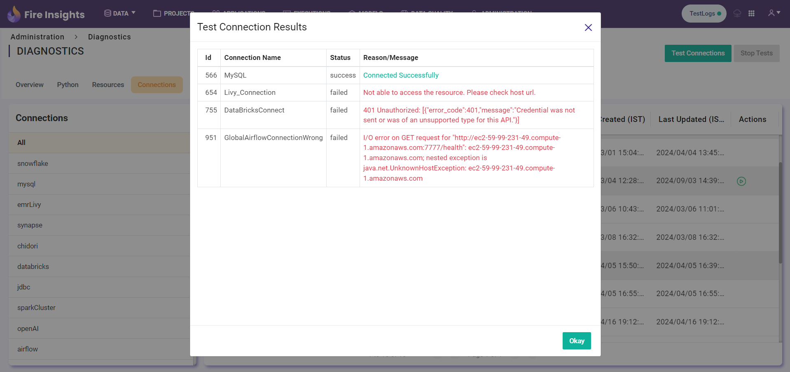

Connections
============

By clicking the 'Connections' tab in Diagnostics, the user can view the multiple connections.

Test Connection 
============================

Once the user selects a connection and clicks on the 'Test Connection' button, they can test the connection.

Stop Test Connection
============================

While the connection test is in progress, if the user wants to stop the tests, they can click on the 'Stop Tests' button to halt the connection test.

Test Connection Results
============================

Once the connection tests are completed, the user can view the test results.

