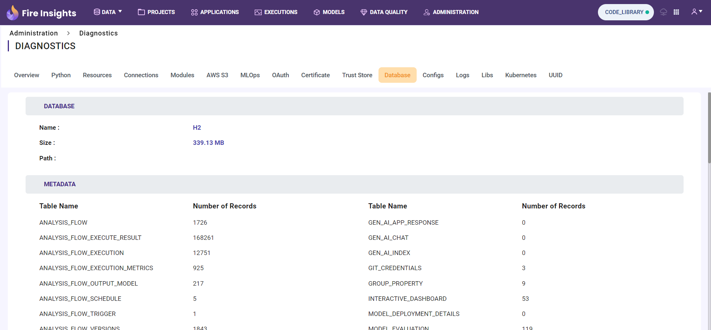

Database
============

By clicking the ``Database`` tab in Diagnostics, the user can view all the tables, the record count for each table, and the total size of the database, along with all related details.

