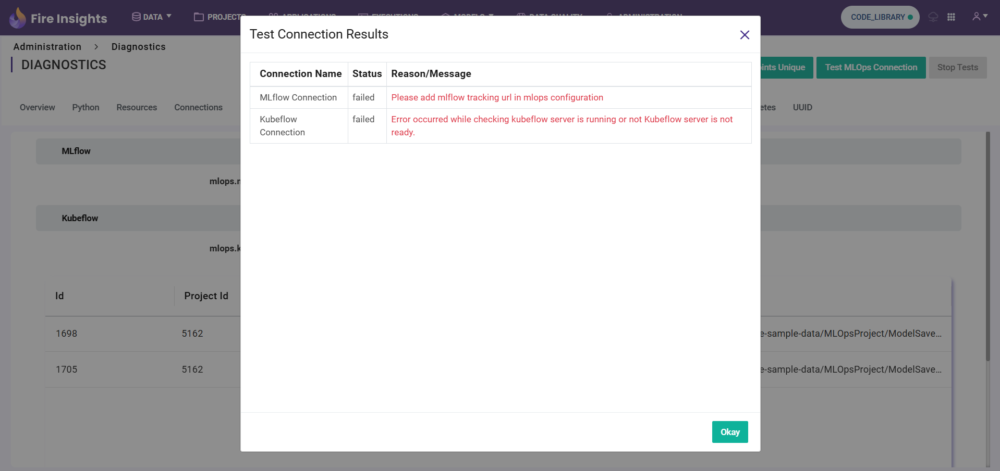
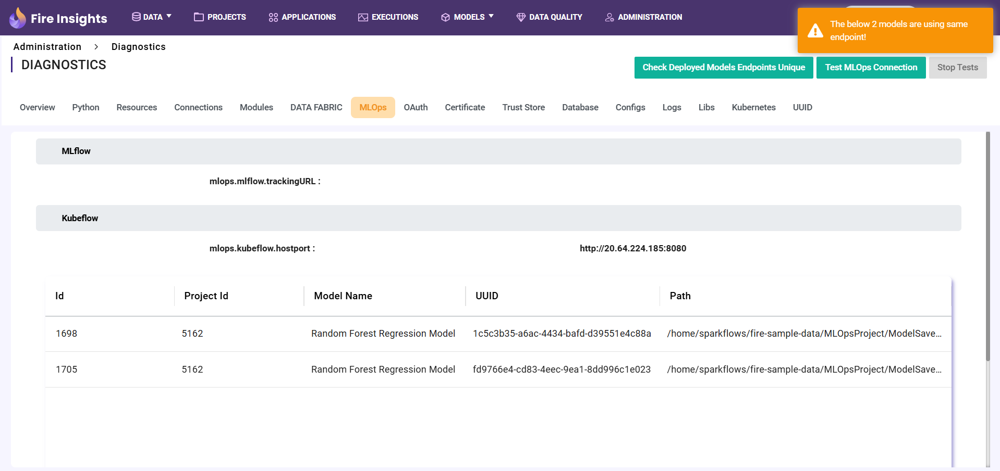
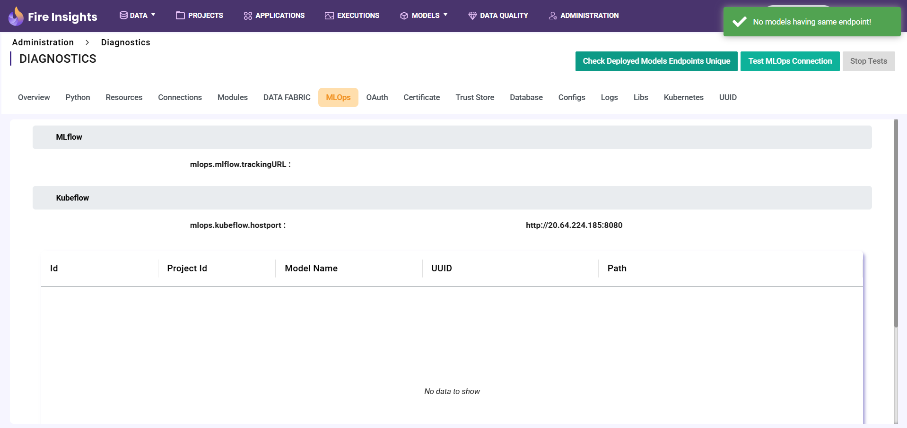

MLOPS
======

By clicking the ``Test MLOps Connection`` button, the user can test the MLOps connection configured in the application's settings.

When the user clicks the ``Check Deployed Models Endpoints Unique`` button, it verifies whether all deployed models have unique endpoints.

