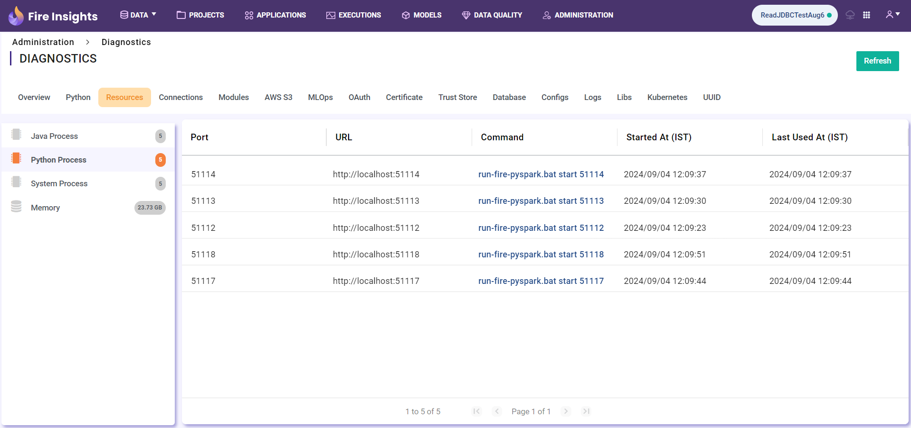
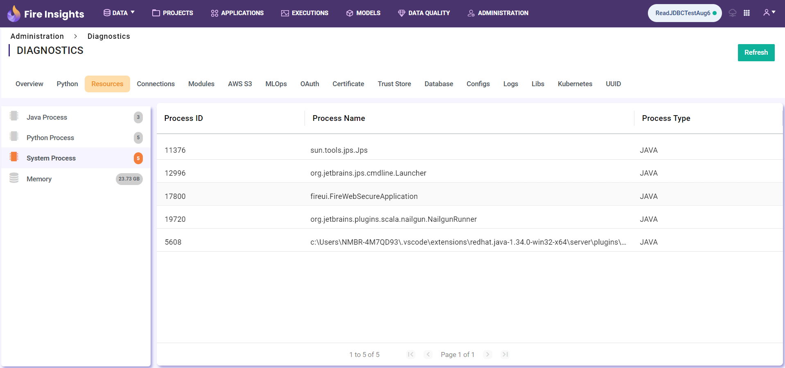
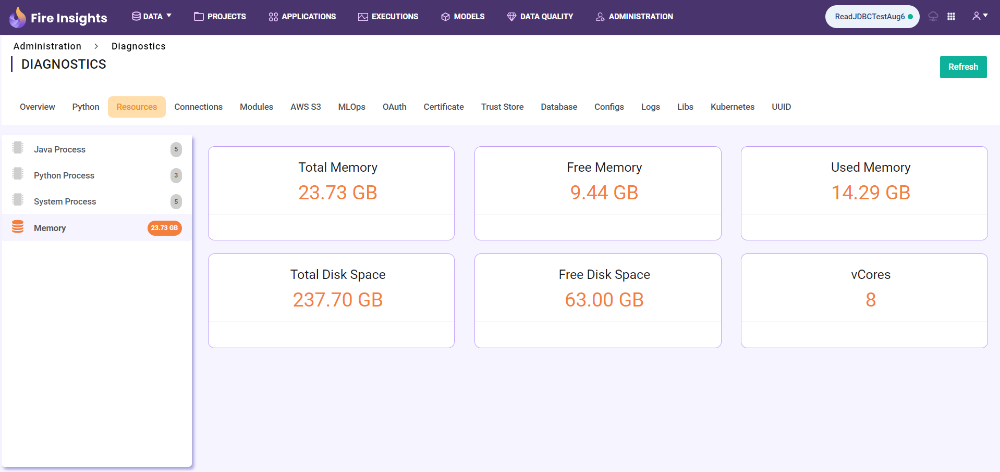

Resources
============

By clicking the **Resources** tab in Diagnostics, the user can view the running processes(like Java, Python and System processes) and machine's memory usage.

Java Processes
----------------

By clicking **Java Processes** from the menu, the user can view the Java processes running on the machine, as shown below.

.. figure:: ../../_assets/diagnositcs/diagnostic-resources-java.png
   :alt: overview
   :width: 60%

Python Processes
-----------------

By clicking **Python Processes** from the menu, the user can view the Python processes running on the machine, as shown below.

System Processes
-----------------

By clicking **System Processes** from the menu, the user can view the System processes running on the machine, as shown below.

Memory
---------

By clicking **Memory** from the menu, the user can view the total memory, free memory, used memory, total disk space, free disk space, and vCores on the machine, as shown below.

