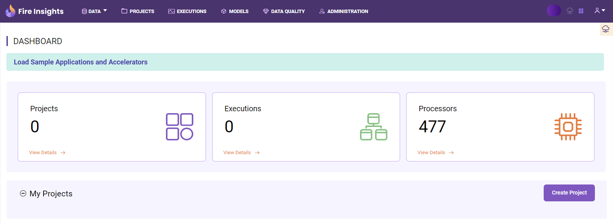
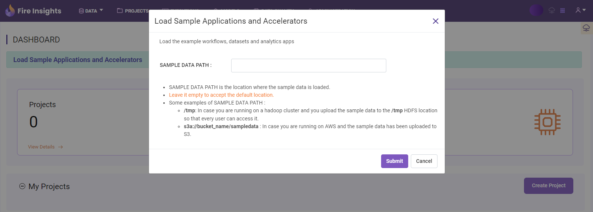

Load Sample Projects
====================

Sparkflows comes with a number of sample projects, which showcase funtionalities and provide accelerators to build usecases.

Below are the steps on how to load sample projects:

Step 1 : Login to Sparkflows 
------------------------------------
To Login :

#. Open Fire Insights login page.
#. Enter your credentials.
#. Click **Sign in** to reach the Dashboard page.

Step 2 : Open Load Sample Projects Window
----------------------------------

From the Dashboard, click **Load Example Applications** to reach a new window.

   
Step 3 : Select Sample Data Path
-----------------------

On Load Sample Projects Window, select sample data path if the sample projects are copied to S3 location, HDFS, DBFS or Local. 

Leave the path as empty to pull from the default location.

.. note:: The empty option only applies when Sparkflows is running in Standalone mode.

Step 4 : Check Dashboard
---------------

Once the sample projects are loaded one can see a list of projects.

.. figure:: ../../_assets/installation/load_example/new-dashboard.png
   :alt: Example application
   :width: 60%
   
Now you can start exploring different workflows, datasets among others.  
   
.. note::  Make sure to copy data folder from Fire Insights Binary and uploaded in data source where you need to reload sample Project.   
