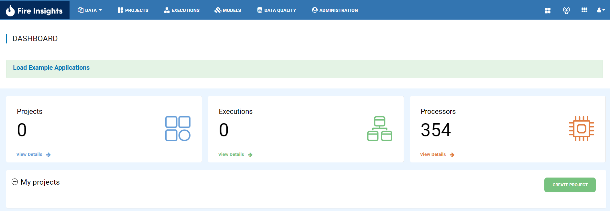
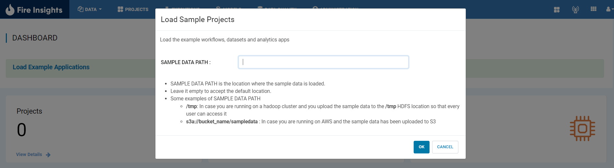
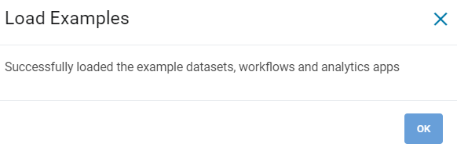
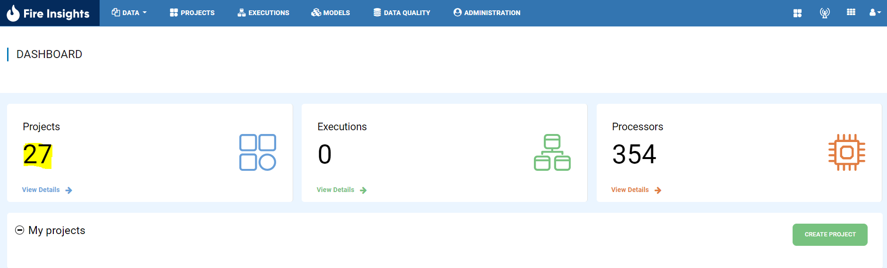

Load Example Project
=============

Fire Insights Comes up with Number of Example Sample Projects, which give detail information on different functionality.

Below are steps on how to load Sample Example Projects:

Login to Fire Insights Application
--------------

Once you Login to Fire Insights Application in dashboard page, you will see option to Load Example Applications.

   
Click on Load Example Applications
--------------

Once you Click on Load Example Applications, it will take you to new page.

Select Sample data path
--------------

Select Sample data path, if it is copied to any s3 location, HDFS, DBFS, Local or left empty to get default path used.

.. note:: Make Sure empty is only applicable when Fire Insights running in Standalone mode.

Once the above steps done, on Clicking Ok, you will see successful msg.

Check dashboard
---------

Once the Example Project is being lodaed you will see different projects.

   
Now you can start Exploring different workflow, dataset etc. in different projects.   
   
