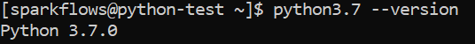
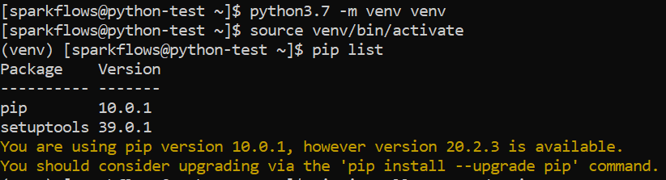
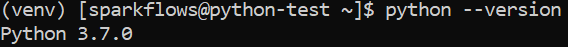
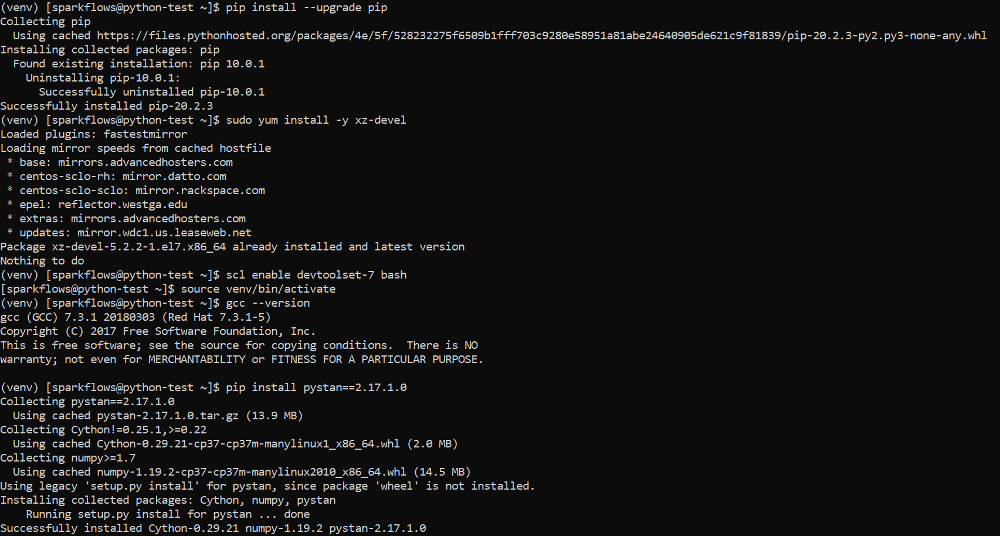
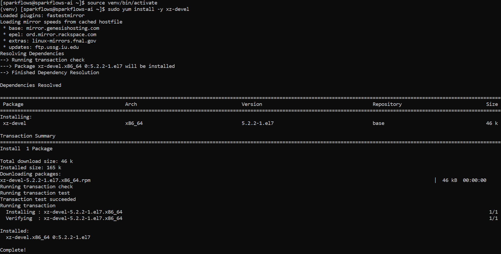
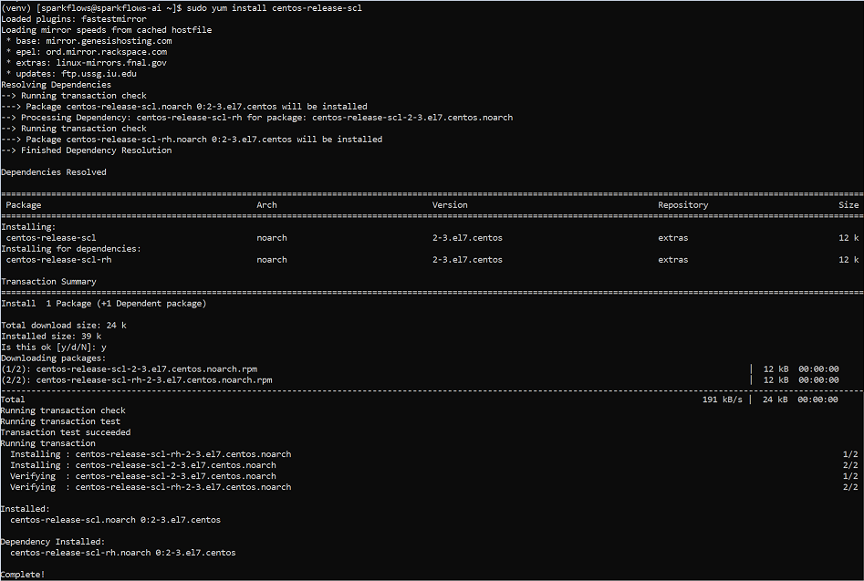
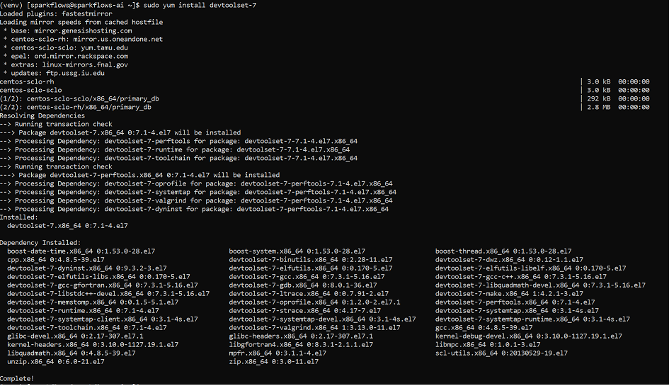
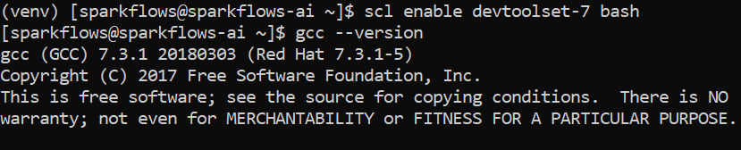
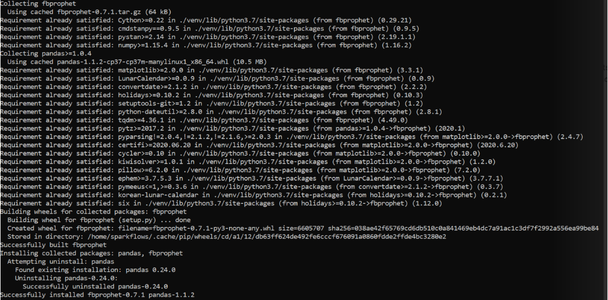
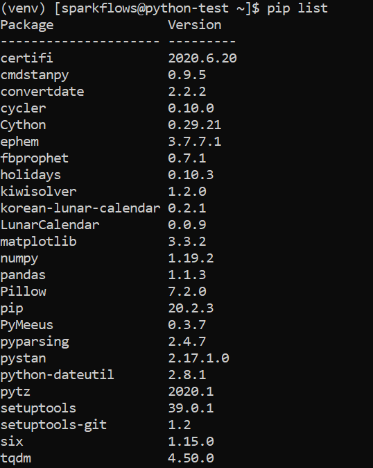

Python Installation on Red Hat 8 and CentOS 7
====================================

Python is only needed if you need to use the PySpark engine enabled in Sparkflows. Python modules in Sparkflows is compatible with Python 3.7.

Check if Python 3.7 is Installed
---------------------------------

Use one of the below commands to check if the Python is installed on the machine or not::

  python --version
  python3 --version

    

Install Python 3.7 (if not installed)
-------------------------------------

Some References for Installing Python:

* CentOS : https://tecadmin.net/install-python-3-7-on-centos/

Prerequisites
+++++++++++++

Python installation requires the GCC compiler to be available on the machine. Use the following command to install the prerequisites for installing Python::

    sudo yum install -y gcc openssl-devel bzip2-devel libffi-devel zlib-devel wget make
    

Download and extract the downloaded package  
++++++++++++++++++++++++++++++
  

Download python from below Link

* https://www.python.org/downloads/
* https://www.python.org/ftp/python/3.7.0/Python-3.7.0.tgz

Download and untar::
  
     wget https://www.python.org/ftp/python/3.7.0/Python-3.7.0.tgz
     tar xzf Python-3.7.0.tgz
     

Compile Python source code
+++++++++++++++++++

Compile the Python source code on your system using altinstall::

    cd Python-3.7.0
    ./configure --enable-optimizations
    sudo make altinstall
    python3.7 --version
  

Create Python virtual environment & Activate it
---------------------------------

Create Python virtual environment & Activate it::

  python3.7 -m venv venv
  source venv/bin/activate
  python --version

Upgrade pip version
-------------------

Upgrade pip version with 20.0 or above::

  pip install pip --upgrade

Install dependency for prophet package (CentOS 7)
-----------------------------------------

Run below command with sudo privilege
++++++++++++++++++++++++++++++++++

* Install development tool

::

      yum install -y xz-devel
    

* Install the CentOS SCL release file

::

     yum install centos-release-scl
  

   
* Install Developer Toolset version 7

::

    yum install devtoolset-7
  

 
* launch a new shell instance using the Software Collection scl tool & Check GCC version
::
 
    scl enable devtoolset-7 bash
    gcc --version
   

* Install prophet package
::
   
   pip install prophet

* Check pip list
::
   
   pip list

* Copy jar to python environment

If you are using python engine, make sure to copy below jar for Reading Excel file

Download ``spark-excel`` jar from below maven repository and copy to ``venv/lib/python3.7/site-packages/pyspark/jars/``

Reference maven url : https://mvnrepository.com/artifact/com.crealytics/spark-excel_2.12/3.2.2_0.18.5

Reference
---------

Links
+++++

  * https://linuxize.com/post/how-to-install-gcc-compiler-on-centos-7/

Install required Packages
----------------------

Install the required python packages for Fire Insights::

  pip install -r fire-x.y.x/dist/fire/requirements.txt
   
``requirements.txt`` file is available in the installation directory of Fire Insights.

Reference
---------

* https://docs.aws.amazon.com/cli/latest/userguide/install-linux-python.html
* https://aws.amazon.com/premiumsupport/knowledge-center/ec2-linux-python3-boto3/
* https://blog.teststation.org/centos/python/2016/05/11/installing-python-virtualenv-centos-7/
  
Delete a venv
+++++++++++++

To delete a virtual environment, follow below steps::

  source venv/bin/activate
  pip freeze > requirements.txt
  pip uninstall -r requirements.txt -y
  deactivate
  rm -r venv/

Installing pip & wheel
+++++++++++++++++++

* yum install https://dl.fedoraproject.org/pub/epel/epel-release-latest-7.noarch.rpm
* yum install python-pip
* yum install python-wheel
  
  
Add below in bash_profile
++++++++++++++++++++++++++

* export PYSPARK_PYTHON=/usr/bin/python3
* export PYSPARK_DRIVER_PYTHON=/usr/bin/python3  

