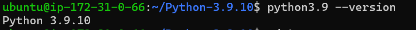
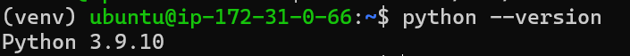

Python Installation on Ubuntu
=============================

Python is only needed if you need to use the PySpark engine enabled in Sparkflows. Python modules in Sparkflows is compatible with Python 3.9.

Check if Python 3.9 is Installed
---------------------------------

Use the below commands::

  python --version
  python3.9 --version

Install Python 3.9 (if not installed)
-------------------------------------

Some References for Installing Python: (https://linuxize.com/post/how-to-install-python-3-7-on-ubuntu-18-04/ )

* Update the packages list and install the packages necessary to build Python source::

    sudo apt update

  .. figure:: ../../_assets/configuration/update_ubuntu.PNG
   :alt: Installations
   :width: 60%

* Install needed dependency::

   sudo apt install build-essential zlib1g-dev libncurses5-dev libgdbm-dev libnss3-dev libssl-dev libsqlite3-dev libreadline-dev libffi-dev wget libbz2-dev

  .. figure:: ../../_assets/configuration/software_update.PNG
   :alt: Installations
   :width: 60%   

  
* Download python from below Link

  * https://www.python.org/downloads/
  * https://www.python.org/ftp/python/3.9.10/Python-3.9.10.tgz

* Download and untar::
  
    wget https://www.python.org/ftp/python/3.9.10/Python-3.9.10.tgz

  ::
  
      tar xzf Python-3.9.10.tgz

  .. figure:: ../../_assets/configuration/python_download.png
         :alt: Installations
         :width: 60%

* Next, navigate to the Python source directory and run the configure script which will perform a number of checks to make sure all of the dependencies on your system are present::

    cd Python-3.9.10

  .. figure:: ../../_assets/configuration/python-cd.png
   :alt: Installations
   :width: 60%

* Build & compile::

    sudo ./configure --enable-optimizations
 
  .. figure:: ../../_assets/configuration/python_run.png
   :alt: Installations
   :width: 60%
   
* Install the Python binaries by running the following command:: 
 
   sudo make altinstall

  .. figure:: ../../_assets/configuration/python_run1.png
   :alt: Installations
   :width: 60%

.. Note:: Do not use the standard make install as it will overwrite the default system python3 binary.

Verify it by typing::

  python3.9 –-version

::

  cd ..

Create Python virtual environment & Activate it
---------------------------------

Create Python virtual environment & Activate it::

  python3.9 -m venv venv

::

  source venv/bin/activate

::

  python --version
  

  

Upgrade pip version
-------------------
Upgrade pip version with 20.0 or above::

 pip install pip --upgrade
  
.. figure:: ../../_assets/configuration/pipupdate.PNG
   :alt: Installations
   :width: 60%  
   
Install required packages
-------------------------

Install the required python packages for Sparkflows::

  pip install -r fire-3.x.y_spark_3.x.y/dist/fire/requirements.txt
   
``requirements.txt`` file is available in the installation directory of Sparkflows.

.. Note:: This can run into `Memory error` if there is not enough free RAM on the machine. In that case, please split the dependencies in `requirements.txt` into multiple parts and install.

Copying delta jar for PySpark
----------------------------------------

Download delta dependencies jar and copy to PySpark jar path, without this PySpark engine will not work.

::

    wget https://repo1.maven.org/maven2/io/delta/delta-storage/3.1.0/delta-storage-3.1.0.jar
    wget https://repo1.maven.org/maven2/io/delta/delta-spark_2.12/3.1.0/delta-spark_2.12-3.1.0.jar
    cp -r delta-storage-3.1.0.jar /home/sparkflows/venv/lib/python3.9/site-packages/pyspark/jars/
    cp -r delta-spark_2.12-3.1.0.jar /home/sparkflows/venv/lib/python3.9/site-packages/pyspark/jars/

.. Note:: Make sure to update absolute path of python environment

If connecting to S3 buckets from PySpark
----------------------------------------
If connecting to S3 buckets to read/write data, one would need to download these following JARs and place them in the virtual env ``SPARKFLOWS_INSTALL_DIR/venv/lib/python3.7/site-packages/pyspark/jars/`` being used by Sparkflows::

   wget https://repo1.maven.org/maven2/org/apache/hadoop/hadoop-aws/3.3.1/hadoop-aws-3.3.1.jar
   wget https://repo1.maven.org/maven2/com/google/guava/guava/23.0/guava-23.0.jar
   wget https://repo1.maven.org/maven2/org/postgresql/postgresql/42.3.2/postgresql-42.3.2.jar

If using read excel node from PySpark
-------------------------------------
If using read excel node from PySpark, one would need to download these following JARs and place them in the virtual env ``SPARKFLOWS_INSTALL_DIR/venv/lib/python3.7/site-packages/pyspark/jars/`` being used by Sparkflows::

   wget https://repo1.maven.org/maven2/com/crealytics/spark-excel_2.12/3.2.2_0.18.5/spark-excel_2.12-3.2.2_0.18.5.jar

Delete a venv
+++++++++++++

To delete a virtual environment, follow below steps::

    source venv/bin/activate

::

    pip freeze > requirements.txt

::

    pip uninstall -r requirements.txt -y

::

    deactivate

::

    rm -r venv/
