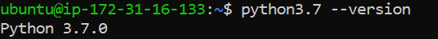
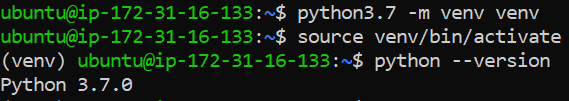

Python Installation on Ubuntu
=============================

Python is only needed if you need to use the PySpark engine enabled in Sparkflows. Python modules in Sparkflows is compatible with Python 3.7 and 3.8.

Check if Python 3.7 or 3.8 is Installed
---------------------------------

Use the below commands::

  python --version
  python3.7 --version

Install Python 3.7 (if not installed)
-------------------------------------

Some References for Installing Python: (https://linuxize.com/post/how-to-install-python-3-7-on-ubuntu-18-04/ )

* Update the packages list and install the packages necessary to build Python source::

  sudo apt update

  .. figure:: ../../_assets/configuration/update_ubuntu.PNG
   :alt: Installations
   :width: 90%

* Install needed dependency::

   sudo apt install build-essential zlib1g-dev libncurses5-dev libgdbm-dev libnss3-dev libssl-dev libsqlite3-dev libreadline-dev libffi-dev wget libbz2-dev

  .. figure:: ../../_assets/configuration/software_update.PNG
   :alt: Installations
   :width: 90%   

  
* Download python from below Link

  * https://www.python.org/downloads/
  * https://www.python.org/ftp/python/3.7.0/Python-3.7.0.tgz

* Download and untar::
  
  wget https://www.python.org/ftp/python/3.7.0/Python-3.7.0.tgz
  
  tar xzf Python-3.7.0.tgz

  .. figure:: ../../_assets/configuration/download_tar.PNG
   :alt: Installations
   :width: 90%

* Next, navigate to the Python source directory and run the configure script which will perform a number of checks to make sure all of the dependencies on your system are present:

  ``cd Python-3.7.0``

  .. figure:: ../../_assets/configuration/cd_python.PNG
   :alt: Installations
   :width: 90%

* Build & compile::

  ./configure --enable-optimizations
 
  .. figure:: ../../_assets/configuration/configure_ubuntu.PNG
   :alt: Installations
   :width: 90%
   
* Install the Python binaries by running the following command:: 
 
   sudo make altinstall

  .. figure:: ../../_assets/configuration/make.PNG
   :alt: Installations
   :width: 90%

Note: Do not use the standard make install as it will overwrite the default system python3 binary.

Verify it by typing::

  python3.7 –-version

Create Python virtual environment & Activate it
---------------------------------

Create Python virtual environment & Activate it::

  python3.7 -m venv venv
  source venv/bin/activate
  python --version
  

Upgrade pip version
-------------------
Upgrade pip version with 20.0 or above::

 pip install pip --upgrade
  
.. figure:: ../../_assets/configuration/pipupdate.PNG
   :alt: Installations
   :width: 90%  
   
Install dependency for prophet package (Ubuntu 18.04)
-----------------------------------------

* pystan dependency::
  
   pip install pystan

  .. figure:: ../../_assets/configuration/pystan.PNG
   :alt: Installations
   :width: 90% 

* convertdate dependency::

   pip install convertdate

  .. figure:: ../../_assets/configuration/convertdate.PNG
   :alt: Installations
   :width: 90% 

* prophet dependency::

   pip install prophet

  .. figure:: ../../_assets/configuration/fbprophet.PNG
   :alt: Installations
   :width: 90% 

* Check pip list::
   
   pip list

  .. figure:: ../../_assets/configuration/piplist.PNG
   :alt: Installations
   :width: 90% 

Install required packages
-------------------------

Install the required python packages for Fire Insights::

  pip install -r fire-x.y.x/dist/fire/requirements.txt
   
``requirements.txt`` file is available in the installation directory of Fire Insights.

Delete a venv
+++++++++++++

To delete a virtual environment, follow below steps::

    source venv/bin/activate
    pip freeze > requirements.txt
    pip uninstall -r requirements.txt -y
    deactivate
    rm -r venv/
