Python Installation on Windows
++++++++++++++++++++++++++++++++

Python is only needed if you need to use Python and the PySpark engine in Fire Insights. Python modules in Fire Insights use Python 3.6+.

Below are steps for installing Anaconda.

  * Download Anaconda from the below Link
     * https://www.anaconda.com/products/individual
     * https://www.anaconda.com/products/individual#Downloads
 

Once the download completes, run the .exe installer

Click Next to confirm the installation
---------------------------------------

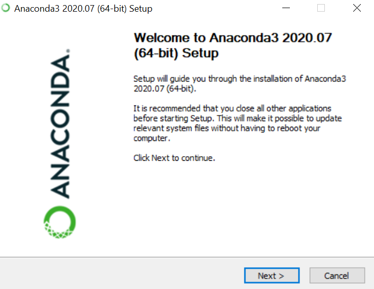

Agree to the License
----------------------

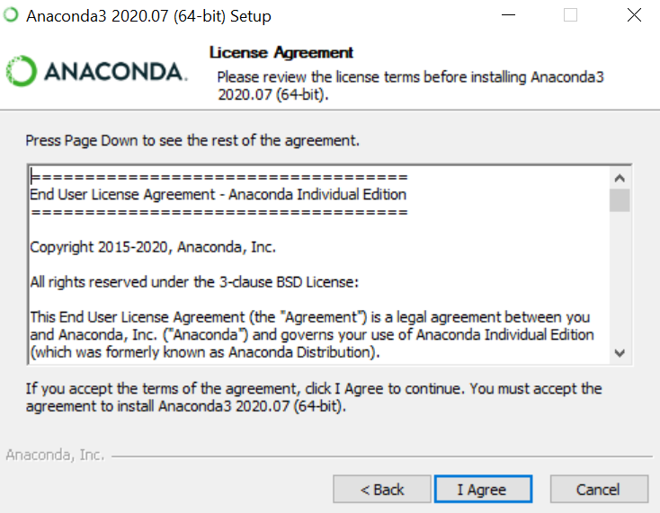

Advanced Installation Options screen
--------------------------------

It is recommended to not check "Add Anaconda to my PATH environment variable"

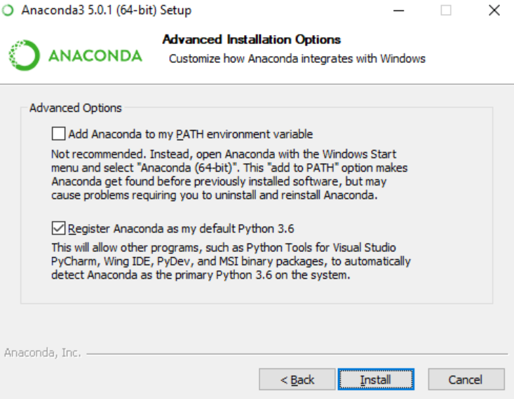

Open the Anaconda Prompt from the Windows start menu
----------------------------------------------------

At the Anaconda prompt, check the ``conda --version``

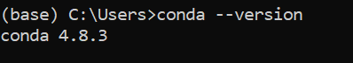
   
Reference Link
------------

* https://problemsolvingwithpython.com/01-Orientation/01.03-Installing-Anaconda-on-Windows/

Create virtual environment using conda
--------------------------------------

Run below command to Create virtual environment using conda.

::

    conda create --name venv python=3.7

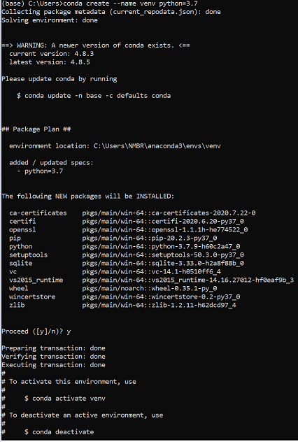

Activate Virtual environment and Check list of python package
---------------------------------------------------------------

Run Below command to activate and check list of python package available by default.

::

    conda activate venv
    python --version
    pip list

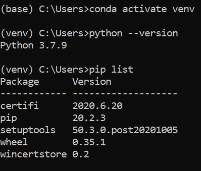

Install Other Dependent Packages
----------------------

Install the other required packages:

::

    pip install -r requirements.txt
   
``requirements.txt`` file is available in the installation directory of Fire Insights : fire-x.y.x/dist/fire/requirements.txt

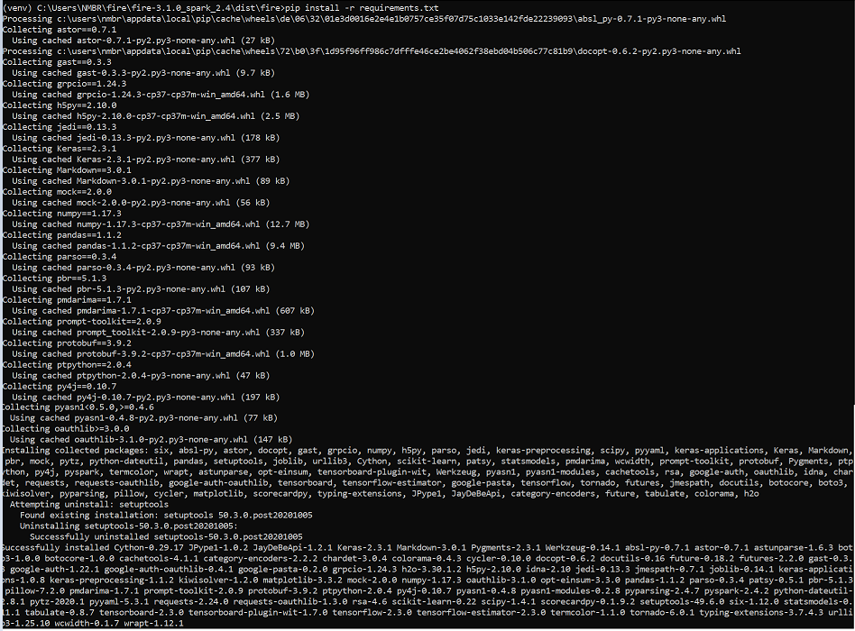

Install dependency for fbprophet package (Windows 10)
----------------------------------------- 

Install pystan:

::

    conda install pystan -c conda-forge

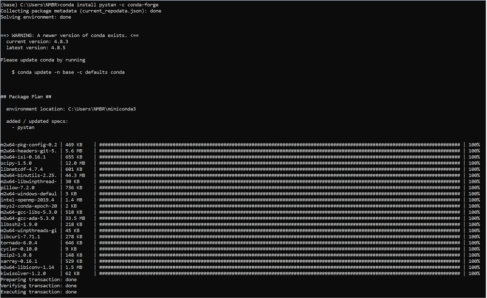

Install fbprophet:

::

    conda install -c conda-forge fbprophet

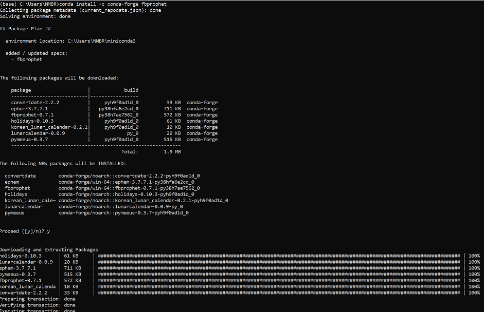

Check the version of fbprophet Installed:

::

    pip list

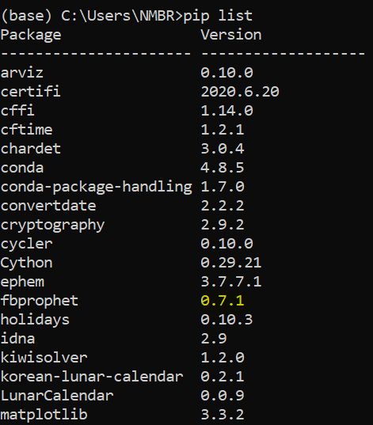

Once the above steps have completed successfully, run the below command to ensure everything was setup correctly.

::

    python ./dist/__main__.py

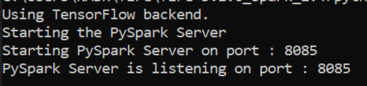

Enable PySpark Engine in Fire Insights
--------------------------------------

Login to Fire Insights application and go to configurations and set ``app.enablePySparkEngine`` to ``true`` and save the changes. Now you can start using PySpark engine in Fire Insights. 

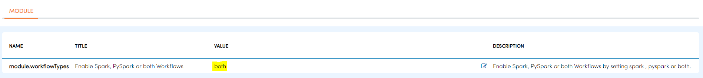

Removing Conda virtual Environment
----------------------------------

::

    conda deactivate
    conda env remove --name name of virtual environment
    Delete those package from exact location

