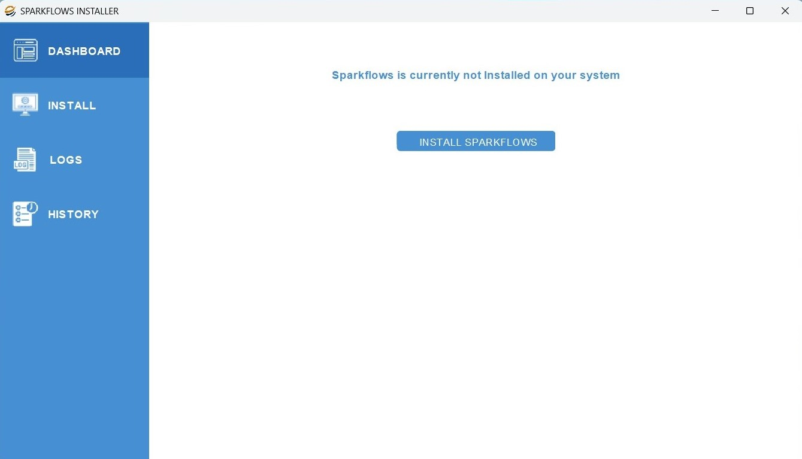
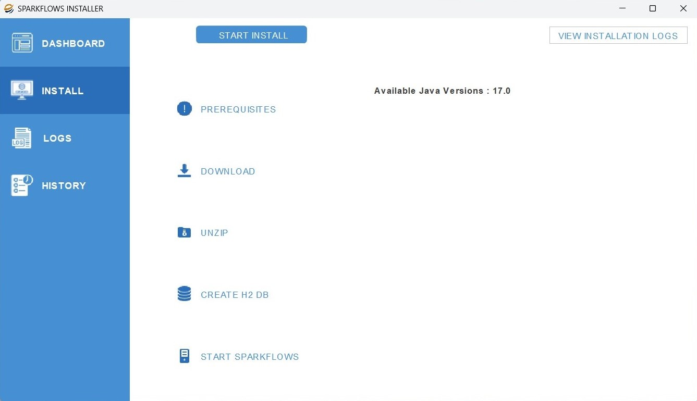
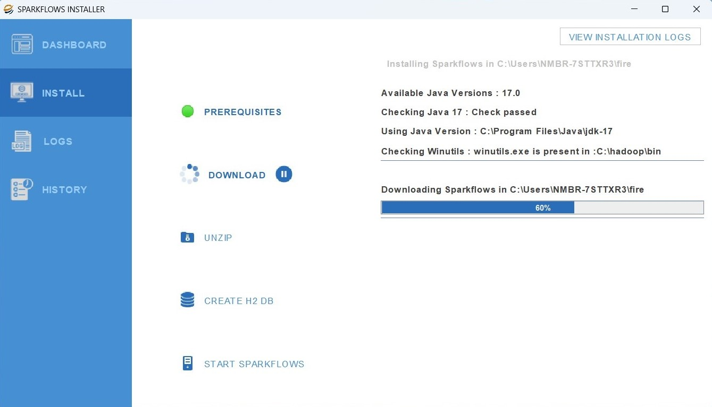
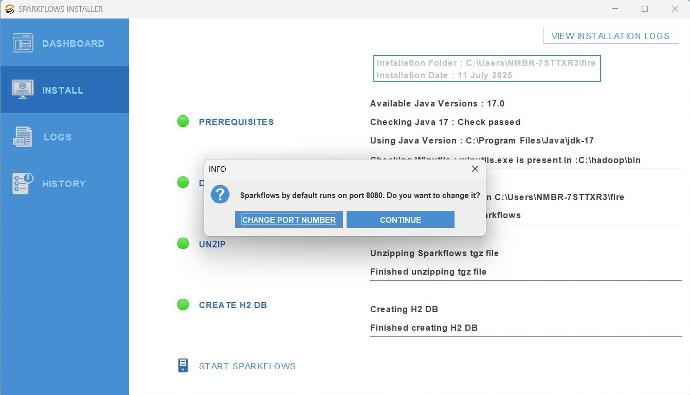
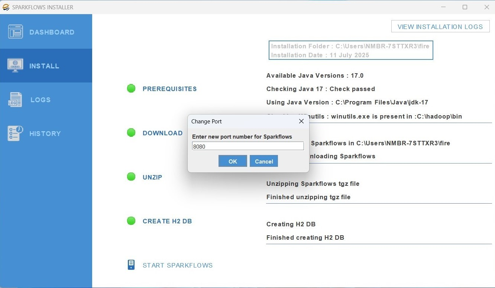
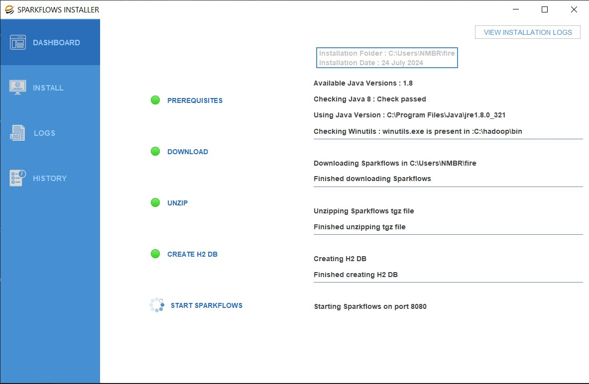
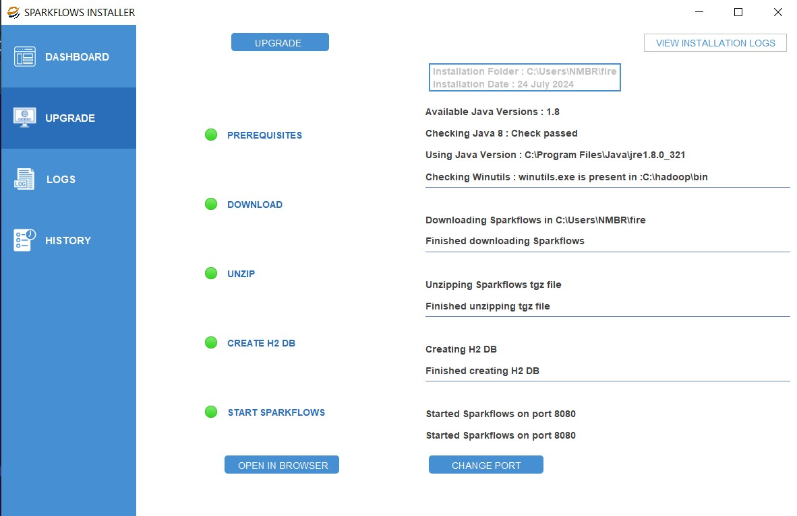
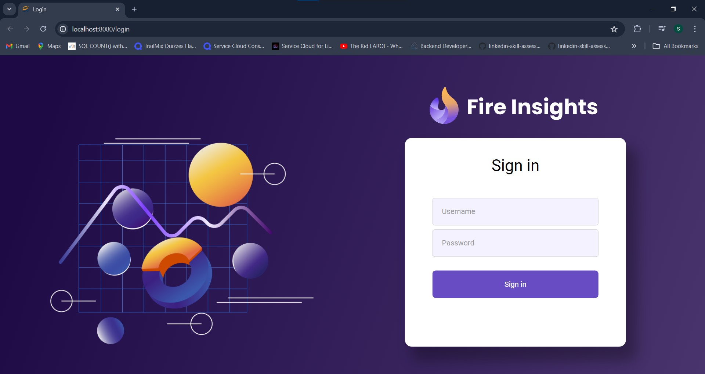
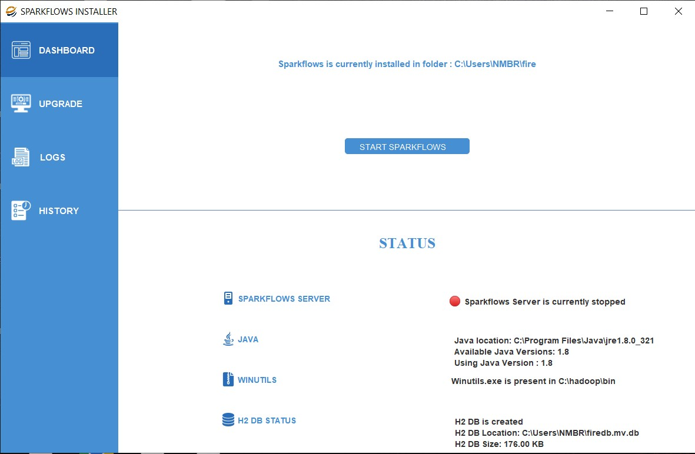
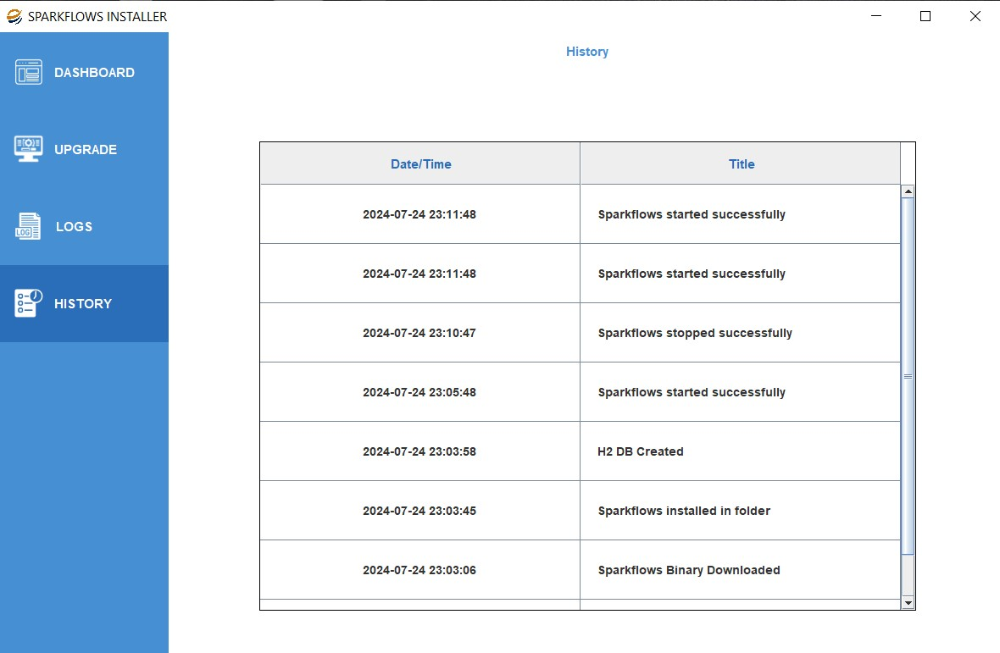

Windows Installer for Laptop and Desktop
====================================

You can download and use the Installer for installing/upgrading Fire Insights on your laptop or desktop.

This is not recommended to use on the server, where you need better control over the Installation process.

Prerequisites
-------------

- JDK 1.8
- Sufficient permission to Download and install Sparkflows in user directory and have write permission to download winutils.exe inside windows directory and set environment path.

Java 8 can be downloaded and installed from here : https://www.oracle.com/java/technologies/javase-jdk8-downloads.html

You may have to set JAVA_HOME after the installation.

.. note::  If you have multiple versions of Java installed on you system, you can update the PATH using the steps outlined in either of the links below:

           * https://javatutorial.net/set-java-home-windows-10
           * https://www.java.com/en/download/help/path.xml
           

Download
--------

Download the installer from : https://www.sparkflows.io/windows-download

Run and Execute
-------

Once Downloaded Open and run the installer file::

The default Installer Dashboard seen on opening the installer is seen below, further on click of the ``Install Sparkflows`` button it will move to the Install Menu.

In the Install Menu, the list of the Available Java Versions currently present in the system will be seen, further click on ``Start Install`` button to start the installation of Sparkflows.

After starting the installtion the Install Menu Dashboard will show further information related to winutils, JAVA version and their paths, it will show the download progress and the location where the file is being downloaded.

After the download of the tgz file, it then unzips the tgz file and starts creating the H2 DB required to start Sparkflows.

.. figure:: ../../_assets/installer/unzipping-creatingdb.jpg
   :alt: Installations
   :width: 60% 

After the H2 DB is created it gives a prompt to choose the port on which the Sparkflows should run (If ``Continue`` button is pressed it would by default run on port 8080).

If we click on ``Change Port Number`` button it will then prompt to enter the new port number, after entering the new port number press ``Ok`` button to start Sparkflows on that port.

Now Starting Sparkflows on port text will be seen on port in the Install Menu Dashboard.

After Sparkflows has started the text Started Sparkflows on port will be seen in the Install Menu Dashboard and will automatically open the browser and navigate to the Sparkflows URL to the login page

Login with the below credentials
    - Username : admin
    - Password : admin

.. note::  On Windows, the PySpark engine will not get installed. Below are he funcationalities that will not be available on bare metal windows install. We recommend either docker on windows to access all functionalities or install Sparkflows on Linux

           * AutoML
           * Prophet
           * ARIMA
           * Scikit learn models
           * Keras/Tensorflow models
           * A few other python native packages.

After Sparkflows has started , navigate to the Installer Dashboard Menu which will be updated with data like Sparkflows Server URL, Status of the Sparkflows Server, Java version being used and its related information, Winutils location, H2 DB status and its related information.

.. figure:: ../../_assets/installer/dashboard-after-start.jpg
   :alt: Installations
   :width: 60% 

If we stop the Sparkflows sever , after clicking the ``Stop Sparkflows`` button , the Installer Dashboard will be updated accordingly.

Logs are also accessible by navigating to the Logs Menu where the below would be seen, and on click of the ``View Server Logs`` or ``View Fire Logs`` buttons would show the respective logs in a new window

.. figure:: ../../_assets/installer/logs-view-page.jpg
   :alt: Installations
   :width: 60% 

History for the actions related to the Sparkflows installer will also be seen in the History Menu in a table with the time when the action took place.

