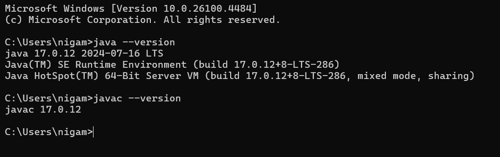

Prerequisites
=============

Check these requirements and install the required components before you install Sparkflows.

Requirements Summary
--------------------

.. list-table::
   :widths: 25 15 60
   :header-rows: 1

   * - Component
     - Needed
     - Details
   * - Windows
     - Required
     - 64-bit Windows 10 or Windows 11.
   * - Memory
     - Required
     - 8 GB RAM minimum; 16 GB recommended.
   * - Disk space
     - Required
     - About 10 GB free: about 2.5 GB for the download, plus the extracted installation and the Python engine environment.
   * - Java
     - Required
     - JDK 17, 64-bit, with ``JAVA_HOME`` set and ``java`` on the ``PATH``. See `Install Java 17`_.
   * - winutils.exe and hadoop.dll
     - Required to run workflows
     - Hadoop native components that Sparkflows uses to read and write files when it runs workflows on Windows. The web application starts without them, but workflows that read or write files fail. See `Install winutils.exe and hadoop.dll`_.
   * - Microsoft C Runtime
     - Required to run workflows
     - Needed by ``hadoop.dll``. See `Install the Microsoft C Runtime`_.
   * - Python 3.9
     - Optional
     - Only to run **Agents** and **Polars** jobs. 64-bit Python, version 3.9.2 or later and below 3.10. See `Install Python 3.9 (Optional)`_.

Install Java 17
---------------

#. Check whether JDK 17 is already installed. Open a Command Prompt and run::

       java -version

   If the output shows version 17, skip to `Set JAVA_HOME and PATH`_. If the command is not found, or shows another version, continue with the steps below.

   .. figure:: ../../../_assets/installation/check-java-installed.png
      :alt: Java is not installed
      :width: 60%

#. Download JDK 17 for Windows from https://www.oracle.com/java/technologies/javase/jdk17-archive-downloads.html. On that page, find **Windows x64 Installer** and download the **.exe** file. Sign in to an Oracle account when prompted; create one if needed.

#. Run the downloaded **.exe** file to start the JDK installation.

   .. figure:: ../../../_assets/installation/install-wizard-jdk.png
      :alt: JDK installation wizard
      :width: 60%

#. Click **Next**. Keep the default installation folder, and click **Next** again.

   .. figure:: ../../../_assets/installation/installation-path-jdk.png
      :alt: JDK installation folder
      :width: 60%

#. When the installation completes, click **Close**.

   .. figure:: ../../../_assets/installation/close-jdk.png
      :alt: JDK installation complete
      :width: 60%

Set JAVA_HOME and PATH
++++++++++++++++++++++

#. Add a system environment variable ``JAVA_HOME`` set to the JDK installation folder, for example ``C:\Program Files\Java\jdk-17``.

   .. figure:: ../../../_assets/installation/java_home.png
      :alt: JAVA_HOME environment variable
      :width: 60%

#. Add ``%JAVA_HOME%\bin`` to the system ``PATH`` variable.

   .. figure:: ../../../_assets/installation/path_env.png
      :alt: PATH environment variable
      :width: 60%

#. Open a **new** Command Prompt, so that it picks up the new variables.

If more than one Java version is installed, make sure ``%JAVA_HOME%\bin`` comes before the other Java folders in ``PATH``.

Install winutils.exe and hadoop.dll
-----------------------------------

Sparkflows uses Hadoop libraries to read and write files when it runs workflows. On Windows, these need two native files, ``winutils.exe`` and ``hadoop.dll``, in a Hadoop folder. Install them before you run workflows.

#. Create the folder ``C:\hadoop\bin``.

   .. figure:: ../../../_assets/installation/create-bin_directory.PNG
      :alt: hadoop bin folder
      :width: 60%

#. Download ``winutils.exe`` from https://sparkflows-release.s3.amazonaws.com/fire/winutils.exe and save it as ``C:\hadoop\bin\winutils.exe``.

   .. figure:: ../../../_assets/installation/winutils.PNG
      :alt: winutils.exe in the hadoop bin folder
      :width: 60%

#. Download ``hadoop.dll`` for Hadoop 3.3.x from https://github.com/kontext-tech/winutils/blob/master/hadoop-3.3.0/bin/hadoop.dll and save it as ``C:\hadoop\bin\hadoop.dll``.

#. Add a system environment variable ``HADOOP_HOME`` set to ``C:\hadoop``.

   .. figure:: ../../../_assets/installation/hadoop_environment.PNG
      :alt: HADOOP_HOME environment variable
      :width: 60%

#. Add ``%HADOOP_HOME%\bin`` to the system ``PATH`` variable. Windows loads ``hadoop.dll`` from the folders in ``PATH``, so it does not need to be copied anywhere else.

   .. figure:: ../../../_assets/installation/hadoop_environment_path.PNG
      :alt: PATH with HADOOP_HOME
      :width: 60%

Install the Microsoft C Runtime
-------------------------------

Download and install the Microsoft Visual C++ Redistributable for your system architecture (x64 for 64-bit Windows) from https://www.microsoft.com/en-us/download/details.aspx?id=40784. The Hadoop native components need it.

Install Python 3.9 (Optional)
-----------------------------

Install Python only if you will run **Agents** or **Polars** jobs. Sparkflows itself does not need it.

* Install **64-bit** Python 3.9, version 3.9.2 or later and below 3.10. Python 3.9.0, 3.9.1 and 3.10 or later are not supported. Download it from https://www.python.org/downloads/windows/, for example `Python 3.9.13 64-bit <https://www.python.org/ftp/python/3.9.13/python-3.9.13-amd64.exe>`_.
* On Windows on ARM, install the **x64** build of Python. It runs under the built-in emulation.
* Visual Studio C++ Build Tools and Windows Developer Mode are **not** required.

Sparkflows creates its own Python environment from this Python during installation. See :doc:`windows-install`.

Verify the Prerequisites
------------------------

Open a **new** Command Prompt and run each check:

.. list-table::
   :widths: 35 65
   :header-rows: 1

   * - Command
     - Expected result
   * - ``java -version``
     - Shows version ``17``, and ``64-Bit`` in the last line.
   * - ``where java``
     - The first line is inside your ``JAVA_HOME`` folder.
   * - ``echo %JAVA_HOME%``
     - The JDK 17 installation folder.
   * - ``echo %HADOOP_HOME%``
     - ``C:\hadoop``
   * - ``where winutils``
     - ``C:\hadoop\bin\winutils.exe``
   * - ``dir C:\hadoop\bin\hadoop.dll``
     - Lists ``hadoop.dll``.
   * - ``py -3.9 --version`` (optional)
     - ``Python 3.9.x``, with ``x`` 2 or later. Only needed for Agents and Polars.

When all the checks pass, continue to :doc:`windows-install`.
