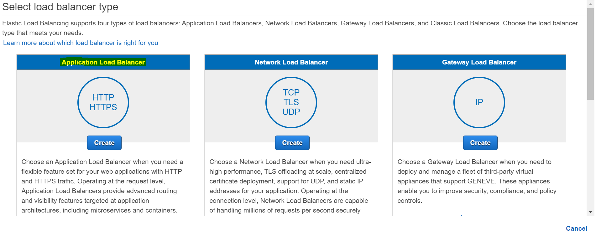
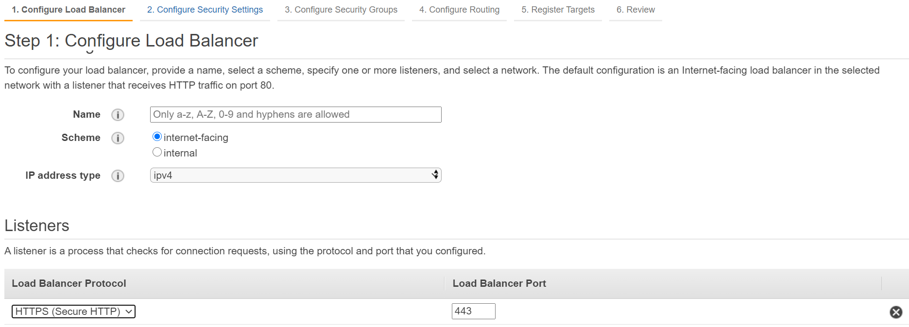

AWS Application Load Balancer
===========================

This document explains the steps for creating ``Application Load Balancer`` in AWS and configuring it for Sparkflows.

Below are steps involved in creating application load balancer in AWS:

Login with AWS console and search for load balancer with EC2 feature
----------

.. figure:: ../..//_assets/loadbalancer/loadbalncer_search.PNG
   :alt: Load balancers
   :width: 60%

Create load balancer and select application load balancer
-------

   
Configure load balancer
--------
 
::
 
    Add Name
    Scheme : internet-facing
    IP address type : ipv4
    Listeners : HTTPS: 443
    Availability Zones
    VPC : select VPC where application vm is running.
    Availability Zones : select the specific zone.
 

 
Configure security settings
--------

Select default certificate.

AWS Certificate Manager (ACM) is the preferred tool to provision and store server certificates. If you previously stored a server certificate using IAM, you can deploy it to your load balancer.

::

    Certificate type
    Certificate name
    Security policy
    
.. figure:: ../..//_assets/loadbalancer/loadbalancer_certificate.PNG
   :alt: Load balancers
   :width: 60%

.. note::  Make sure to add certificate either through ACM or IAM.
   
   https://docs.aws.amazon.com/elasticbeanstalk/latest/dg/configuring-https-ssl-upload.html
   
Select security policy
--------

::

    Security policy : Select existing or create new security policy.
   

Configure routing
----------

::

    Target group
    Name : A name of target group
    Target type :  Instance
    Protocol : HTTPS
    Port :443
    Protocol version : HTTP1
    Register Target
    
Port forwarding
-------

Sparkflows by default runs on port 8080 for HTTP and 8443 for HTTPS. Make sure to forward HTTP or HTTPS to specified ports on which Sparkflows is running.

::

    sudo firewall-cmd --add-forward-port=port=443:proto=tcp:toport=8443 --permanent
    sudo firewall-cmd --reload    
