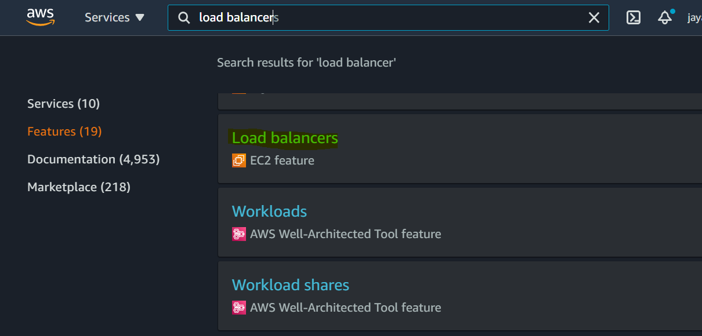
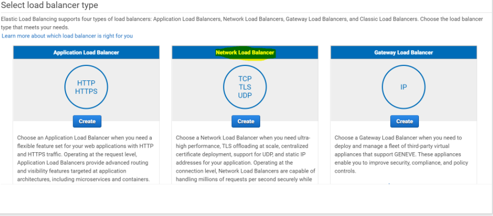
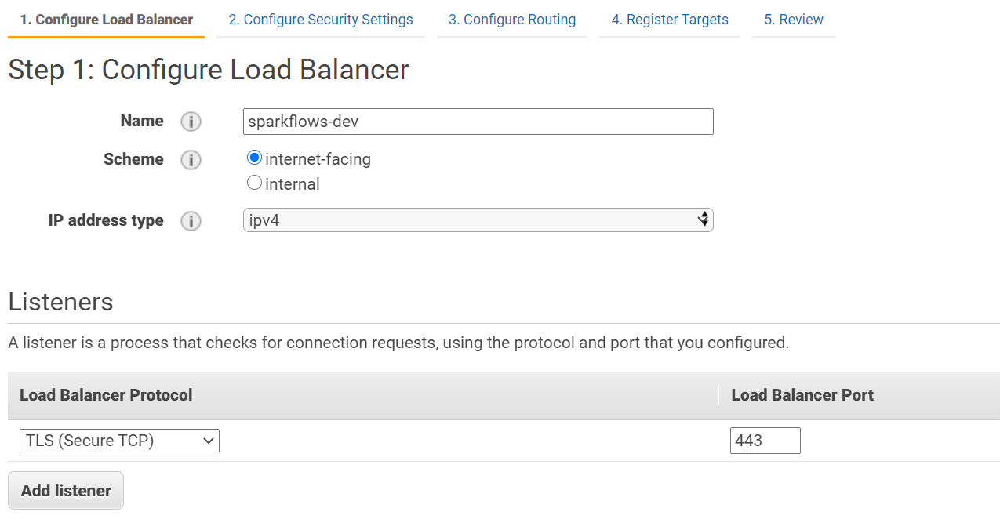
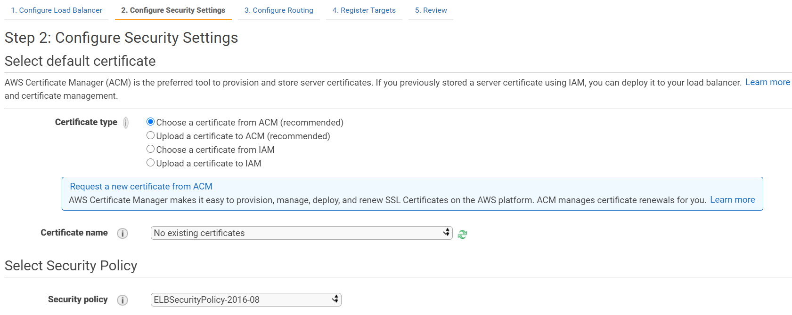
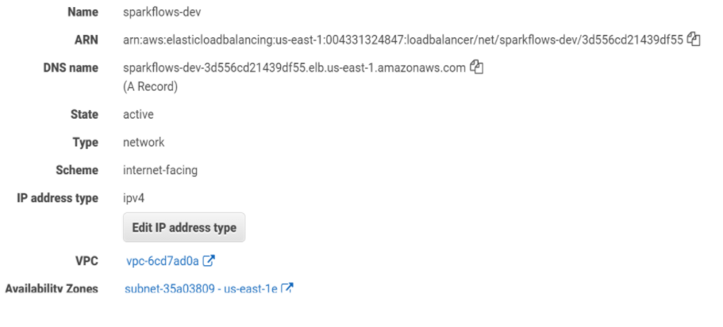

AWS Network Load Balancer
==========================

It explains about creating network load balancer in AWS and configuring VM running with Sparkflows.

Below are steps involved in creating network load balancer in AWS:

Login with AWS console and search for load balancer with EC2 feature
------

Create load balancer and select network load balancer
------

   
Configure load balancer
--------
 
::
 
    Add Name
    Scheme : internet-facing
    IP address type : ipv4
    Listeners
    Load Balancer Protocol : TLS (SECURETCP)  Port: 443
    Availability Zones
    VPC : select VPC where application vm is running.
    Availability Zones : select the specific zone.

Configure security settings
------

Select default certificate.

AWS Certificate Manager (ACM) is the preferred tool to provision and store server certificates. If you previously stored a server certificate using IAM, you can deploy it to your load balancer.

::

    Certificate type
    Certificate name
    Security policy
    

.. note::  Make sure to add certificate either through ACM or IAM
   
   https://docs.aws.amazon.com/elasticbeanstalk/latest/dg/configuring-https-ssl-upload.html

Configure Routing
--------

::

    Target group
    Name : A name of target group
    Target type :  Instance
    Protocol : TCP
    Port : 80 
    Register Target

Port forwarding
--------

As Sparkflows by default running on port 8080 for HTTP & 8443 for HTTPS, make sure to forward HTTP or HTTPS to specified port on which Sparkflows is running.

::

    sudo firewall-cmd --add-forward-port=port=443:proto=tcp:toport=8443 --permanent
    sudo firewall-cmd --reload

   
