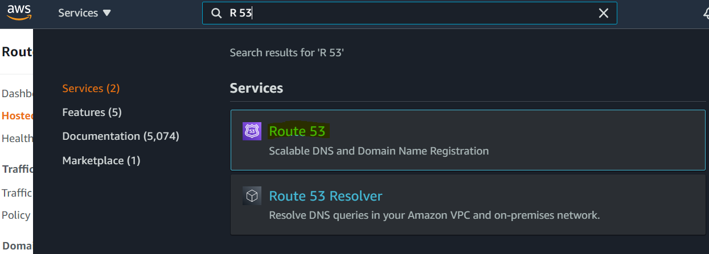
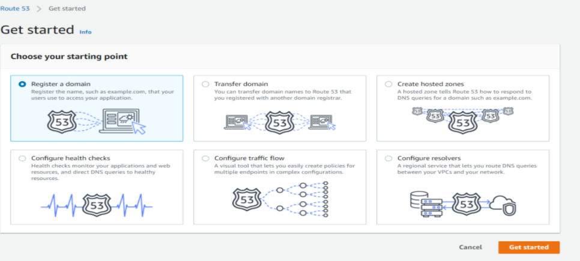
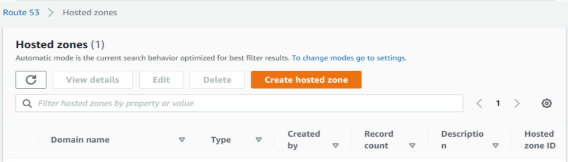
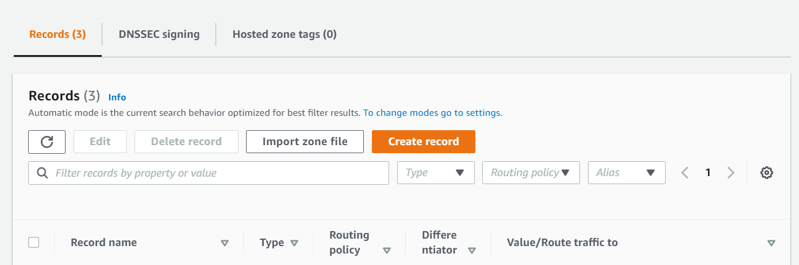
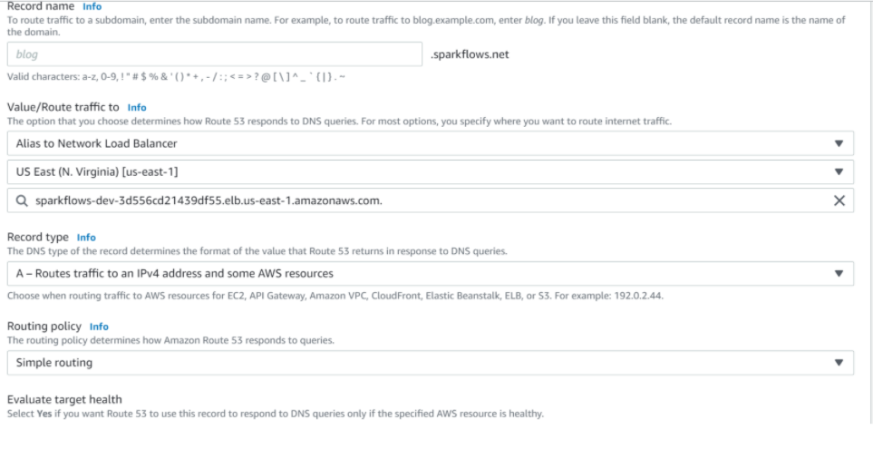

Route 53 
==========

This page explains the steps for configuring "Route 53" with network load balancer.

Login to AWS console and type "R 53" in search box
--------

Sign in to the AWS Management Console and open the Route 53 console at https://console.aws.amazon.com/route53/

Get started with R 53 Dashboard
--------

:: 
 
    Register a domain.
    

Hosted zone
-------

Create hosted zone.

   
Create records
------

Create records and Registered Network load balancer to it.

::

    Value/Route traffic to : Alias to Network LB
    Select Zone
    By default load balancer domain name should be populated.
    Record type : A -Routes traffic to IPV4 address and some aws resources.
    Routing policy : Simple Routing
    

