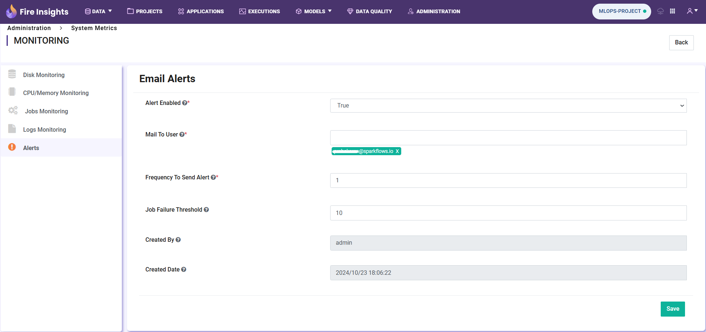

Email Alerts
=============

This document outlines the steps to **Configure** the email alerts for Sparkflows executions.

Follow the steps given below:

Step 1 : Login to Sparkflows
+++++++++
**Login** to the Sparkflows using your credentials. 

Step 2 : Navigate to the Alerts Page
+++++++++
Navigate to **Administration -> Monitoring -> Alerts**

On the Alerts page, you'll see options to configure email alerts for Sparkflows executions.

Step 3 : Fill in Alert Configuration Details
++++++++++

Now, complete the following details to **set up** email alerts:

* **Alert Enabled**

 * It enables or disables the email alert functionality.
 * To enable it set it to 'True' from the dropdown option.

* **MailToUser**

 * Specify the recipient email addresses in this field. 
 * Separate multiple addresses using commas.

* **FrequencyToSendAlert**

 * It defines how often Sparkflows will check for executions or failures.
 * If no executions occur or the number of failures increases, an email alert is sent.

  .. figure:: ../../_assets/alerts/alert-no-executions.png
      :alt: alert-no-executions
      :width: 60%

* **JobFailureThreshold**

 * It monitors the execution failure rate within a specified time frame.
 * For example: Set a failure rate threshold (e.g., 50%) for executions. If the execution failure rate exceeds this threshold within the specified time frame, an alert email is triggered.

  .. figure:: ../../_assets/alerts/alert-execution-exceeds-failure.png
      :alt: alert-execution-exceeds-failure
      :width: 60%

.. note:: 

 * **FrequencyToSendAlert:**
   For example, if the Alert Frequency is set to 5 minutes, the Sparkflows scheduler will check if any workflow/pipeline has been executed within the last 5 minutes. If no executions have occurred during this period, it will trigger an alert email notification.
 
 * **JobFailureThreshold:**
   For example, if the user schedules the workflow/pipeline to run every minute and sets the Alert Frequency to 5 minutes, the workflow/pipeline will be executed 5 times within that period. The Sparkflows scheduler then calculates the Job Failure Threshold, say 50%. If all 5 executions fail, resulting in a 100% failure rate—exceeding the 50% threshold—the system will trigger an alert email notification.

