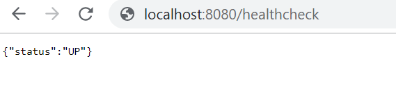

Health Check
============

This document outlines steps for checking the health status of Sparkflows.

Follow the steps given below:

Step 1 : Open Your Browser
----------------------------------

Navigate to your preferred web browser.

Step 2 : Enter the Health Check URL
--------------------------------------------

Type the following URL into the browser's address bar:

::
   
    http://localhost:8080/healthcheck

Step 3 : Check the Response
---------------------------------
After hitting enter, you should see a response similar to:

::

    {"status":"UP"}

    
.. note::  Make sure to change the localhost to your domain name or your IP if Sparkflows is running on a different machine.
