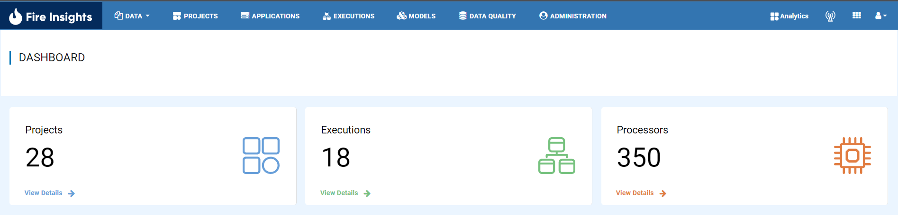
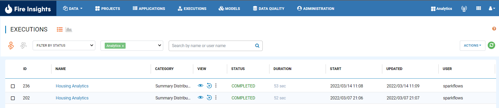
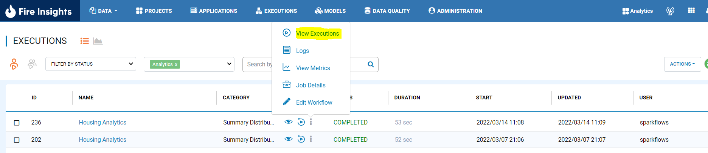
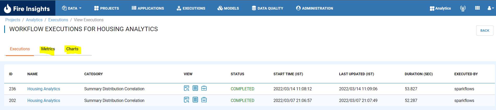
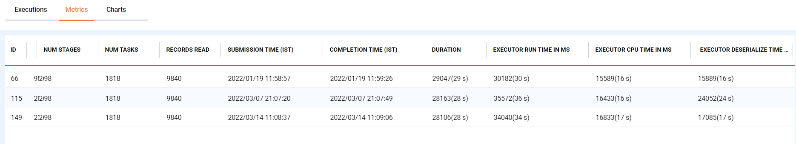
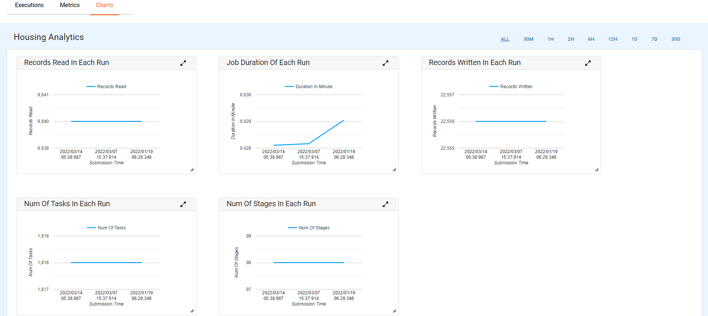

Job Metrics
=========

Fire Insights enable you to see job metrics.

Below are steps on how to view metrics in Fire Insights:

1. Login to Fire Insights application.

2. Execute a workflow.
3. Go to Executions page.

4. Select View Executions.

5. Now you will be able to see metrics and chart tab respectively.

   

