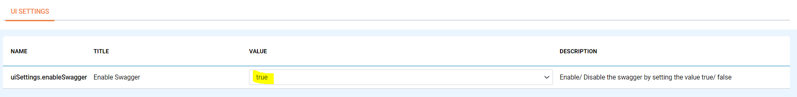
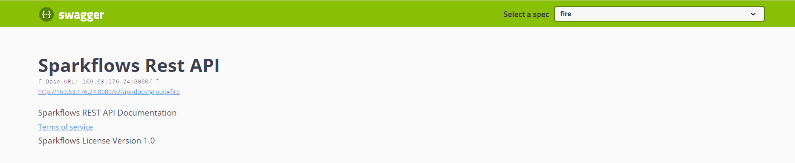

Swagger REST API's
=========

Fire Insights enables you to use ``Swagger REST API'S``. It can be accessible only when the admin provides the privilge to access it.

Below are the required steps:

1. Enable Swagger inside ``application.properties``.

Enable Swagger by adding the following line next to application.properties :
::

    swagger.enable=true
    fire.cors.enable=true
    fire.security.csrf.enable=false

2. Enable it from configurations page.

Once the above configurations are updated and the Fire server gets restarted, login to the Fire Insights application and enable the following configurations :

3. Now you can access Swagger REST API'S using the following URL.

Login to the below-mentioned URL :

::

    https://localhost:port/swagger-ui.html
    

    
.. note::  Make sure to change the localhost with respective IP or domain name and the port on which the Fire Insights is running.    

