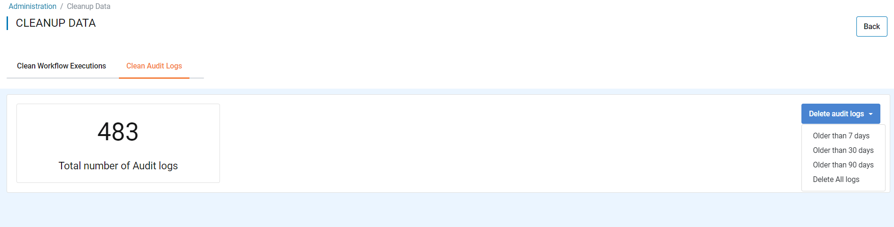

Regular Maintenance Tasks
==============

It is important to do a few maintenance tasks regularly to have Fire Insights running smoothly over time.

Commands cheatsheet for H2 DB is available at : https://docs.sparkflows.io/en/latest/commands/h2-db.html

Backing up H2 DB
----------------

Fire Insights can be run with the embedded H2 DB, or when an external database like MySQL, SQL Server etc.

It is important to back up the database regularly.

In order to backup the H2 DB follow the steps below:

* Stop Fire Insights
* Copy the H2 DB files to another folder. This file is normally named firedb.mv.db.
* Start Fire Insights

Cleaning H2 DB
--------------

Fire Insights by default uses the H2 embedded database.

It is important to keep the size of the database in control. All the Fire Insights tables are relatively small except those which store the result of workflow execution.

Cleaning Old Workflow Executions
+++++++++++++++++

It is important to regularly delete the old workflow executions in order to keep the size of the H2 DB in control.

- Go to the Administration/Cleanup Data
- On ''Clean Workflow Executions'' tab, Click on ''Delete workflow executions'' drop down & Delete workflow executions which is older than 30 days.

.. figure:: ../../_assets/installation/clean-up_data.PNG
   :alt: Installations
   :width: 60% 

Cleaning Old Audit logs
+++++++++++++++++++++++

It is important to regularly delete the old Audit logs for cleaning the DB.

- Go to the Administration/Cleanup Data
- On ''Clean Audit Logs'' tab, Click on ''Delete audit logs'' drop down & Delete Audit Logs which is older than 30 days

   

Compact H2 DB File
++++++++++++++++++

By default H2 DB file is in the home folder of the user running Fire Insights. It is named as firedb.mv.db

If the H2 DB file size grows too large (> 3GB), then follow the steps below for compacting it.

* Make a copy of firedb.mv.db file to be safe
* Use the commands below for compacting it::

    java -cp ~/fire-3.1.0/db/h2/h2-1.4.199.jar  org.h2.tools.Shell
    URL: jdbc:h2:./firedb
    Driver : org.h2.Driver
    User : fire
    Password : fire

    SHUTDOWN COMPACT

    
Recreating the H2 DB to further reduce the database size
+++++++++++++

Recreating the H2 DB, drastically reduces the size of the H2 DB. Below are the steps for recreating it.

https://stackoverflow.com/questions/41469066/why-does-recreating-h2-database-reduce-the-size-drastically

* Make a copy of firedb.mv.db file to be safe
* Use the commands below for recreating it

::

    java -cp ~/fire-3.1.0/db/h2/h2-1.4.199.jar  org.h2.tools.Shell
    URL: jdbc:h2:./firedb
    Driver : org.h2.Driver
    User : fire
    Password : fire
    
    SCRIPT TO 'mydb.sql'; 
    DROP ALL OBJECTS; 
    RUNSCRIPT FROM 'mydb.sql';
    
Deleting old files
----------------

Regularly delete the following folders:

* /tmp/fire/workflowlogs
* /tmp/fire/workflows

