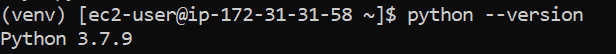
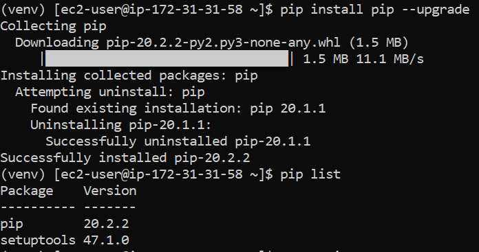
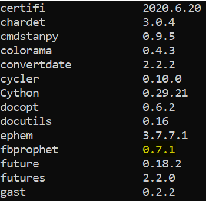

Python Installation on Linux - Redhat/CentOS
============================

Python is only needed if you need to use Python and the PySpark engine in Fire Insights. Python modules in Fire Insights use Python 3.6+.

Check if Python 3.7+ is Installed
----------------

  * ``python --version``
  * ``python3 --version``

Install Python 3 (if not installed)
----------------

Some References for Installing Python:

  * CentOS : https://tecadmin.net/install-python-3-7-on-centos/

Install python3:

Requirements:

Python installation required the GCC compiler on your system, use the following command to install prerequisites for Python before installing it.

  * ``yum install gcc openssl-devel bzip2-devel libffi-devel zlib-devel``

  * Download python from below Link
     * https://www.python.org/downloads/
     * https://www.python.org/ftp/python/3.7.0/Python-3.7.0.tgz

Using below command download and untar it  
------------------------------------------
  
  * ``wget https://www.python.org/ftp/python/3.7.0/Python-3.7.0.tgz``   
  * ``tar xzf Python-3.7.0.tgz``
     
Create Python virtual environment & Activate it
---------------------------------

  * python3 -m venv venv
  * source venv/bin/activate
  * ``python --version``

.. figure:: ../_assets/configuration/venv_python.PNG
   :alt: Installations
   :align: center
   :width: 60%

Upgrade pip version
-------------------

  * ``pip install pip --upgrade``

Install dependency for fbprophet package (CentOS 7)
-----------------------------------------

Run below command with sudo privilege
++++++++++++++++++++++++++++++++++

* ``yum install -y xz-devel``
    
.. figure:: ../_assets/configuration/develop-tool.PNG
   :alt: Installations
   :align: center
   :width: 60%   

* ``yum install centos-release-scl``
  
.. figure:: ../_assets/configuration/scl-tool.PNG
   :alt: Installations
   :align: center
   :width: 60% 
   
* ``yum install devtoolset-7``
  
.. figure:: ../_assets/configuration/devtool7.PNG
   :alt: Installations
   :align: center
   :width: 60%  
 
* ``scl enable devtoolset-7 bash``
* ``gcc --version``
   
.. figure:: ../_assets/configuration/gcc_version.PNG
   :alt: Installations
   :align: center
   :width: 60%    

* ``pip install fbprophet``

.. figure:: ../_assets/configuration/fbprophet.PNG
   :alt: Installations
   :align: center
   :width: 60%

* ``pip list``

Reference
---------

Links
+++++

  * https://linuxize.com/post/how-to-install-gcc-compiler-on-centos-7/

Install Other Packages
----------------------

Install the required packages:

   * cd fire-x.y.x/dist/fire
   * pip install -r requirements.txt
   
``requirements.txt`` file is available in the installation directory of fire insights.

* fire-x.y.x/dist/fire/requirements.txt

Reference
---------

Links
+++++

  * https://docs.aws.amazon.com/cli/latest/userguide/install-linux-python.html
  * https://aws.amazon.com/premiumsupport/knowledge-center/ec2-linux-python3-boto3/
  * https://blog.teststation.org/centos/python/2016/05/11/installing-python-virtualenv-centos-7/
  
Delete a venv
+++++++++++++

   * source venv/bin/activate
   * pip freeze > requirements.txt
   * pip uninstall -r requirements.txt -y
   * deactivate
   * rm -r venv/

Installing pip & wheel
+++++++++++++++++++

  * yum install https://dl.fedoraproject.org/pub/epel/epel-release-latest-7.noarch.rpm
  * yum install python-pip
  * yum install python-wheel
  
  
Add below in .bash_profile
++++++++++++++++++++++++++

  * export PYSPARK_PYTHON=/usr/bin/python3
  * export PYSPARK_DRIVER_PYTHON=/usr/bin/python3  

   
For Ubuntu
----------

  * Ubuntu : https://docs.python-guide.org/starting/install3/linux/
  
   
