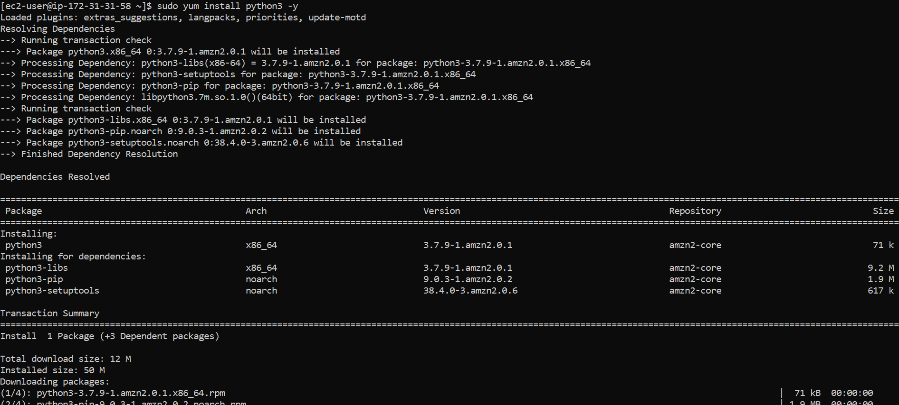
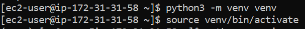

Python Installation on Linux
============================

Python is only needed if you need to use Python and the PySpark engine in Fire Insights. Python modules in Fire Insights use Python 3.6+.

Check if Python 3.6+ is Installed
----------------

  * `python --version`
  * `python3 --version`

Install Python 3 (if not installed)
----------------

Install EPEL repository if needed:

  * https://www.tecmint.com/install-epel-repository-on-centos/
  * yum install epel-release
  
Check if python3 is available in the configured yum repositories:

  * sudo yum list installed | grep -i python3
  
.. figure:: ../_assets/configuration/python-package.PNG
   :alt: Installations
   :align: center
   :width: 60%

Install python3:

  * sudo yum install python3 -y

Create Python virtual environment & Activate it
---------------------------------

  * python3 -m venv venv
  * source venv/bin/activate
  * ``python --version``

.. figure:: ../_assets/configuration/python-version.PNG
   :alt: Installations
   :align: center
   :width: 60%

Upgrade pip version
-------------------

  * pip install pip --upgrade

.. figure:: ../_assets/configuration/pip-upgrade.PNG
   :alt: Installations
   :align: center
   :width: 60%

Install Other Packages
----------------------

Install the required packages:

   * cd fire-x.y.x/dist/fire
   * pip install -r requirements.txt
   
``requirements.txt`` file is available in the installation directory of fire insights.

* fire-x.y.x/dist/fire/requirements.txt

Reference
---------

Links
+++++

  * https://docs.aws.amazon.com/cli/latest/userguide/install-linux-python.html
  * https://aws.amazon.com/premiumsupport/knowledge-center/ec2-linux-python3-boto3/
  * https://blog.teststation.org/centos/python/2016/05/11/installing-python-virtualenv-centos-7/
  

Installing pip & wheel
+++++++++++++++++++

  * yum install https://dl.fedoraproject.org/pub/epel/epel-release-latest-7.noarch.rpm
  * yum install python-pip
  * yum install python-wheel
  
  
Add below in .bash_profile
++++++++++++++++++++++++++

  * export PYSPARK_PYTHON=/usr/bin/python3
  * export PYSPARK_DRIVER_PYTHON=/usr/bin/python3  

   
   
