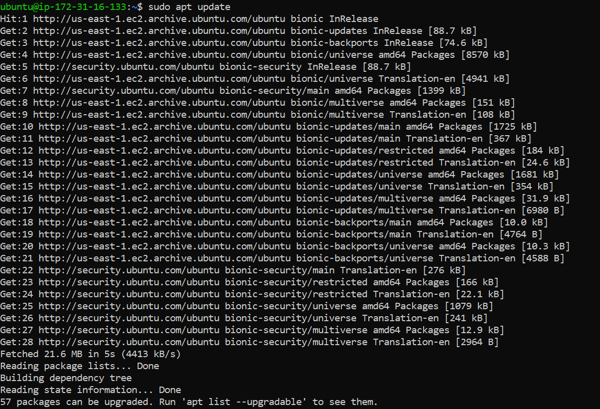
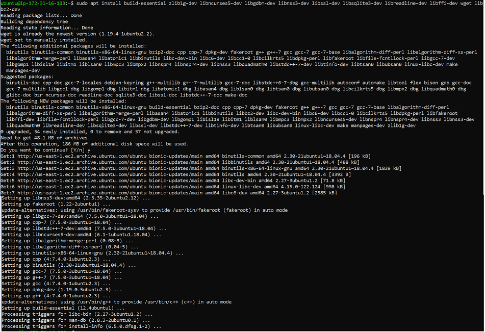
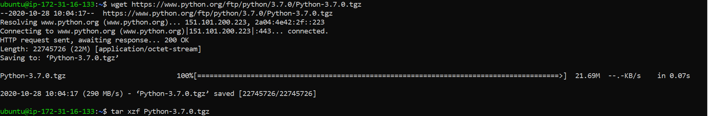
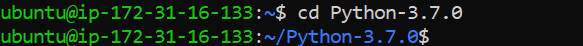

Python Installation on Linux - Ubuntu
============================

Python is only needed if you need to use Python and the PySpark engine in Fire Insights. Python modules in Fire Insights use Python 3.7+.

Check if Python 3.7+ is Installed
----------------

  * ``python --version``
  * ``python3.7 --version``

Install Python 3.7 (if not installed)
----------------

Some References for Installing Python:

* Ubuntu : https://linuxize.com/post/how-to-install-python-3-7-on-ubuntu-18-04/

Prerequisites
+++++++++++++

update the packages list and install the packages necessary to build Python source:

  * ``sudo apt update``
  * ``sudo apt install build-essential zlib1g-dev libncurses5-dev libgdbm-dev libnss3-dev libssl-dev libsqlite3-dev libreadline-dev libffi-dev wget libbz2-dev``
   

  

Download and extract the downloaded package  
++++++++++++++++++++++++++++++
  
  * Download the latest release’s source code from the Python download page using the following wget command:
     * https://www.python.org/downloads/
     * https://www.python.org/ftp/python/3.7.0/Python-3.7.0.tgz

  
  * ``wget https://www.python.org/ftp/python/3.7.0/Python-3.7.0.tgz``   
  * ``tar xzf Python-3.7.0.tgz``

Next, navigate to the Python source directory and run the configure script which will perform a number of checks to make sure all of the dependencies on your system are present:

 * ``cd Python-3.7.0``
 

 * ``./configure --enable-optimizations``
 
install the Python binaries by running the following command: 
 
 * ``make altinstall``
 
Note: Do not use the standard make install as it will overwrite the default system python3 binary.

Verify it by typing:

 * ``python3.7 –-version``
