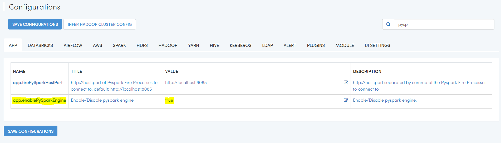

Python Installation on Windows
++++++++++++++++++++++++++++++++

Python is only needed if you need to use Python and the PySpark engine in Fire Insights. Python modules in Fire Insights use Python 3.6+.

Below are steps for installing Anaconda.

  * Download Anaconda from the below Link
     * https://www.anaconda.com/products/individual
     * https://www.anaconda.com/products/individual#Downloads
 

Once the download completes, run the .exe installer

Click Next to confirm the installation
---------------------------------------

.. figure:: ../_assets/installation/anaconda.PNG
   :alt: Installations
   :align: center
   :width: 60%

Agree to the License
----------------------

.. figure:: ../_assets/installation/anaconda_agreement.PNG
   :alt: Installations
   :align: center
   :width: 60%

Advanced Installation Options screen
--------------------------------

It is recommended to not check "Add Anaconda to my PATH environment variable"

.. figure:: ../_assets/installation/anaconda_path.PNG
   :alt: Installations
   :align: center
   :width: 60%

Open the Anaconda Prompt from the Windows start menu
----------------------------------------------------

At the Anaconda prompt, check the `conda --version`.

.. figure:: ../_assets/installation/conda_version.PNG
   :alt: Installations
   :align: center
   :width: 60%
   
Reference Link
------------

* https://problemsolvingwithpython.com/01-Orientation/01.03-Installing-Anaconda-on-Windows/

Install dependency for fbprophet package (Windows 10)
----------------------------------------- 

Install pystan:

* ``conda install pystan -c conda-forge``

.. figure:: ../_assets/installation/conda-pystan.PNG
   :alt: Installations
   :align: center
   :width: 60%

Install fbprophet:

* ``conda install -c conda-forge fbprophet``

.. figure:: ../_assets/installation/fbprophet_conda.PNG
   :alt: Installations
   :align: center
   :width: 60%

Check the version of fbprophet Installed:

* ``pip list``

.. figure:: ../_assets/installation/piplist_conda.PNG
   :alt: Installations
   :align: center
   :width: 60%

Install Other Dependent Packages
----------------------

Install the other required packages:

   * pip install -r requirements.txt
   
``requirements.txt`` file is available in the installation directory of Fire Insights : fire-x.y.x/dist/fire/requirements.txt

Once the above steps have completed successfully, run the below command to ensure everything was setup correctly.

* ``python ./dist/__main__.py``

.. figure:: ../_assets/installation/pyspark_server.PNG
   :alt: Installations
   :align: center
   :width: 60%

Enable PySpark Engine in Fire Insights
--------------------------------------

Login to Fire Insights application and go to configurations and set ``app.enablePySparkEngine`` to ``true`` and save the changes. Now you can start using PySpark engine in Fire Insights. 

