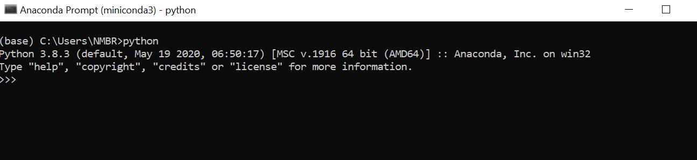

Python Installation on Windows
++++++++++++++++++++++++++++++++

Python is only needed if you need to use Python and the PySpark engine in Fire Insights. Python modules in Fire Insights use Python 3.6+.

Below are steps which intsall miniconda and package involved with it.

  * Download Miniconda from below Link
     * https://docs.conda.io/en/latest/miniconda.html
     * https://repo.anaconda.com/miniconda/Miniconda3-latest-Windows-x86_64.exe
 

Once the download completes, open and run the .exe installer, agree to the license.

At the Advanced Installation Options screen, I recommend that you do not check "Add Anaconda to my PATH environment variable"

Open the Anaconda Prompt from the Windows start menu
----------------------------------------------------

At the Anaconda prompt, type python and hit [Enter]. The python command starts the Python interpreter, also called the Python REPL (for Read Evaluate Print Loop).

Install dependency for fbprophet package (Windows 10)
----------------------------------------- 

* ``conda install pystan -c conda-forge``

.. figure:: ../_assets/installation/conda-pystan.PNG
   :alt: Installations
   :align: center
   :width: 60%

Install Other Dependent Packages
----------------------

Install the other required packages:

   * pip install -r requirements.txt
   
``requirements.txt`` file is available in the installation directory of Fire Insights : fire-x.y.x/dist/fire/requirements.txt

Once the above steps have completed successfully, run the below command to ensure everything was setup correctly.

* ``python ./dist/__main__.py``

.. figure:: ../_assets/installation/pyspark_server.PNG
   :alt: Installations
   :align: center
   :width: 60%

Enable PySpark Engine in Fire Insights
--------------------------------------

Login to Fire Insights application and go to configurations and set ``app.enablePySparkEngine`` to ``true`` and save the changes. Now you can start using PySpark engine in Fire Insights. 

.. figure:: ../_assets/installation/pyspark_url.PNG
   :alt: Installations
   :align: center
   :width: 60%

