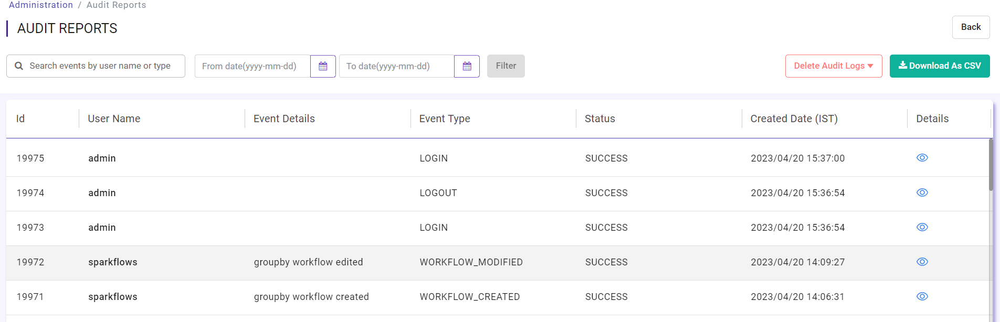
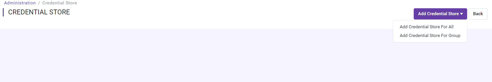
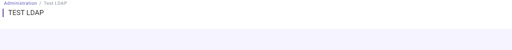
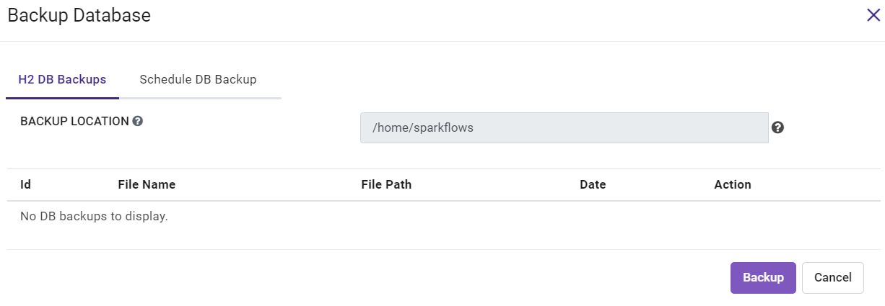
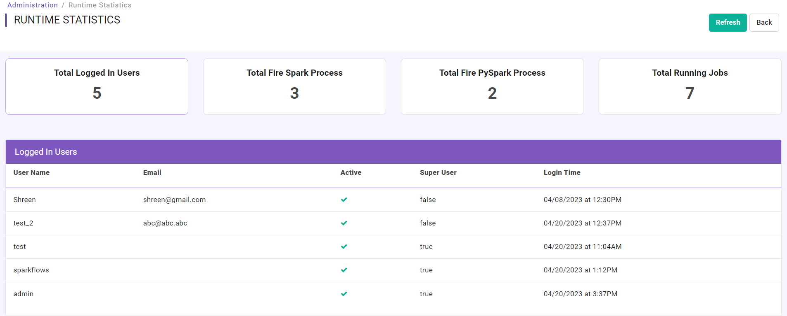
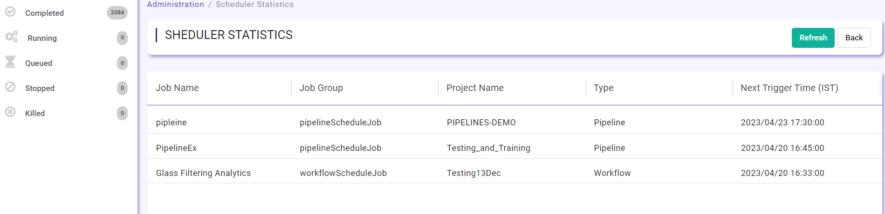

Superuser and Admin Users
===========

Superusers and Admin users have special permissions and rights.

Superuser
---------

A user in Fire Insights can be marked to be a super-user. A Super user has the below permissions:

#. User Management: Create/ Update User
#. Group Management: Create/ Update/ Delete Group
#. Roles Management: Create/ Update/ Delete Roles.
#. A Superuser can share/unshare any project with any group.
#. A Superuser can be created by only a Superuser
#. A Superuser has  by default all Operational permissions like View Server log, update configuration, 
#. A Superuser has access to all Persona: Analytical, Business and Admin Persona.

Admin user
---------

An admin user is one who has ``users.manage`` permission.

     
Permissions for Admin User
-------------

The Admin User has the below permissions:

- users.manage
- groups.manage
- roles.manage
- configurations.manage

Admin User Rights
-----------------

The Admin user has the following rights:

Operating Fire Insights
++++++++++++++++++++++++

In Fire Insights an admin user can do the following administration tasks:

- Manage users, groups, permissions.
- Configure Fire Insights.
- Run diagnostics.
- Usage statistics.
- View YARN Applications.
- Load sample projects.
- Manage Global Connections.
- View server logs.
- Cleanup data.
- View Audit Report.
- Manage Credential store.
- Test LDAP.
- Backup DB (only H2 DB)
- View Runtime statistics.
- View Scheduler Statistics.
- View Cache Statistics.

.. figure:: ../../_assets/security/admin_user/admin_user.PNG
   :alt: security
   :width: 70%

.. figure:: ../../_assets/security/admin_user/admin_operations.PNG
   :alt: security
   :width: 70%

Projects/Data etc
+++++++++++++++++

As regards the projects, the admin user can do the following:

- View all the projects which admin user belongs.
- View the executions of all the workflows which admin user belongs.
- View the executions of all the analytical apps which admin user belongs.
- Create analytics app in project which admin user belongs.

Deleting Users/Groups
++++++++++++++++++++

In Fire Insights, users cannot be deleted, We can delete Groups. But users can be made inactive.

Details on the Admin user rights
--------------------

Diagnostics
++++++++++

The admin user can view detailed informations about machine environments.

.. figure:: ../../_assets/security/admin_user/admin_diagnostic_1.PNG
   :alt: security
   :width: 70%

.. figure:: ../../_assets/security/admin_user/admin_diagnostic_2.PNG
   :alt: security
   :width: 70%
   
.. figure:: ../../_assets/security/admin_user/admin_diagnostic_3.PNG
   :alt: security
   :width: 70%

Usage Statistics
++++++++++++++

The admin user can view total users, groups, roles, projects, workflows & workflows executions.

.. figure:: ../../_assets/security/admin_user/admin_usage_statistics.PNG
   :alt: security
   :width: 70%
   

YARN APPLICATIONS
++++++++++++++

The admin user can view YARN APPLICATIONS if running on Spark Cluster with yarn.

.. figure:: ../../_assets/security/admin_user/admin_yarn_application.PNG
   :alt: security
   :width: 70%

Sample Projects
+++++++++++++

The admin user can reload sample projects, as by default Fire Insights comes with sample projects containing different types of workflows & datasets.

.. figure:: ../../_assets/security/admin_user/admin_sample_project.PNG
   :alt: security
   :width: 70%

.. figure:: ../../_assets/security/admin_user/admin_sample_project_1.PNG
   :alt: security
   :width: 70%

Global Connections
+++++++++++++++++++

The admin user can add connections which everyone can use and also connections at the group level.

.. figure:: ../../_assets/security/admin_user/admin_global.PNG
   :alt: security
   :width: 70%

Server Logs
++++++++

The admin user can view Fire server logs, Fire logs, Fire exception logs & Fire PySpark logs.

.. figure:: ../../_assets/security/admin_user/admin_logs.PNG
   :alt: security
   :width: 70%
   
Cleanup Data
+++++++++++

The admin user can delete old workflow executions for cleaning the DB which is older than  last 7 days or older than last 30 days, older than  last 90 days & delete all executions.

.. figure:: ../../_assets/security/admin_user/admin_cleanup_1.PNG
   :alt: security
   :width: 70%

The admin user can delete old pipeline executions for cleaning the DB which is older than  last 7 days or older than last 30 days, older than  last 90 days & delete all executions.

.. figure:: ../../_assets/security/admin_user/admin_cleanup_2.PNG
   :alt: security
   :width: 70%

The admin user can clean audit logs for cleaning the DB which is older than last 7 days, older than last 30 days, older than last 90 days & delete all logs.

.. figure:: ../../_assets/security/admin_user/admin_cleanup_3.PNG
   :alt: security
   :width: 70%

Audit Report
++++++++++++

The admin user can view, Download audit report of user login, logout & workflow modified.

Credential Store
+++++++++++++++++

The admin user can add credential store. When creating connections, values like username/password etc. can be fetched from the credential store.

TEST LDAP
+++++++++++++++++

The admin user can TEST LDAP configuration if its configured correctly or not (only when ldap properties file is updated)

Backup DB
+++++++++++++++++

The admin user can Backup DB (only if application is running on H2 DB) to Instance at accessible location.

Runtime Statistics
++++++++++++++

The admin user can view total logged in users, total Fire Spark processes, total Fire PySpark processes & total running jobs.

Scheduler Statistics
++++++++++++++

The admin user can view total list of Scheduled jobs.

Cache Statistics
++++++++++++++

The admin user can view Cache Statistics of LoggedIn and data source like Snowflake, Databricks.

.. figure:: ../../_assets/security/admin_user/admin_cache_statistics.PNG
   :alt: security
   :width: 70%
