Admin User
===========

Fire Insights support variety of permissions for roles. Each user can be assigned one or more roles.

Permissions supported by Fire Insights
----------------------

Below are the permissions supported by Fire Insights:

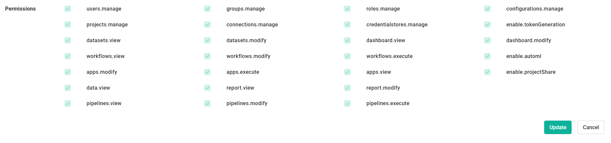
     
     
.. list-table:: 
   :widths: 10 20 
   :header-rows: 1

   * - Title
     - Description
   * - users.manage
     - create, modify & disable user
   * - groups.manage
     - Create, modify & delete the group
   * - roles.manage
     - Create, modify & delete the roles  
   * - configurations.manage
     - modify diifferent configurations  
   * - projects.manage
     - Create, modify & delete the projects
   * - connections.manage
     - manage the connections  
   * - credentialstores.manage
     - manage the credentialstores
   * - enable.tokenGeneration
     - manage token generations
   * - datasets.view
     - view dataset in specified project
   * - datasets.modify
     - modify datasets in specified project
   * - dashboard.view
     - view dashboard
   * - dashboard.modify
     - modify the dashboard
   * - workflows.view
     - view workflows in specified project
   * - workflows.modify
     - modify workflows in specified project
   * - workflows.execute
     - execute workflow in specified project
   * - enable.automl
     - enable automl 
   * - apps.modify
     - modify analytics application 
   * - apps.execute
     - execute analytics application
   * - apps.view
     - view analytics application
   * - enable.projectShare
     - enable project share permission  
   * - data.view
     - view data
   * - report.view
     - report view
   * - report.modify
     - report modify
   * -  pipelines.view
     - view  pipelines in specified project
   * -  pipelines.modify
     - modify  pipelines in specified project
   * -  pipelines.execute
     - execute  pipelines in specified project  
     
Permissions for Admin User
-------------

In Fire Insights, generally, the below permissions are associated with Admin features:

- users.manage
- groups.manage
- roles.manage
- configurations.manage

An admin user in Fire Insights is one who has ``users.manage permission``.

Admin User Rights
-----------------

The Admin user gets the following rights:

Operating Fire Insights
++++++++++++++++++++++++

In Fire Insights an admin user can do the following administration tasks:

- Manage users, groups, permissions.
- Configure Fire Insights.
- Run diagnostics.
- Usage statistics.
- View YARN Applications.
- Load sample projects.
- Manage Global Connections.
- View server logs.
- Cleanup data.
- View Audit Report.
- Manage Credential store.
- Test LDAP.
- Backup DB (only H2 DB)
- View Runtime statistics.
- View Scheduler Statistics.
- View Cache Statistics.

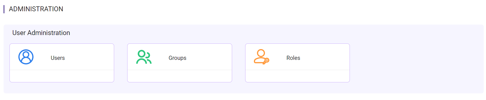

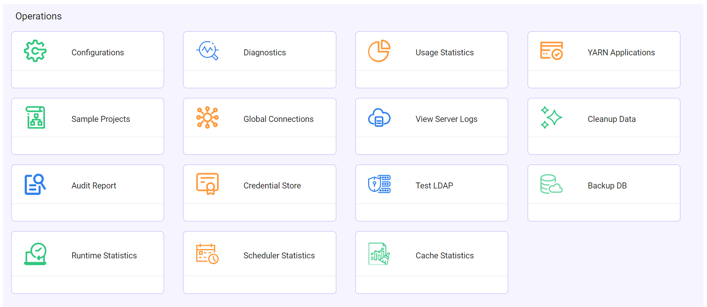

Projects/Data etc
+++++++++++++++++

As regards the projects, the admin user can do the following:

- View all the projects which admin user belongs.
- View the executions of all the workflows which admin user belongs.
- View the executions of all the analytical apps which admin user belongs.
- Create analytics app in project which admin user belongs.

Deleting Users/Groups
++++++++++++++++++++

In Fire Insights, users cannot be deleted. But users can be made inactive.

Superuser
---------

A user in Fire Insights can be marked to be a super-user. A super-user has all the rights exactly similar to that of the admin user, Means it have same Administrative right.
     
Details on the Admin user rights
--------------------

Diagnostics
++++++++++

The admin user can view detailed informations about machine environments.

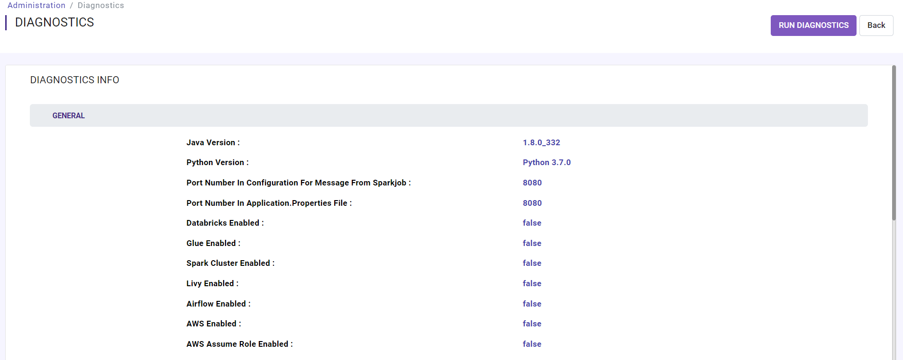

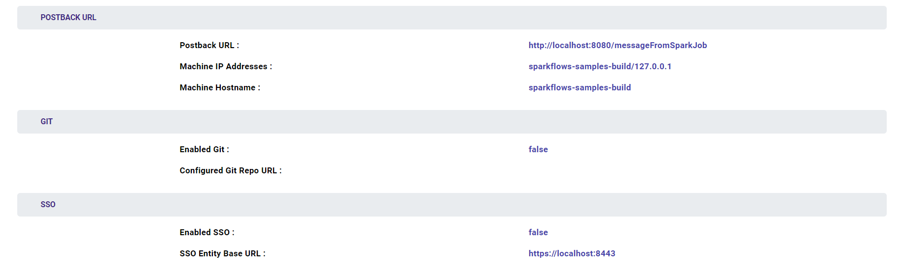
   
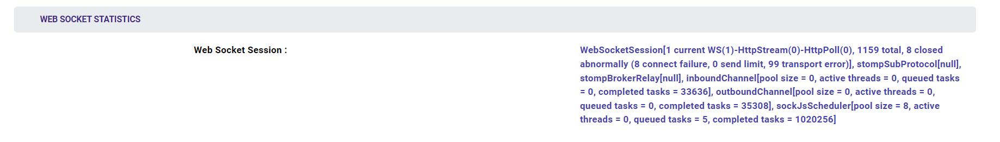

Usage Statistics
++++++++++++++

The admin user can view total users, groups, roles, projects, workflows & workflows executions.

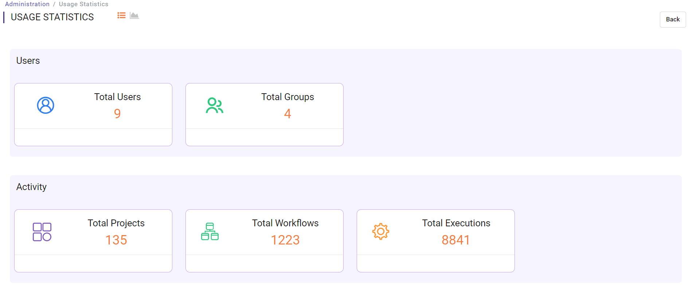
   

YARN APPLICATIONS
++++++++++++++

The admin user can view YARN APPLICATIONS if running on Spark Cluster with yarn.

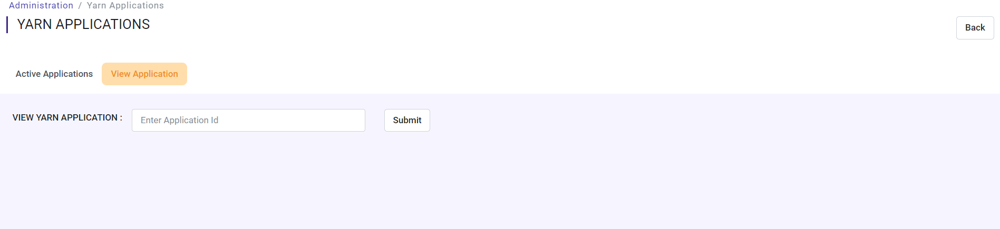

Sample Projects
+++++++++++++

The admin user can reload sample projects, as by default Fire Insights comes with sample projects containing different types of workflows & datasets.

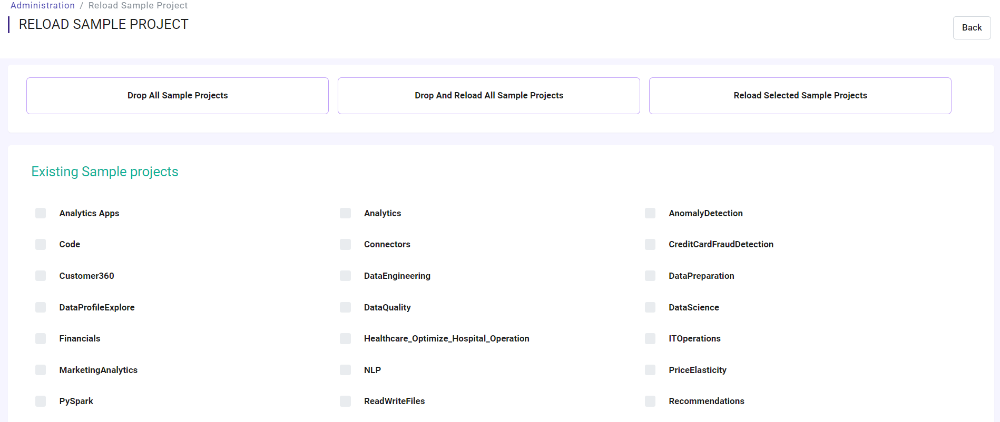

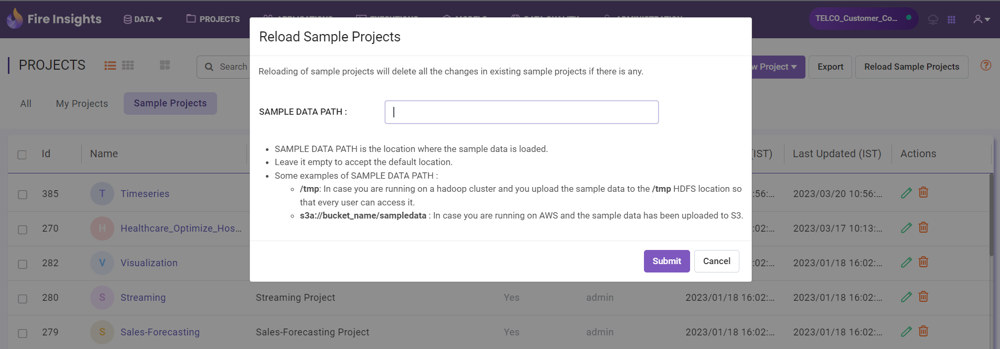

Global Connections
+++++++++++++++++++

The admin user can add connections which everyone can use and also connections at the group level.

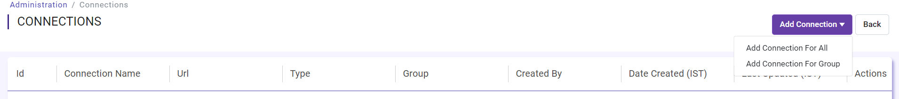

Server Logs
++++++++

The admin user can view Fire server logs, Fire logs, Fire exception logs & Fire PySpark logs.

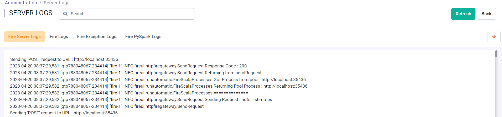
   
Cleanup Data
+++++++++++

The admin user can delete old workflow executions for cleaning the DB which is older than  last 7 days or older than last 30 days, older than  last 90 days & delete all executions.

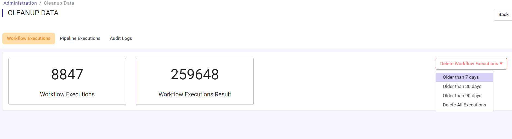

The admin user can delete old pipeline executions for cleaning the DB which is older than  last 7 days or older than last 30 days, older than  last 90 days & delete all executions.

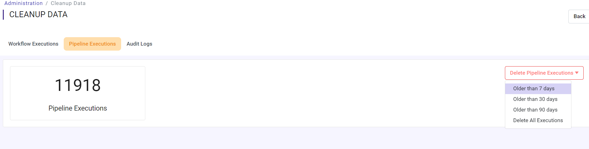

The admin user can clean audit logs for cleaning the DB which is older than last 7 days, older than last 30 days, older than last 90 days & delete all logs.

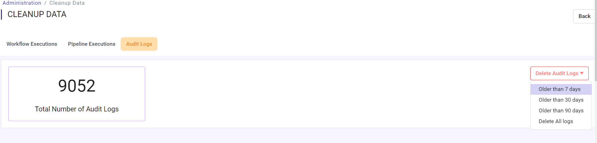

Audit Report
++++++++++++

The admin user can view audit report of user login, logout & workflow modified.

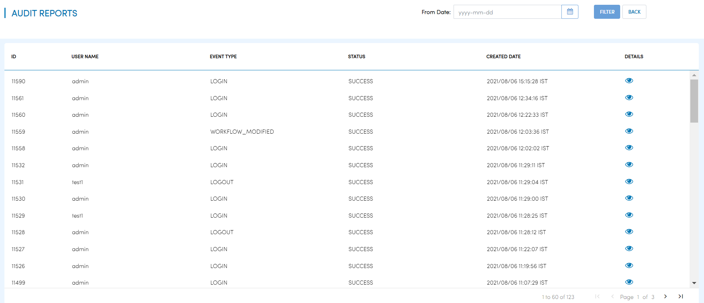

Runtime Statistics
++++++++++++++

The admin user can view total logged in users, total Fire Spark processes, total Fire PySpark processes & total running jobs.

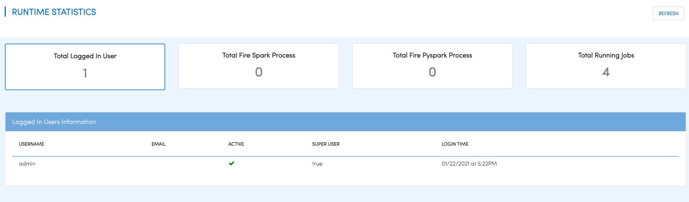

Credential Store
+++++++++++++++++

The admin user can add credential store. When creating connections, values like username/password etc. can be fetched from the credential store.

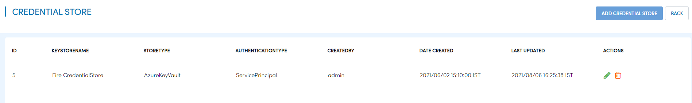
