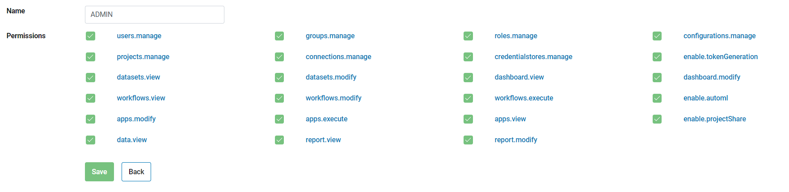
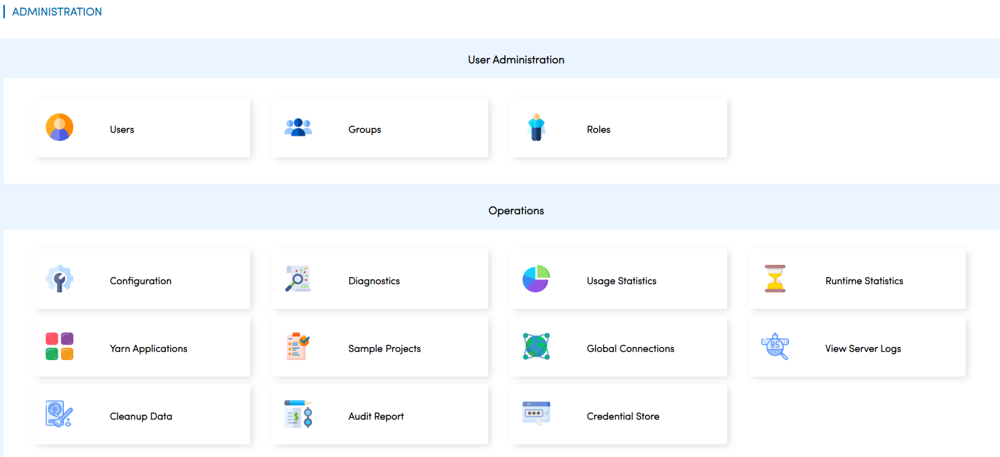
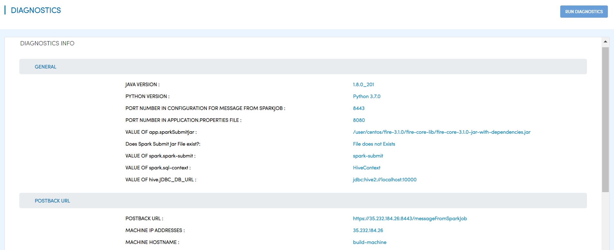
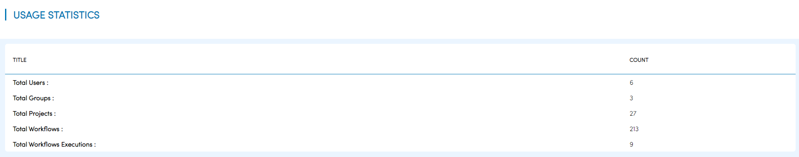
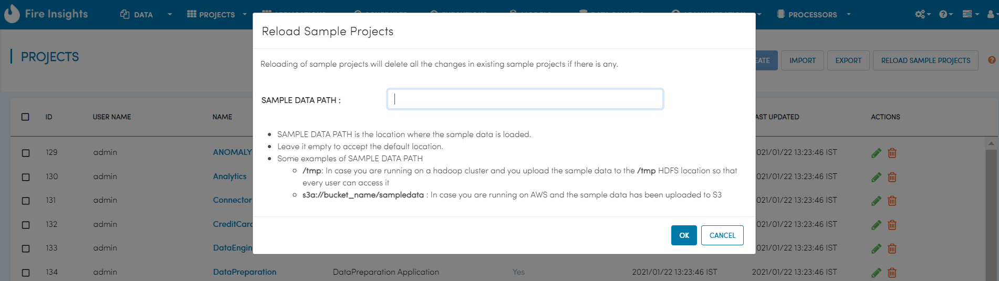
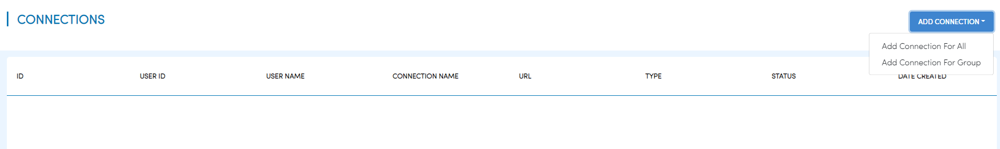
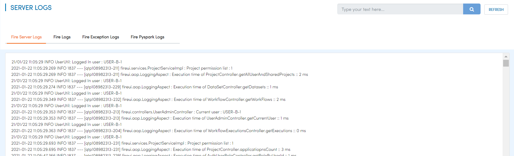
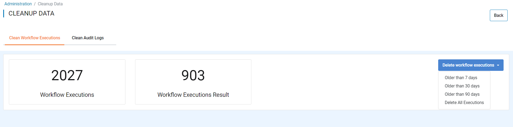
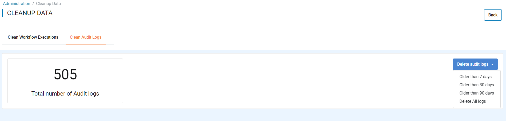

Admin user
===========

Fire Insights support variety of permissions for Roles. Each user can be assigned one more more Roles.

Permissions supported by Fire Insights
----------------------

Below are the permissions supported by Fire Insights.

     
     
.. list-table:: 
   :widths: 10 20 
   :header-rows: 1

   * - Title
     - Description
   * - users.manage
     - create, modify & disable user
   * - groups.manage
     - Create, modify & delete the group
   * - roles.manage
     - Create, modify & delete the roles  
   * - projects.manage
     - Create, modify & delete the projects
   * - configurations.manage
     - modify diifferent configurations   
   * - enable.projectShare
     - enable project share permission
   * - connections.manage
     - manage the connections
   * - credentialstores.manage
     - manage the credentialstores
   * - enable.tokenGeneration
     - manage token generations
   * - datasets.view
     - view dataset in specified project
   * - datasets.modify
     - modify datasets in specified project
   * - dashboard.view
     - view dashboard
   * - dashboard.modify
     - modify the dashboard
   * - workflows.view
     - view workflows in specified project
   * - workflows.modify
     - modify workflows in specified project
   * - workflows.execute
     - execute workflow in specified project
   * - enable.automl
     - enable automl 
   * - apps.modify
     - modify analytics application 
   * - apps.execute
     - execute analytics application
   * - apps.view
     - view analytics application
   * - data.view
     - view data
   * - report.view
     - report view
   * - report.modify
     - report modify
     
Permissions for Admin User
-------------

In Fire Insights generally the below permissions are associated with Admin features

- users.manage
- groups.manage
- roles.manage
- configurations.manage

An admin user in Fire Insights is one who has ``users.manage permission``.

Admin User Rights
-----------------

The Admin user gets the following rights.

Operating Fire Insights
++++++++++++++++++++++++

In Fire Insights an admin user can do the following administration tasks:

- Configure Fire Insights
- Run Diagnostics
- Manage Users, Groups, Permissions
- Load Sample Projects
- View Server Logs
- Cleanup Data
- Usage Statistics
- Runtime Statistics
- Global Connections
- Audit Report
- Credential Store

Projects/Data etc
+++++++++++++++++

As regards to Projects, the Admin user can do the following:

- View all the Projects
- View the executions of all the Workflows
- View the executions of all the Analytical Apps

- Create Analytics App in any Project

Deleting Users/Groups
++++++++++++++++++++

In Fire Insights, users and groups cannot be deleted. Users can be made inactive.

Superuser
---------

A user in Fire Insights can be marked to be a super-user. A super-user has all the same rights as the admin user.
     
Details on the Admin user rights
--------------------

Diagnostics
++++++++++

The admin user can view detailed informations about Machine environments.

Usage Statistics
++++++++++++++

The admin user can view Total Users, Groups, Roles, Projects, Workflows & Workflows Executions

   
Runtime Statistics
++++++++++++++

The admin user can view Total Logged In Users, Total Fire Spark Processes, Total Fire Pyspark Processes & Total Running Jobs

.. figure:: ../../_assets/security/runtime.PNG
   :alt: security
   :width: 60%
   
Sample Projects
+++++++++++++

The admin user can RELOAD SAMPLE PROJECTS, as by default Fire Insights comes with sample projects containing different types of workflows & datasets

Global Connections
+++++++++++++++++++

The admin user can Add Connections which everyone can use and also connections at the Group Level.

Server Logs
++++++++

The admin user can view Fire Server Logs, Fire Logs, Fire Exception Logs & Fire Pyspark Logs

   
Cleanup Data
+++++++++++

The admin user can Delete old workflow executions for cleaning the DB which is Older than  Last 7 days, Older than  Last 30 days, Older than  Last 90 days & Delete All Executions

The admin user can Clean Audit Logs for cleaning the DB which is Older than  Last 7 days, Older than  Last 30 days, Older than  Last 90 days & Delete All Logs.

Audit Report
++++++++++++

The admin user can view Audit Report of user login, logout & Workflow modified.

.. figure:: ../../_assets/security/audit_report.PNG
   :alt: security
   :width: 60%

Credential Store
+++++++++++++++++

The admin user can Add Credential Store, When creating connections, values like username/password etc. can be fetched from the Credential Store

.. figure:: ../../_assets/security/credentialstore.PNG
   :alt: security
   :width: 60%
