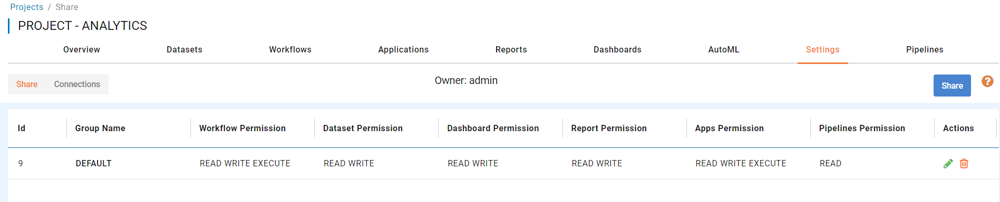

Sharing Projects
================

A project can be shared with multiple groups. A project is visible only to users who belong to the groups with which it has been shared.

Below is a project shared with the **DEFAULT** group:

The following permissions can be granted to a group when sharing the project:

.. figure:: ../../_assets/security/project_group.PNG
   :alt: security
   :width: 60%

All users belonging to the group receive the associated permissions for the project.

