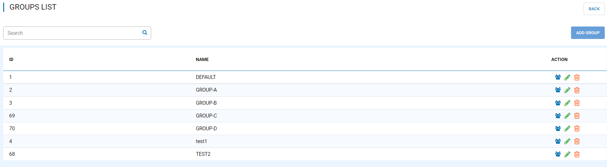
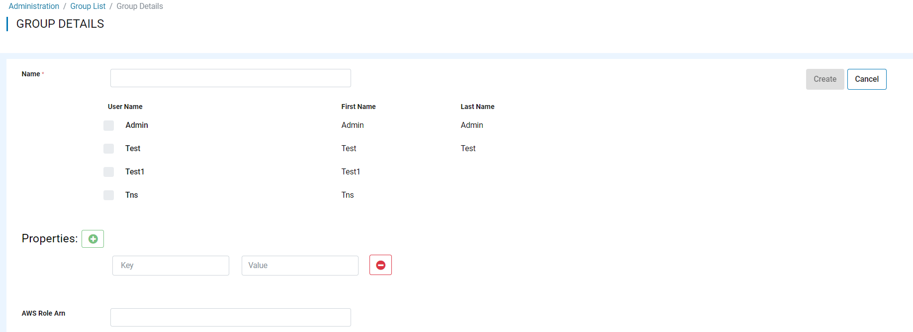
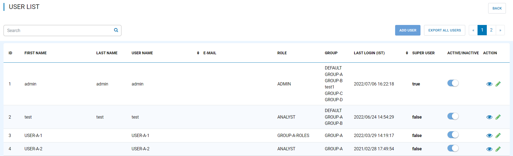
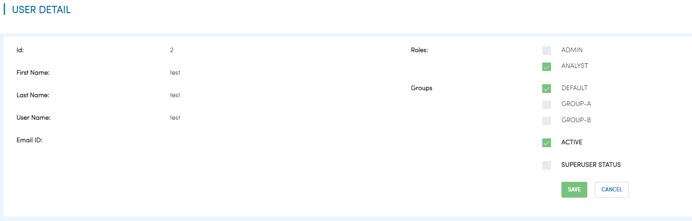
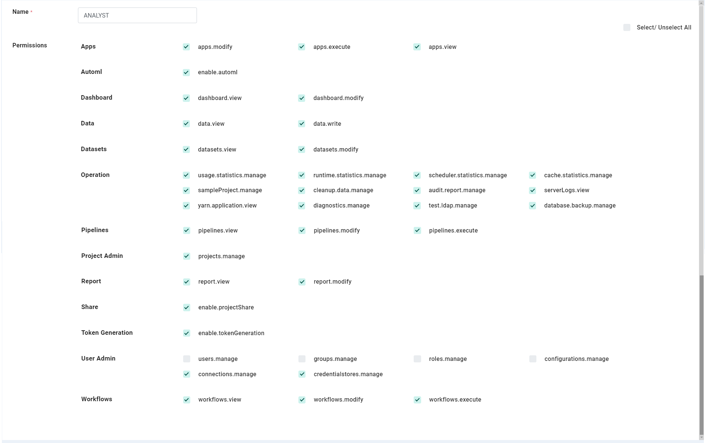
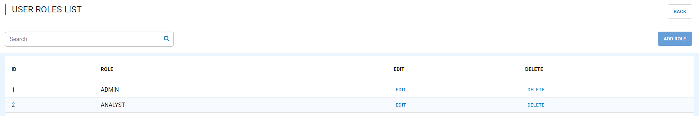

User/Group/Role/Permission
==========================

Fire Insights supports users, groups, roles and permissions. A User can belong to multiple groups and have multiple roles.

Each role can have multiple permissions associated with it.

Groups
------

There can be multiple groups in Fire Insights. A user can belong to one or more groups.

Below are further details associated with each group:

  * Name : Name of the group.
  * Properties : Key and value pair you need to pass.
  * AWS Role ARN : S3 locations which the users of the group can browse and view. Associated with each S3 location is also the IAM role to be assumed.
  * S3 Access Key : The credential to authenticate and authorize access to Amazon Web Services (AWS) resources, such as S3 buckets.
  * S3 Secret Key :  The credential Secret Key. Together, they are used to authenticate and authorize access to Amazon Web Services (AWS) resources, such as S3 buckets.
  * S3 Endpoint URL : The S3 endpoint URL used to access Amazon S3 (Simple Storage Service).

Users
-----

Fire Insights supports multiple users. Each user can belong to multiple groups and also have multiple roles.

Permissions
-----------

Fire Insights supports the following permissions. Permissions are associated with roles.

.. list-table:: 
   :widths: 10 20 
   :header-rows: 1

   * - Title
     - Description
   * - users.manage
     - create, modify & disable user
   * - groups.manage
     - Create, modify & delete the group
   * - roles.manage
     - Create, modify & delete the roles  
   * - projects.manage
     - Create, modify & delete the projects
   * - configurations.manage
     - modify diifferent configurations   
   * - enable.projectShare
     - enable project share permission
   * - connections.manage
     - manage the connections
   * - credentialstores.manage
     - manage the credentialstores
   * - enable.tokenGeneration
     - manage token generations
   * - datasets.view
     - view dataset in specified project
   * - datasets.modify
     - modify datasets in specified project
   * - dashboard.view
     - view dashboard
   * - dashboard.modify
     - modify the dashboard
   * - workflows.view
     - view workflows in specified project
   * - workflows.modify
     - modify workflows in specified project
   * - workflows.execute
     - execute workflow in specified project
   * - enable.automl
     - enable automl 
   * - apps.modify
     - modify analytics application 
   * - apps.execute
     - execute analytics application
   * - apps.view
     - view analytics application
   * - data.view
     - view data
   * - data.write
     - write and read data
   * - report.view
     - report view
   * - report.modify
     - report modify
   * - usage.statistics.manage
     - view usage statistics
   * - runtime.statistics.manage
     - view runtime statistics
   * - scheduler.statistics.manage
     - view scheduler statistics
   * - cache.statistics.manage
     - view cache statistics
   * - sampleProject.manage
     - reload sampleProject
   * - cleanup.data.manage
     - cleanup data
   * - audit.report.manage
     - view, export and delete audit report
   * - serverLogs.view
     - view serverLogs
   * - yarn.application.view
     - view and search yarn application
   * - diagnostics.manage
     - run diagnostics
   * - test.ldap.manage
     - test ldap configurations
   * - database.backup.manage
     - backup database and scheduled
   * - enable.tokenGeneration
     - enable tokenGeneration
   * - pipelines.view
     - view pipelines 
   * - pipelines.modify
     - create, modify and delete pipelines
   * - pipelines.execute
     - execute pipeline 

Role's Permissions
----------------

A role has a set of permissions associated with it. A new role can be created and an existing role can be edited.

Out of the box, Fire Insights comes with two roles : ADMIN and ANALYST

User/Roles
-----

A user can have multiple roles. The actions which a user can do depend on the roles they belong to.

