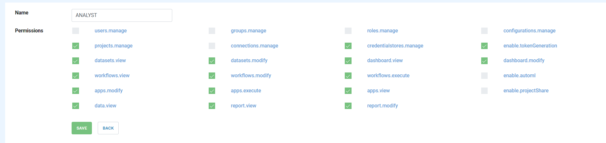

User/Group/Role/Permission
==========================

Fire Insights supports Users, Groups, Roles, Permissions. A User can belong to multiple groups and have multiple roles.

Each role can have multiple permissions associated with it.

Groups
------

There can be multiple groups in Fire Insights. A user can belong to one or more Groups.

.. figure:: ../../_assets/security/group_list.PNG
   :alt: security
   :width: 60%

Associated with each Group are some more details. These include the following:

  * Name : Name of the group
  * Properties : key and value pair you need to pass.
  * AWS Role Arn : S3 locations which the users of the group can browse and view. Associated with each S3 location is also the IAM role to be assumed.

Users
-----

Fire Insights supports multiple users. Each user can belong to multiple Groups, and also have multiple Roles.

.. figure:: ../../_assets/security/user_list.PNG
   :alt: security
   :width: 60%

.. figure:: ../../_assets/security/user_detail.PNG
   :alt: security
   :width: 60%

Permissions
-----------

Fire Insights supports the following Permissions. Permissions are associated with Roles.

.. list-table:: 
   :widths: 10 20 
   :header-rows: 1

   * - Title
     - Description
   * - users.manage
     - create, modify & disable user
   * - groups.manage
     - Create, modify & delete the group
   * - roles.manage
     - Create, modify & delete the roles  
   * - projects.manage
     - Create, modify & delete the projects
   * - enable.projectShare
     - enable project share permission
   * - configurations.manage
     - modify diifferent configurations 
   * - connections.manage
     - manage the connections
   * - credentialstores.manage
     - manage the credentialstores
   * - enable.tokenGeneration
     - manage token generations
   * - datasets.view
     - view dataset in specified project
   * - datasets.modify
     - modify datasets in specified project
   * - dashboard.view
     - view dashboard
   * - dashboard.modify
     - modify the dashboard
   * - workflows.view
     - view workflows in specified project
   * - workflows.modify
     - modify workflows in specified project
   * - workflows.execute
     - execute workflow in specified project
   * - enable.automl
     - enable automl 
   * - apps.modify
     - modify analytics application 
   * - apps.execute
     - execute analytics application
   * - apps.view
     - view analytics application
   * - data.view
     - view data
   * - report.view
     - report view
   * - report.modify
     - report modify

Role's Permissions
----------------

A Role has a set of permissions associated with it. A new Role can be created and an existing Role can be edited.

Out of the box, Fire Insights comes with two roles : ADMIN and ANALYST

User/Roles
-----

A user can have multiple Roles. The actions which a user can do depends on the Roles they belong to.

.. figure:: ../../_assets/security/role_list1.PNG
   :alt: security
   :width: 60%

