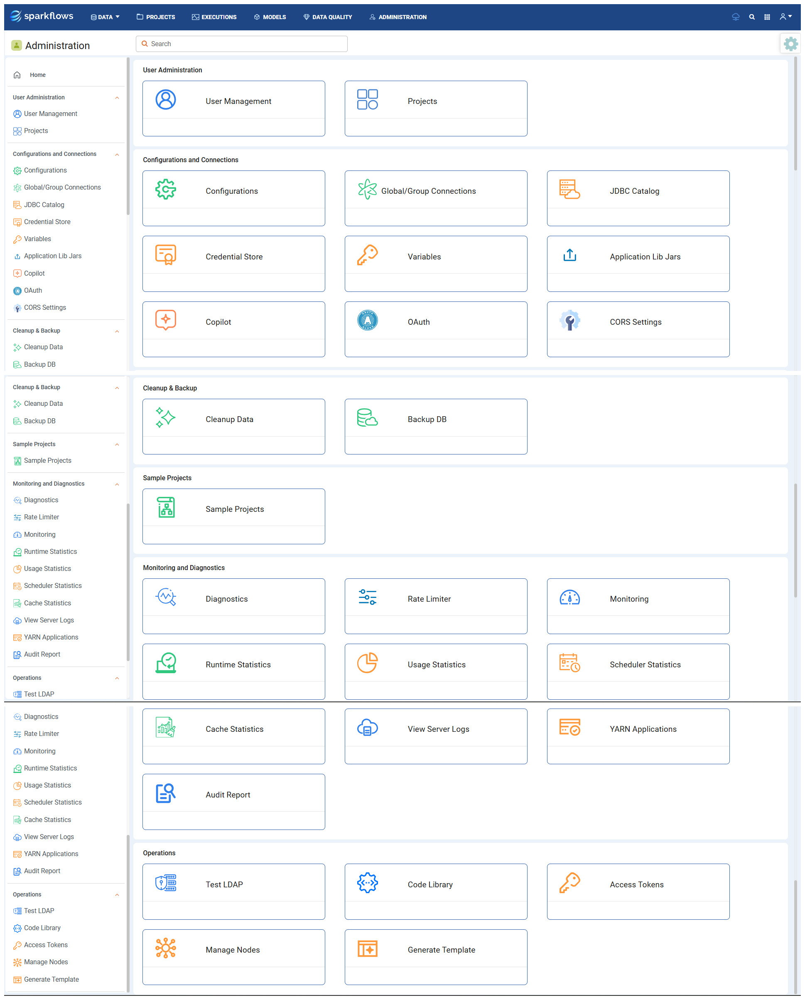

Superuser and Admin Users
===========

Superusers and Admin users have special permissions and rights.

Super User
---------

A user in Sparkflows can be marked to be a super-user. A Super user has the below permissions:

#. **Project Sharing:** Share or unshare any project with any group.
#. **User Privileges:** Designate other users as Superusers.
#. **Group Management:** Create, update, or delete groups.
#. **User Management:** Create or update users.
#. **Roles Management:** Create, update, or delete roles.
#. **Operational Permissions:** Access tasks such as updating configurations, modifying CORS settings, uploading application library jars, managing global/group connections, accessing the credential store, configuring OAuth Settings and testing LDAP.
#. **Data & Maintenance:** Perform database backups, clean up data, and access the JDBC catalog.
#. **Monitoring & Statistics:** View monitoring dashboards, server logs, YARN applications, audit reports, rate limiters, and system statistics (runtime, usage, scheduler, and cache)

Admin User
---------

Any user who have the permission to manage users is considered an Admin user. Generally an ADMIN role is created, which has the users.manage permission granted to it.

Users who would be administrating Sparkflows would have the Admin Role assigned to them.

Users with users.manage permission can do the following:

- **Add new users:** Create new user accounts.
- **Export all users:** Export the list of all users.
- **Edit users:** Modify existing user details (e.g., name, role, etc.).
- **Activate/Deactivate users:** Enable or disable user accounts as needed.

Managing Users, Groups, Roles
----------

Below are the permissions for managing users, groups and roles:

* users.manage - Manage users

* groups.manage - Manage groups

* roles.manage - Manage roles

Operating Sparkflows Permissions
----------

Below are the permission for operating Sparkflows:

Core Operations & Maintenance
+++++

#. **System Configuration:** Configure global Sparkflows settings.
#. **Diagnostics:** Run system diagnostics to troubleshoot issues.
#. **Usage Statistics:** View platform usage statistics and trends.
#. **YARN Applications:** Monitor YARN applications running on the connected Spark cluster.
#. **Sample Projects:** Load sample projects that come pre-packaged with Sparkflows.
#. **Global/Group Connections:** Manage connections at both the global and group levels.
#. **Server Logs:** View Fire server logs, exception logs, and PySpark logs directly from the UI.
#. **Data Cleanup:** Delete old workflow executions based on specific time ranges (e.g., older than 7, 30, or 90 days).
#. **Audit Report:** View and download audit reports detailing user activities such as logins, logouts, and workflow modifications.
#. **Credential Store:** Manage credential stores to securely retrieve usernames, passwords, and other secrets when creating connections.
#. **LDAP Testing:** Test your LDAP configuration to ensure it is set up correctly (applicable only when the LDAP properties file is updated).
#. **Database Backup:** Trigger a backup of the database (applicable if running on the embedded H2 database).
#. **Runtime Statistics:** View the total number of logged-in users, active Fire Spark processes, PySpark processes, and currently running jobs.
#. **Scheduler Statistics:** Monitor the status and health of scheduled jobs.
#. **Cache Statistics:** View cache statistics for logged-in users and external data sources like Snowflake and Databricks.

Identity, Access & Security
+++++

#. **User Management:** Create, update, and manage user accounts, groups, and roles.
#. **OAuth:** Configure OAuth authentication settings for the platform.
#. **CORS Settings:** Manage Cross-Origin Resource Sharing (CORS) configurations to ensure API security.
#. **Access Tokens:** View manage personal or system access tokens.

Advanced Data & Workspace Management
+++++

#. **Projects:** Access the super-user view to globally share or unshare projects across different groups.
#. **JDBC Catalog:** Manage JDBC catalog datasets and configuration details.
#. **Variables:** View and modify global/group variables used across various workflows and pipelines.
#. **Application Lib Jars:** Upload and manage custom Fire application library JAR files.
#. **Manage Nodes:** Manage Workflow nodes.

System Integrations & AI
+++++

#. **Copilot:** Configure and manage the AI Copilot integration for assisted development.
#. **Test MLOps Connection:** Validate connectivity to your designated MLOps (e.g., Kubeflow) server.
#. **Code Library:** Access and manage the global feature code library.

Extended Monitoring
+++++

#. **Rate Limiter:** View rate limit statistics and manage API parameters.
#. **Monitoring:** View overall system performance metrics and dashboards.

Operating Sparkflows
-----

There are certain tasks to be performed for operating Sparkflows. It is recommended to give the below permissions to the Admin for performing the operational tasks in Sparkflows.

Projects/Data
+++++++++++++++++

As for projects, the admin user can do the following:

* View all the projects to which the admin user belongs.
* View the executions of all workflows to which the admin user belongs.
* View the executions of all analytical apps to which the admin user belongs.
* Create analytics apps in projects to which the admin user belongs.

Deleting Users/Groups
++++++++++++++++++++

* **User Deactivation:** In Sparkflows, users cannot be deleted but can be made inactive.
* **Group Deletion:** Groups can be deleted as needed.

