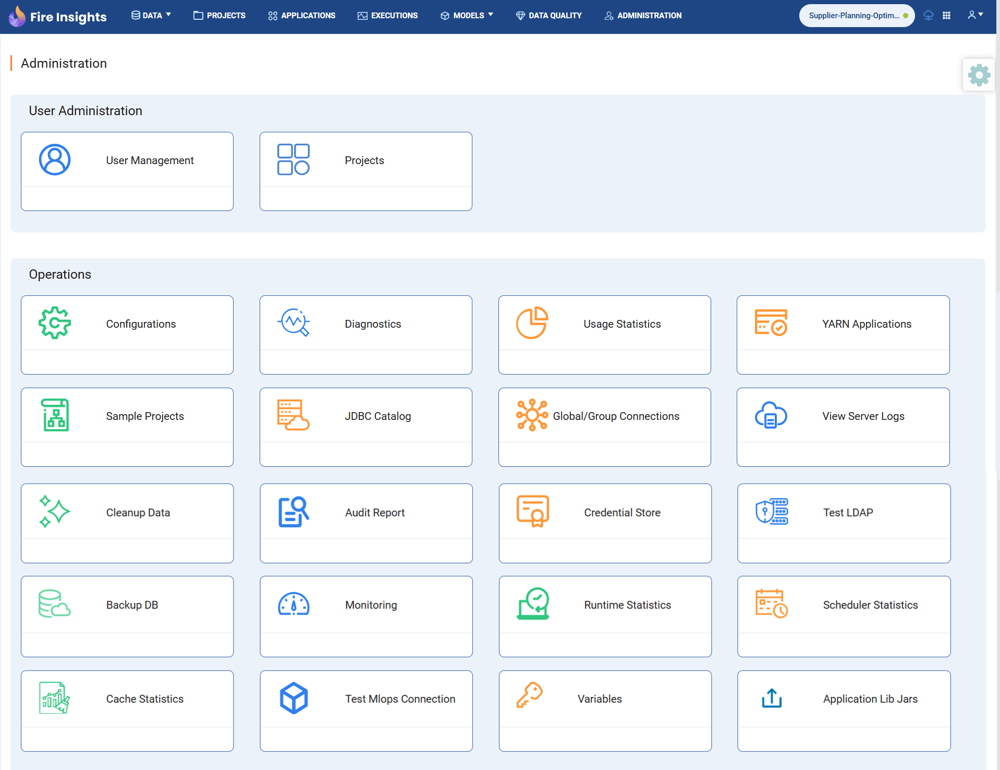

Superuser and Admin Users
===========

Superusers and Admin users have special permissions and rights.

Super User
---------

A user in Sparkflows can be marked to be a super-user. A Super user has the below permissions:

#. **Project Sharing:** Share or unshare any project with any group.
#. **User Privileges:** Designate other users as Superusers.
#. **Group Management:** Create, update, or delete groups.
#. **User Management:** Create or update users.
#. **Roles Management:** Create, update, or delete roles.
#. **Operational Permissions:** Access tasks such as viewing server logs, updating configurations, etc.

Admin User
---------

Any user who have the permission to manage users is considered an Admin user. Generally an ADMIN role is created, which has the users.manage permission granted to it.

Users who would be administrating Sparkflows would have the Admin Role assigned to them.

Users with users.manage permission can do the following:

- **Add new users**: Create new user accounts.
- **Export all users**: Export the list of all users.
- **Edit users**: Modify existing user details (e.g., name, role, etc.).
- **Activate/Deactivate users**: Enable or disable user accounts as needed.

Managing Users, Groups, Roles
----------

Below are the permissions for managing users, groups and roles:

* users.manage - Manage users

* groups.manage - Manage groups

* roles.manage - Manage roles

Operating Sparkflows Permissions
----------

Below are the permission for operating Sparkflows:

* **System Configuration:** Configure Sparkflows settings.
* **Diagnostics:** Run system diagnostics.
* **Usage Statistics:** View platform usage statistics.
* **YARN Applications:** Monitor YARN applications running on the Spark cluster.
* **Sample Projects:** Load sample projects that come with Sparkflows.
* **Global Connections:** Manage global and group-level connections.
* **Server Logs:** View Fire server logs, exception logs, and PySpark logs.
* **Data Cleanup:** Delete old workflow executions based on time ranges (e.g., older than 7, 30, or 90 days).
* **Audit Report:** View and download audit reports for user activities like logins, logouts, and workflow modifications.
* **Credential Store:** Manage credential stores for securely retrieving usernames, passwords, etc., when creating connections.
* **LDAP Testing:** Test LDAP configuration to ensure it's set up correctly (only when the LDAP properties file is updated).
* **Database Backup:** Backup the database if running on H2 DB.
* **Runtime Statistics:** View total logged-in users, active Fire Spark processes, and PySpark processes, along with running jobs.
* **Scheduler Statistics:** Monitor the status of scheduled jobs.
* **Cache Statistics:** View cache statistics for logged-in users and data sources like Snowflake and Databricks.

Operating Sparkflows
-----

There are certain tasks to be performed for operating Sparkflows. It is recommended to give the below permissions to the Admin for performing the operational tasks in Sparkflows.

Projects/Data
+++++++++++++++++

As for projects, the admin user can do the following:

* View all the projects to which the admin user belongs.
* View the executions of all workflows to which the admin user belongs.
* View the executions of all analytical apps to which the admin user belongs.
* Create analytics apps in projects to which the admin user belongs.

Deleting Users/Groups
++++++++++++++++++++

* **User Deactivation:** In Sparkflows, users cannot be deleted but can be made inactive.
* **Group Deletion:** Groups can be deleted as needed.

