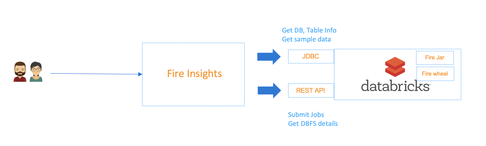
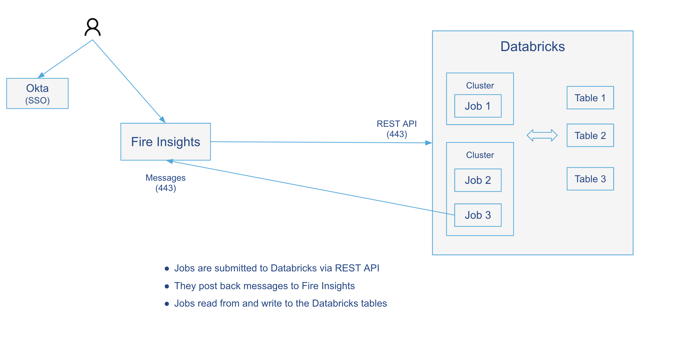
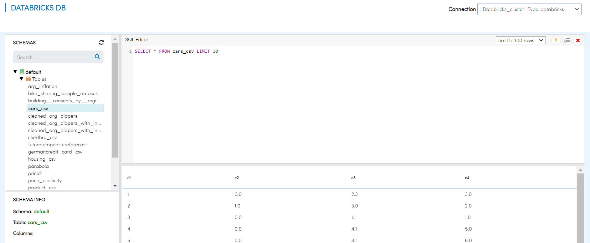
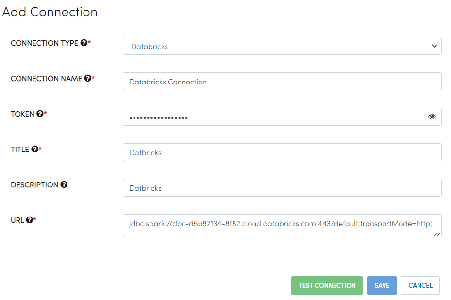

Databricks Security
===================

Users in Sparkflows access Databricks via **Databricks Tokens**. Whenever users interact with Databricks in Sparkflows, they have access according to the permissions assigned to the token in Databricks. The following diagrams show the integration of Sparkflows with Databricks:

   
   

Viewing DB/Tables
-----------------

In Sparkflows, users can view databases and tables. These are accessed via **JDBC** from the Databricks cluster using the token. The same applies if users choose to execute a query to view records from the table.

Executing Workflows
-------------------

When users execute workflows in Sparkflows, they are submitted to the Databricks cluster via the **REST API** using the Databricks token. These jobs post messages back to Sparkflows. They use a token generated specifically for the job to post back the messages.

Databricks Connections
-----------------------

The Databricks cluster details and token are specified in a connection. Users use these connections when interacting with Databricks. Connections can be at the global level or the project level. Global-level connections are created by the admin user, while project-level connections are created by project users. Sparkflows also supports defining group-level connections. 

For more details on **creating Databricks Connection** in Sparkflows - `Click Here. <https://docs.sparkflows.io/en/latest/user-guide/connection/compute-connection/databricks.html>`_ 

