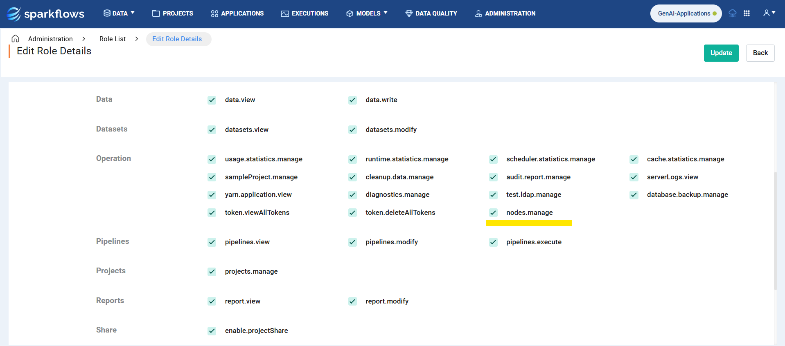
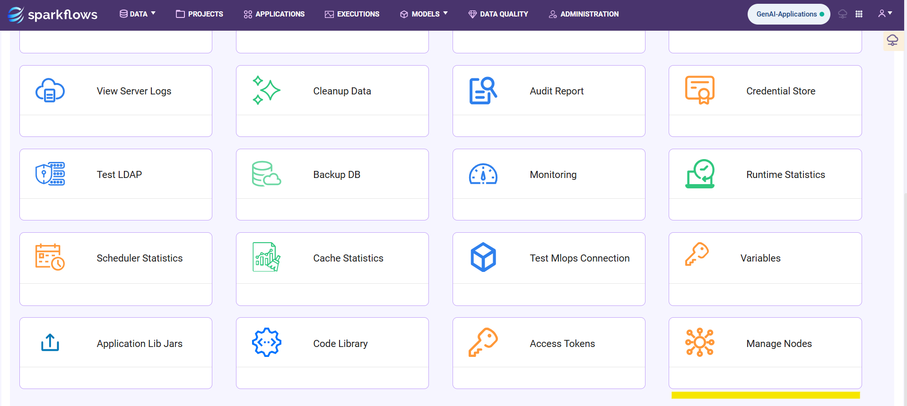
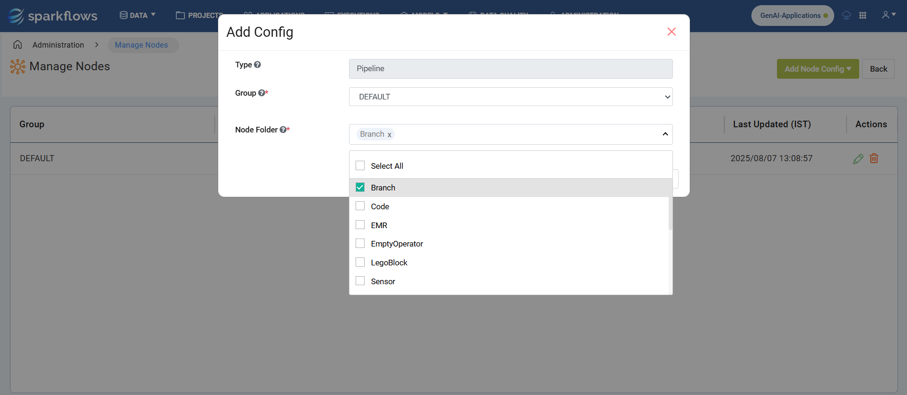
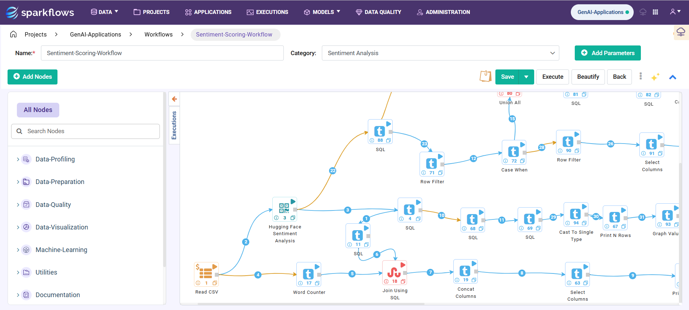
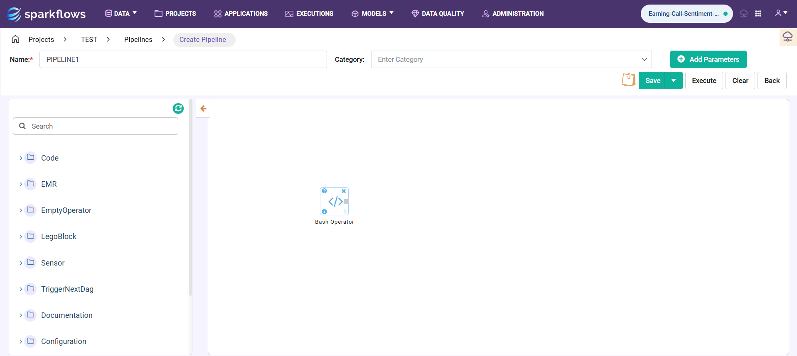

Manage Nodes
===============
Pre-requisites
-----------

Make sure the user has the **nodes.manage** permission to access the **Manage Nodes** page.

Access this section by navigating to **Administration -> Manage Nodes** after logging into Sparkflows.

Add Node Configuration
-----------

When the user clicks the "Add Node Config" button, they can configure and hide workflow or pipeline nodes for the selected group.

Once a node has been hidden through the configuration, users who are part of that group will no longer have access to the configured nodes

