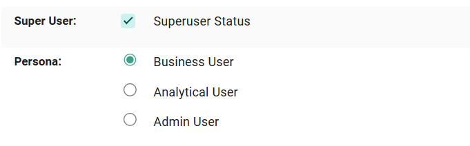
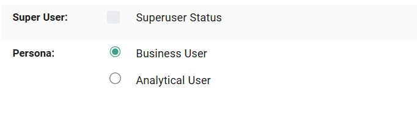

Personas
----

Sparkflows provides role-based access through predefined Personas—**Business**, **Admin**, and **Analytical**—which define the level of access and functionality available to users. These personas can be assigned while creating or editing **user details** under **Administration → User Management** and help tailor the platform experience based on user responsibilities.

**Case 1:** If the user is having superuser status he will have access to admin persona as well.

**Case 2:** If the user is not having superuser status then he will have access to only business and analytical personas.

Configuring and Accessing Personas on UI
=====

* In order for the user to switch personas, **uiSettings.enablePersona** configuration property has to be enabled by setting its value to **true** by an admin user:

  .. figure:: ../../_assets/security/enable-persona-uisetting.png
     :alt: security
     :width: 60%

* Enabling this property allows the user to easily access **option to switch between personas** by clicking the **user profile icon** on the top right corner, as shown below:

  .. figure:: ../../_assets/security/switch-persona.png
     :alt: security
     :width: 60%

Defining Each Persona
====

**Business Persona**
++++++++++++++++++++++

This persona offers:

  * On the Dashboard page, the user can view items present within **Reports, Analytical Apps, Interactive Dashboards and Chatbot** of the **selected project** from the dropdown and if ample permissions are given the user can also edit these module’s items.

    .. figure:: ../../_assets/security/business-persona-nontoggle-mode.png
     :alt: security
     :width: 60%

  * The **Project** whose modules are to be viewed can be selected from the dropdown as shown below:

    .. figure:: ../../_assets/security/business-persona-project-select.png
     :alt: security
     :width: 60%

  * We can also go into toggle mode by clicking on the icon shown below:

    .. figure:: ../../_assets/security/toggle-mode-icon.PNG
     :alt: security
     :width: 60%

  * On clicking the above icon, the Dashboard is displayed in below format:

    .. figure:: ../../_assets/security/business-persona-toggle-mode.png
     :alt: security
     :width: 60%

  * When in Toggle Mode , user can  filter the cards for specific modules that are seen in Business Dashboard - **Reports, Analytical Apps, Interactive Dashboards and Chatbots**. User can also **view / edit** specific items within these four modules (if ample permissions are given) as shown below:

    .. figure:: ../../_assets/security/filtered-business-persona-toggle-mode.png
     :alt: security
     :width: 60%

**Admin Persona**
+++++++++++++++++++

This persona is accessible only to users with **Superuser status**.

This Persona offers:

  * On the Dashboard page, the user can access **Projects**, **Executions**, **Groups** and **Workflows**, which redirect to their respective pages when clicked.
  * It also allows the user to view the **Executions By Date**, represented through a **Count By Date** Bar Graph and displays the **latest 5 executions**.

    .. figure:: ../../_assets/security/admin-persona.png
     :alt: security
     :width: 60%

**Analyst Persona**
+++++++++++++++++++++

This Persona offers:

  * On the Dashboard page, the user can access **Projects**, **Executions** and **Processors** which redirect to their respective pages when clicked.
  * It also allows the user to access the **recent projects, workflows, pipelines and reports** directly from the dashboard page.

    .. figure:: ../../_assets/security/analyst-persona.png
     :alt: security
     :width: 60%

