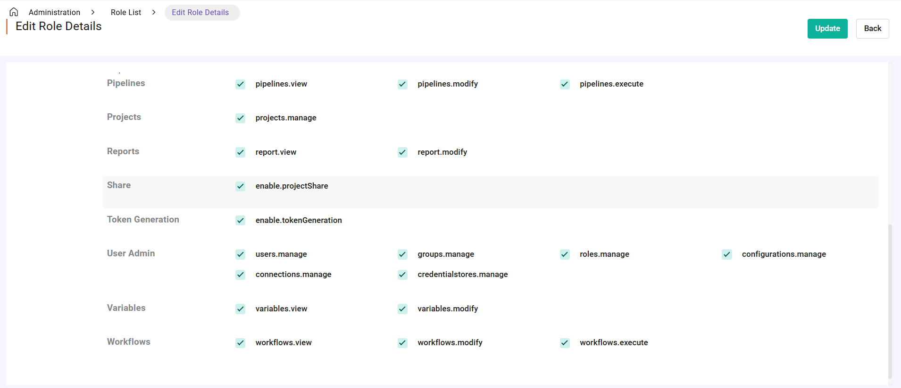
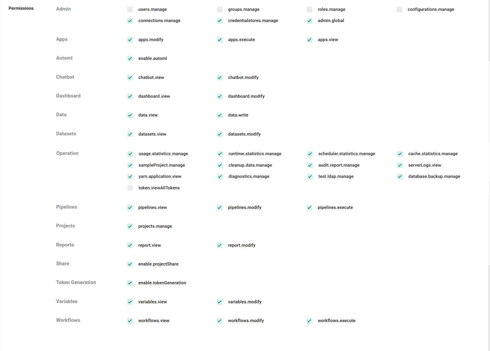

User/Group/Role/Permission
==========================

Fire Insights supports users, groups, roles, and permissions. A user can belong to multiple groups and have multiple roles. Each role can have multiple permissions associated with it.

Users
-----

Fire Insights supports multiple users. 

* Each user can belong to multiple groups and have multiple roles.
* A user can be a designated as a superuser.
* The user should exist on HDFS (when running against a Hadoop Cluster). Fire can run independent of a Hadoop Cluster.

.. figure:: ../../_assets/security/user_list.PNG
   :alt: security
   :width: 60%

.. figure:: ../../_assets/security/user_detail.PNG
   :alt: security
   :width: 60%

Groups
------

There can be multiple groups in Fire Insights. A user can belong to one or more groups.

.. figure:: ../../_assets/security/group_list.PNG
   :alt: security
   :width: 60%

Below are further details associated with each group:

* **Name:** The name of the group.
* **Properties:** Key-value pairs you need to pass.
* **AWS Role ARN:** S3 locations that the users of the group can browse and view. Associated with each S3 location is also the IAM role to be assumed.
* **S3 Access Key:** The credential used to authenticate and authorize access to Amazon Web Services (AWS) resources, such as S3 buckets.
* **S3 Secret Key:** The credential secret key. Together with the access key, it is used to authenticate and authorize access to AWS resources, such as S3 buckets.
* **S3 Endpoint URL:** The S3 endpoint URL used to access Amazon S3 (Simple Storage Service).

.. figure:: ../../_assets/security/group_creation.PNG
   :alt: security
   :width: 60%

Roles
-----

A user can have multiple roles. The actions a user can perform depend on the roles they belong to.

.. figure:: ../../_assets/security/role_list1.PNG
   :alt: security
   :width: 60%

A role has a set of permissions associated with it. A new role can be created, and an existing role can be edited.

Out of the box, Fire Insights comes with three roles: **ADMIN**, **ANALYST**, and **BUSINESS ASSOCIATE**.

Permissions
-----------

Fire Insights supports the following permissions, which are associated with roles.

.. list-table:: 
   :widths: 30 70 
   :header-rows: 1

   * - Permission Name
     - Description
   * - users.manage
     - Create, modify, view and activate or deactivate users in user management page from administration.
   * - global.admin
     - Create, modify, and view connections, credential stores, and variables from the administration panel as well as within the project.
   * - groups.manage
     - Create, modify, view users of a group, view connections of a group and delete groups in user management page from administration.
   * - roles.manage
     - Create, modify, and delete roles in user management page from administration.
   * - projects.manage
     - Create, create project using sample project, import project from local, export, modify, and delete projects.
   * - configurations.manage
     - Modify different configurations in configurations page from administration.
   * - enable.projectShare
     - Enable project sharing permissions to share projects with other groups which the user has access to.
   * - connections.manage
     - For a superuser - Create, modify, clone, view and delete connections globally in connections page from administration and for any other user - can perform the same actions but within the project for connections.
   * - credentialstores.manage
     - For a superuser - Create, modify, edit value and delete credential stores and credentials globally in credential store page from administration and for any other user - create, modify details, modify value and delete credentials within the project using globally created credential stores. 
   * - enable.tokenGeneration
     - Generate and delete personal access tokens, but not for other users.
   * - token.viewAllTokens
     - View personal access tokens created by all users in access tokens page from administration.
   * - datasets.view
     - View datasets in specified projects.
   * - datasets.modify
     - Create, modify, clone, export, perform dataset profiling, view and delete datasets in specified projects.
   * - dashboard.view
     - View dashboard and charts in specified projects.
   * - dashboard.modify
     - Create, modify, view and delete dashboards and charts in specified projects.
   * - workflows.view
     - View workflows and its json, view workflow schedules in specified projects.
   * - workflows.modify
     - Create, modify, clone, lock, import, export, view or edit json, access trashed workflows, view workflow schedules and delete workflows in specified projects.
   * - workflows.execute
     - Execute, schedule, perform actions on workflow executions, view metrics of workflow executions, job details of workflow executions, logs of workflow executions, create or update workflow schedules, delete schedules of workflows in specified projects.
   * - enable.automl
     - Create, modify, view, import, export, run, view executions and delete automl experiments in specified projects.
   * - apps.view
     - View, activate or deactivate analytics applications in specified projects.
   * - apps.modify
     - Create, modify, import, export, update by import, view, activate or deactivate, view executions and delete analytics applications in specified projects.
   * - apps.execute
     - Execute, view executions, activate or deactivate analytics applications in specified projects.
   * - data.view
     - View data of files in folders.
   * - data.write
     - Create, modify, download, upload, move, delete files and folders.
   * - report.view
     - View reports in specified projects.
   * - report.modify
     - Create, modify, import, export, view and delete reports in specified projects.
   * - pipelines.view
     - View pipelines and its json, view pipeline executions, view pipeline schedules in specified projects. 
   * - pipelines.modify
     - Create, modify, clone, import, export, view pipeline and its json, view pipeline executions, view pipeline schedules, access trashed pipelines and delete pipelines in specified projects.
   * - pipelines.execute
     - Execute, schedule, view json of pipelines, perform actions on pipeline executions, create or modify pipeline schedules and delete schedules of pipelines in specified projects.
   * - variables.view
     - For a superuser - create, modify, import variables using a INI/JSON file globally or for a group, export global variables or of a group to a JSON file, view and delete variables on variables page from administration and for any other user - only view project level created variables.
   * - variables.modify
     - For a superuser - create, modify, import variables using a INI/JSON file, export to a JSON file, view and delete variables on variables page from administration and for any other user - create, modify, view and delete project level created variables.
   * - chatbot.view
     - View and export chabots in specified projects.
   * - chatbot.modify
     - Create, modify, import, export, view and delete chatbots in specified projects.
   * - usage.statistics.manage
     - View and perform actions available in usage statistics page from administration.
   * - runtime.statistics.manage
     - View perform actions available in runtime statistics page from administration.
   * - scheduler.statistics.manage
     - View and perform actions available in scheduler statistics page from administration.
   * - cache.statistics.manage
     - View and perform actions available in cache statistics page from administration.
   * - sampleProject.manage
     - View and perform actions available in sample projects page from administration, reload sample projects in projects page.
   * - cleanup.data.manage
     - View and perform actions available like deletion of workflow and pipeline executions, audit logs in clean up data page from administration.
   * - audit.report.manage
     - View, export, and delete in audit reports page from administration.
   * - serverLogs.view
     - View fire server logs, fire server exception logs, fire logs, fire pyspark logs and perform actions available in server logs page from administration. 
   * - yarn.application.view
     - View and search YARN applications in yarn applications page from administration.
   * - diagnostics.manage
     - Run and perform diagnostics from administration on diagnostics page.
   * - test.ldap.manage
     - Test LDAP configurations and perform actions available in test LDAP page from administration and add ability to add or sync a LDAP user in user management page from administration.
   * - database.backup.manage
     - Backup H2 databases, delete backed up databases and schedule H2 database backups to a specific location from administration.

Fire has the following permissions defined.

