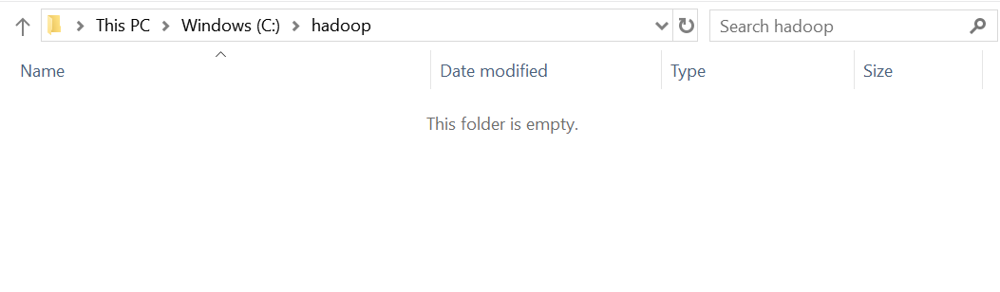
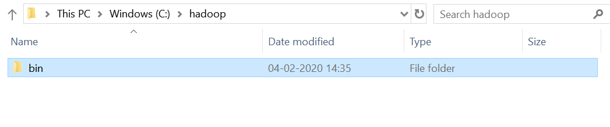
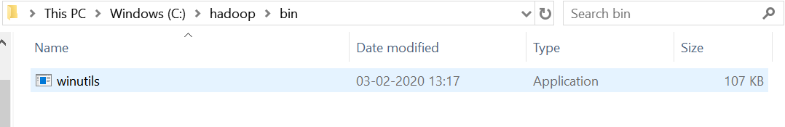
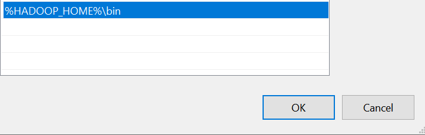

Windows Installation Prerequisites
====================

Below are the Prerequisites for installing Fire Insights on a windows machine::

  - JDK 1.8 installed.
  - java and jar have to be in the PATH
  - 5GB+ of RAM.
  - Python 3.6+ (when running Python and PySpark, otherwise not needed)

Check JDK 1.8 is installed
-------------

* Check the JDK version installed on your machine::

    Open terminal window 
    Type the following command to check your java version : java -version

* If JDK 1.8 is not installed, follow the JDK installation steps mentioned below.

Install JDK 1.8
---------------

* Download JDK 1.8 for windows using the link below:

    * https://www.oracle.com/technetwork/java/javase/downloads/jdk8-downloads-2133151.html

* Install java by double clicking on the downloaded exe file

* After installation, make sure that java 1.8 is in the path::

    Open a new terminal window 
    Type the following command to check your java version : java -version

.. note::  If you have multiple versions of Java installed on you system, you can update the PATH using the steps outlined in either of the links below:

           * https://www.java.com/en/download/help/path.xml
           * https://javatutorial.net/set-java-home-windows-10
           
           
           
 
.. note:: With the above steps, you would have Fire Insights running locally on your laptop. It would not be able to submit jobs to a Spark cluster. For that, Fire Insights has to be installed on the edge node of the cluster.

winutils.exe
------------

winutils.exe is needed for running Apache Spark/Hadoop on windows machines. Follow the below steps to setup winutils.exe on your machine::

   
- Download winutils.exe from https://github.com/steveloughran/winutils

      - winutils.exe can be directly downloaded from link below:
      - https://github.com/steveloughran/winutils/blob/master/hadoop-2.7.1/bin/winutils.exe
  
- Create hadoop folder in Your System : C:\hadoop

  - Create bin folder in hadoop directory : C:\hadoop\bin

  - Copy the downloaded winutils.exe to the bin directory : C:\hadoop\bin\winutils.exe

  - Add a new Environment Variable. 

    - HADOOP_HOME = C:\hadoop
  
.. figure:: ../_assets/installation/Add_hadoop_environment.PNG
   :alt: Installations
   :align: center
   :width: 60%

  
  - Update the System Environment Variable PATH by adding: C:\hadoop\bin

* Guide to setting Environment Variables on Windows

    https://www.architectryan.com/2018/08/31/how-to-change-environment-variables-on-windows-10/

Troubleshooting
---------------

Running into an exception when saving files
++++++++++++++++++++++++++++

    org.apache.spark.SparkException: Job aborted due to stage failure: Task 1 in stage 33.0 failed 1 times, most recent failure: Lost task 1.0 in stage 33.0 (TID 131, localhost): java.io.IOException: (null) entry in command string: null chmod 0644 
    
If you run into an exception like above, then there is problem with the setup of ``winutils.exe``.

