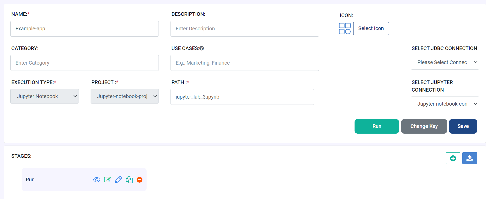
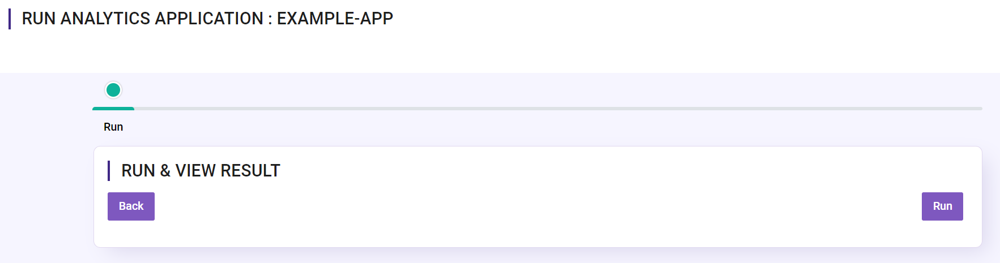
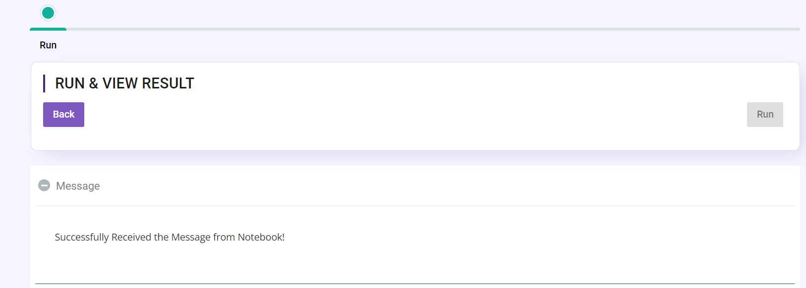

Example Analytical App
==================

This is a Hello World Analytical App. It enables the user to run the app and view the output produced by the Jupyter Notebook.

Analytical App Overview
--------

The following application performs the following tasks:

* Reads the Jupyter Notebook named **jupyter_lab_3.ipynb**
* Prints the output of the notebook

Jupyter Notebook
------

Below is the Jupyter Notebook that gets invoked by the Analytical App to output the results back to the Analytical App.

Jupyter Notebook **jupyter_lab_3.ipynb**, contains the below:

::

    print("I am jupyter lab")
    import os
    os.getcwd()
    print()
    import sys
    print(sys.argv)

    webserverURL = "http://localhost:8080/messageFromSparkJob"
    jobId = "123456789"
    from fire_notebook.output.workflowcontext import RestWorkflowContext
    restworkflowcontext = RestWorkflowContext(webserverURL, jobId)

    message = "Successfully Received the Message from Notebook!"
    restworkflowcontext.outStr(9, title="Message", text=message)

Prints the Results
------------------

When you run the application, it utilizes the Jupyter Notebook connection to submit the job and print the response back from the Jupyter Notebook to the Fire Insights UI.

