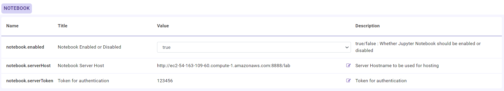
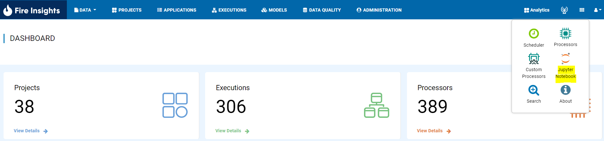
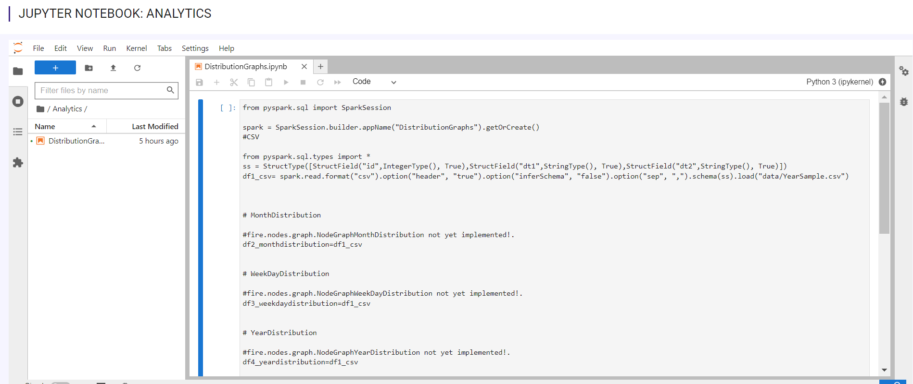
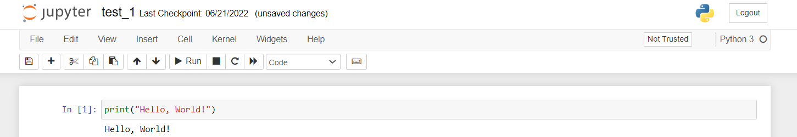

Jupyter Notebook
=============

Jupyter Notebook is an open-source web-based application that allows Data Scientists and Python developers to create and share documents that contain live code, equations, visualizations, and narrative text. 

Overview
--------

Fire can be used to, easily, create a downsampled dataset. Fire provides a ``sample`` processor for it.

Once the dataset size is small, data scientists can use it to build model in Jupyter notebook.

Once the modeling process is complete, the algorithm can be run on the full data in Fire.

Installations
-----

Fire can be configured to Jupyter Notebook. Below are  the steps involved in it:

1. Login to Fire web server URL

Once login to Fire web server URL, Goto ``ADMINISTRATION -->> Configurations`` and select ``NOTEBOOK``.

Update the below parameters:

::

    notebook.enabled : true
    notebook.serverHost : jupyternotebook server url which include token
    notebook.serverToken : Token being used
    
.. note::  Make sure to change localhost to your domain name or your IP where Fire is running and it should be accessible.   

2. Open Jupyter Notebook

Once the above configuration is saved, refresh the web server URL and you will see ''Jupyter Notebook'', Open it.

3. Access Jupyter Notebook

Once you click on ''Jupyter Notebook'', it will open a new page for Jupyter Notebook and you can run the python code on top of it.

