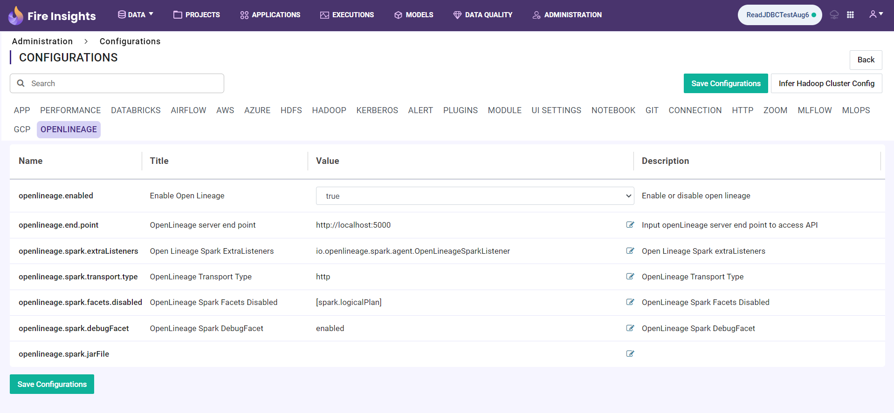
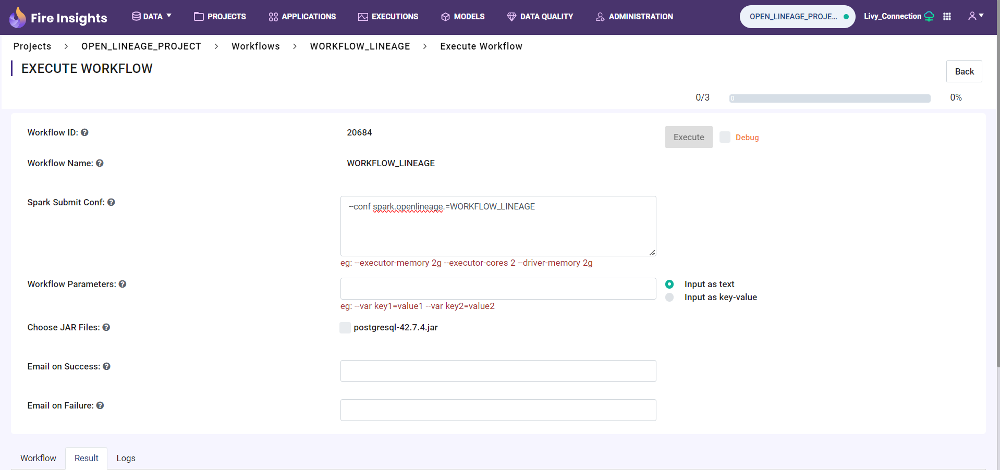

Lineage Configuration
=====
This document outlines the steps to configure Lineage in Sparkflows.

Step 1 : Log In and Navigate to the Configurations Page
----------------------------------

Log in to the **Sparkflows application** and go to **Administration > Configurations**. 

Step 2 : Enable Local Lineage Configuration
---------------------------

To enable OpenLineage, enable the **openlineage.enabled** property on the Configurations Page:
::

   openlineage.enabled = true

Step 3 : Enable Lineage Configuration with Livy 
------------------------------

To configure OpenLineage with the Livy connection, enable the following properties on the Configurations Page:
::

    connection.openlineage.enabled = true
    connection.livy.enabled = true

Step 4 : Create Open Lineage Connection
--------------------------------

After enabling the Open Lineage connection, you can create the lineage connection in the administration settings. 

Follow the steps below to create the connection:

#. Navigate to **Administration > Connections**.
#. Click on the **Add Connection** button located on the top right corner.
#. Enter the connection details on the pop-up window.

   .. figure:: ../../_assets/lineage/create_connection_lineage.png
      :alt: enable-lineage
      :width: 60%

#. After entering all the details **Test and Save** the connection.
#. Once the lineage connection is created, select it for the Livy connection as shown below:

   .. figure:: ../../_assets/lineage/livy_lineage.png
      :alt: livy-lineage
      :width: 60%

Step 5 : Execute Workflows with Livy
-----------------------------------

While executing workflows with Livy, include the following configuration for the namespace:

ex. **--conf spark.openlineage.=WORKFLOW_LINEAGE**

